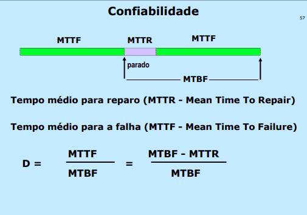

# Tipos das falhas
Permanentes
- sem possibilidade de recuperação

Recuperáveis
- com possibilidade de recuperação após certo tempo

Transientes
- **Macroscópicas**: podem ser recuperadas rapidamente mediante alguma intervenção
- **Microscópicas**: recuperam-se sem intervenção
## Natureza das falhas - efeito
- Funcional: Não realiza a função para o qual o sitema foi projetado. Usualmente chamada de **falha**
- Desempenho: a função é executada corretamente, mas em tempo insatisfatório. Um critério (SLA) é estabelecido para que possa ser caracterizada

## Natureza das falhas - escopo
- Total: Interrupção total de um serviço
- Parcial: Algumas funções são interrompidas e outras continuam a operar normalmente
## Confiabilidade
MTBF (Mean Time Between Failures) - Tempo médio entre falhas

PS: Evitar confundir tempo médio entre falhas com tempo de vida do equipamento

MTTR (Mean Time To Repair) -  Tempo médio de reparo
MTTF (Mean Time To Failure) -  Tempo médio para a falha

D = MTTF/MTBF = (MTBF - MTTR)/MTBF



PS: Não confundir tempo médio entre falhas com tempo de vida do equipamento

### MTTR e dependência com o tipo de contrato para manutenção
O MTTR depende do tipo de contrato para manutenção:
- Peças no local, técnico residente 24x7: 30 - 120 minutos
- Peças em estoque do fornecedor, técnico residente 8x5: 8 horas em dias úteis
- Peças em estoque do fornecedor, técnico chamado, 8x5: 1 dia útil 
- Contrato “per call”: 3 dias

### MTBF de componentes em série
É a soma do inverso dos MTBF individuais

```
1/MTBFs = 1/MTBF + 1/MTBF  + . . . + 1/MTBF 
            (1)      (2)              (n)
```

Se um trabalho tem de ser executado por n dispositivos ao mesmo tempo, o MTBF do conjunto cai para: 

```
MTBFconjunto = MTBFindiv/n
```

### MTBF de componentes em paralelos
#### Sem reparo do componente que falhou

MTBFredundante = MTBF individual*(1 + 1/2 + ... + 1/n)

O benefício é pequeno, mas mostra que a probabilidade de uma falha dupla é muito pequena

#### Com reparo do componente que falhou
1/MTBFreduntante = 1 / 2*MTBFindiv + (MTBFinvid^2/MTTR ) 

TODO: Entender a Formula 1/MTBFreduntante = 1 / 2*MTBFindiv + (MTBFinvid^2/MTTR ) (Slide 31/59)
TODO: MTBF sem Reparo não deveria ser 1.200.000 * (1 + 1/2) ao invés de 500 * (1 + 1/2)? (32/59)
TODO
## Disponibilidade 
Disponibilidade de rede. Usualmente monitorada em separado pelo software de gerenciamento de rede.
Pode ser subdividida por componentes


## Disponibilidade de Software
O software não falha por uso ou fadiga, mas pode sofrer "envelhecimento"
- Envelhecimento de software exemplos:
  - "vazamento de memória"
  - processos que não conseguem terminar
  - locks não liberados
  - acumulação de erros de arredondamento

Como correções podem introduzir novas possibilidades de falhas, a taxa de redução de falhas de software decresce lentamente

Para software utiliza-se o conceito de tempo médio entre defeitos (MTBD - Mean time between defects).

Mecanismos de detecção de falhas em software
- watchdog
- hearthbeat
- manual

Mecanismo de recuperação
- reinicialização automática
- reboot automático
- manual

Conceito de estados de processos
- robusto
- degradado 
- parado

Concept: Intervalo de rejuvenescimento

# Datacenters
## Localização - Onde é legal colocar um?
- possibilidade de expansão [SIM]
- risco ambientais - inundações, desastres, naturais [NÃO]
- riscos por vizinhos - desabamento, exploção [NÃO]
- segurança pessoal
- facilidade de acesso

## Caracteristicas da construção
- estrutura
- janela
- facilidade de identificação

## Utilidades
- multiplos acessos independentes para energia e rede

## Layout
- equipamentos de processamento
- cabine de força
- gerador
- no-breaks e baterias
- sala de staging
- etc

## Condicionamento de energia
- queda de energia 
- alteração da tensão
- picos
- variação da forma de onda
  - causados pelas fontes dos equipamentos
- usualmente tratados por um **no-break** ou UPS

## Planejamento de contigência
Objetivo: Propor diretrizes estratégicas e planos para administração eficaz e rápida das emergências + Garantir a continuidade dos negócios.

### Atividades ligadas ao planejamento de contigência
- Coordenar e integrar a ação dos diversos departamentos envolvidos
- assegurar o apoio da direção superior
- desenvolver, implementar, manter e testar o plano de contingência
- promover o desenvolvimento de sites de contingência

### Etapas de um planejamento de contigência
- Início e gestão do projeto
- Análise (e redução) de risco
- Análise do impacto no negócio
    - Curva ABC das atividades
    - planejamento é de toda a empresa e não somente de TI
- Desenvolvimento de estratégioas de
  - resposta: Conjunto de providências imediatas após o incidente, geralmente com procedimentos alternativos ou operações com capacidade limitada
  - recuperação: é o conjunto de medidas de prazo maior, destinadas a restaurar plenamente a funcionalidade
- realização do plano
- treinamento dos envolvidos
- testes periódicos
- manutenção

### Ações dada a importancia da funcionalidade

1. Recuperação imediata
- Aplicações que não podem ser interrompidas Requer a implementação de um site alternativo, em local diferente, inteiramente operacional. 
- Exige atualização síncrona dos arquivos

2. Recuperação em até algumas horas
- Também exige site de contingência preparado, mas pode receber pessoal e dados e alguns equipamentos após o incidente 
- De preferência atualização síncrona de arquivos

3. Recuperação em um dia
- O site de contingência deve existir, mas em geral pode ser preparado após o incidente 
- Geralmente atualização assíncrona de arquivos

4. Recuperação em 3 dias ou mais
- O site pode ser preparado após o incidente 
- recuperação de dados pode ser através de fitas
mantidas fora do site

# Redes

## Camada Física
- A camada física cuida dos meios de transmissão de dados
- Transmissão transparente de sequências de bits pelo meio físico

- A transmissão envolve
 - meio para transferência
 - capacidade de transferência
 - latência para a transferência

- Contém os padrões elétricos, mecânicos (ex: tipo de conector), física (ex: níveis de tensão), funcionais das interfaces e tipo de transmissão (ex: analógica/digital, tipo de modulação)

### Classificações das Conexões
- ponto a ponto: Conexões ponto a ponto ligam fisicamente dois nós
- multiponto: Conexões multiponto ligam mais de dois nós através de um meio compartilhado
    - As conexões multiponto apresentam o problema adicional de decisão sobre qual nó pode transmitir num certo instante

### Generalidades sobre Cabos
Cabos podem ser elétricos ou ópticos

**Cabos comuns:**
- são revestidos por plástico combustível, que gera produtos
venenosos em caso de incêndio

**Cabos plenum**
- Devem ser utilizados onde existe risco de incêndio: plenum,
prumadas
- São mais caros e rígidos

**Cabos externos**
- Possuem proteção contra agentes atmosféricos
- Possuem guia de aço ou plástico rígido, para serem autoportantes
- Muito rígidos

## Camada de Enlace (Data Link Layer)

## Camada de transporte
- transmissão confiável entre dois nós (os nós não estão necessáriamente conectados diretamente)

## Camada de aplicação


## Modelo OSI x Protocolos OSI
- O modelo OSI é bem pensado
- Devido á sua complexidade


## Modelo de referência TPC/IP
- Formula uma hipótese de que a rede não é confiável

application 
transport ~ tcp
internet ~ ip
host-to-network

