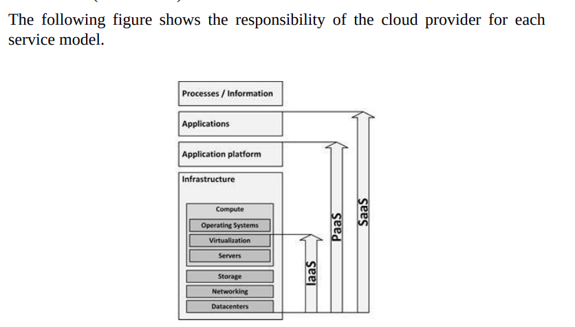
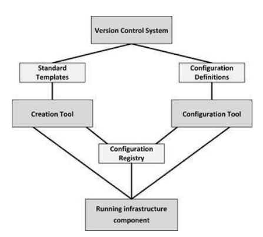

# 3 - Cloud Computing
Cloud computing is an outsourcing model, in which IT services are provided and paid based on actual on-demand use.

## Cloud Definition


> Cloud computing is a model for enabling ubiquitous, convenient, on-demand network access to a shared pool of configurable computing resources that can be rapidly provisioned and released with minimal management effort or service provider interaction (NIST)

It is important to realize that cloud computing is not about technology; it is an outsourcing business model. It enables organizations to cut cost while at the same time focusing on their primary business – they should focus on running their business instead of running a mail server.

## Cloud Characteristics
- On demand self-service: As a result of optimal automation and orchestration, minimal systems management efort is needed to deploy systems or applications in a cloud environment.
- Rapid elasticity: A cloud is able to quickly scale up and scale down resources
- resource pooling: Instead of providing each application with fixed amount of processing power and storage, cloud computing provides appliçations with resources from a shred pool. This is tipically done using virtualization technologies
- measured service: In a cloud environment the actual resource usage is measured and billed. there are no capital expenses, only operational expenses. This is constrast with the investiment needed to build a traditional infrastructure
- broad network access - capabilities are available over the network and accessed through standard mechanisms

> Be aware that when using off-premises cloud based solutions, the internet connection becomes a Single Point of Failure. Internet availability and internet performance becomes critical and redundant connectivity is therefore key.

## Cloud Deployment models
- public cloud deployment is delivered by a cloud service provider, is accessible through the internet, and available to the general public.
- private cloud is operated solely for a single organization, whether managed internally or by a third-party, and hosted either on premises or
external. 
- **community cloud** is much like a private cloud, but shared with a community of organizations that have shared concerns (like compliance considerations). It may be owned, managed, and operated by one or more of the organizations in the community, a third party, or some combination, and it may exist on or off premises.
- **hybrid cloud** deployment, a service or application is provided by a combination of a public cloud, and a community cloud and/or a private cloud. This enables running generic services (like email servers) in the public cloud while hosting specialized services (like a business specific application) in the private or community cloud.

## Cloud Service Models
- Software as a Service (Saas) delivers full applications that can be used by business users, and need little or no configuration. Examples: Microsoft Office365, LinkedIn, Facebook, Twitter, and Salesforce.com

- Platform as a Service (PaaS) delivers a scalable, high available, open programming platform that can be used by developers to build bespoke applications that run on the PaaS platform. Examples are Microsoft Azure Cloud Service and Google App Engine.
    > Application-centric, integrated runtime. No need to assemble an application stack, it is took for granted by the platform's users.
    > 
    > Removes the need for you to manage underlying infrastructure (usually hardware and operating systems), and allows you to focus on the deployment and management of your applications.
    Computing platforms typically includes operating system, programming language execution environment, database, web server etc.
    >
    > Primarily for developers and programmers, a PaaS allows the user to develop, run, and manage their own apps without having to build and maintain the infrastructure or platform usually associated with the process.
    >
    > Example: Heroku
    > [Augusto's Github](https://github.com/AugustoCalado/Computer-Science-Concepts-Techniques-Technologies/blob/a7bf4e9842829bbbd15e45fc6f51f4dc0c688edc/Cloud-Native/Cloud-Native%20Architecture.md)

- Infrastructure as a service (IaaS) delivers (virtual) machines, networking, and storage. The user needs to install and maintain the operating systems and the layers above that. Examples Amazon Elastic
Cloud (EC2 and S3). The consumer has full control over the VM and has to maintain Patching, Software Updates, Security, etc.




## What is the relationship between cloud and virtualization?
```
Qual a relação entre nuvem e virtualização?
- Em princípio, nenhuma, mas na prática nuvens são quase sempre implementadas através de máquinas virtuais.
- O compartilhamento de recursos dentro de uma mesma máquina física pode causar problemas adicionais de segurança
```

## Infraestructure as Code
Until recently, most servers, storage, and networks were configured manually.

Systems managers installed operating systems from an installation medium,
added libraries and applications, patched the system to the latest software
versions, and configured the software to this specific installation. 

This approach is, however, slow, error prone, not easily repeatable, introduces variances in server configurations that should be equal, and makes the infrastructure very
hard to maintain.



Tools to implement infrastructure as code include Puppet, Chef, Ansible, SaltStack, and Terraform. The process to create a new infrastructure component is as follows:

- Standard templates are defined that describe the basic setup of infrastructure components.
- Configurations of infrastructure components are defined in configuration definitions.
-  New instances of infrastructure components can be created automatically by a creation tool, using the standard templates. This leads to a running, unconfigured infrastructure component.
- After an infrastructure component is created, the configuration tool automatically configures it, based on the configuration definitions, leading to a running, configured infrastructure component.
- When the new infrastructure component is created and configured, its properties, like DNS name and if a server is part of a load balancer pool, are automatically stored in the configuration registry.
- The configuration registry allows running instances of infrastructure to
recognize and find each other and ensures all needed components are running.
- Configuration definition files and standard templates are kept in a version control system, which enables roll backs and rolling upgrades. This way, infrastructure is defined and managed the same way as software code.

The point of using configuration definition files and standard templates is not only that an infrastructure deployment can easily be implemented and rebuilt, but also that the configuration is easy to understand, test, and modify. Infrastructure as code ensures all infrastructure components that should be equal, are equal.