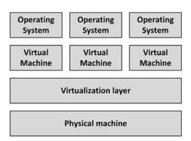
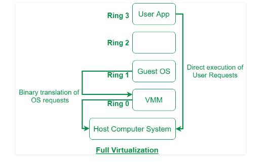
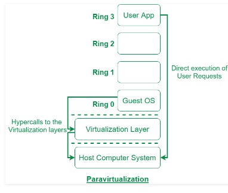
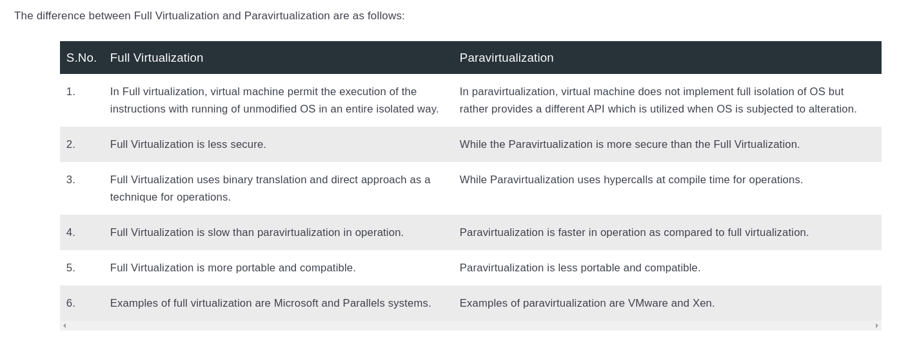

# 4 - Compute Virtualization
Compute virtualization, also known as server virtualization or Software Defined Compute, introduces an abstraction layer between physical computer hardware and the operating system using that hardware. Virtualization allows multiple operating systems to run on a single physical machine.



Virtualization decouples and isolates virtual machines from the physical machine and from other virtual machines by means of a virtualization layer. **A virtual machine is a logical representation of a physical computer in software.**

- Good Feature:
  - They are isolated from each other, meaning that if one virtual machine crashes, the others are isolated from the failure and are unaffected.
  - Allows new virtual machines to be provisioned as needed, without the need for an upfront hardware purchase.
  - By consolidating many physical computers as virtual machines on fewer (bigger) physical machines, costs can be saved on hardware, power, and cooling. Because fewer physical machines are needed, the cost of maintenance contracts can be reduced and the risk of hardware failure is reduced.


## Software Defined Compute (SDC)
VMs are typically managed using one redundant **centralized virtual machine management system**. This enables systems managers to manage more machines with the same number of staff and allows managing the virtual machines using apis.

Centralized management of resources and optimization of resources also eases managements efforts.

Server virtualization can therefore be seen as Software Defined Compute, as shown in Figure below.

![](./resources/software-defined-compute.png

In a SDC architecture, all physical machines are running a **hypervisor** and all hypervisor are manages ** as one layer** using management software.

Via the hypervisor, CPU, memory, disk, and networking resources can be dynamically allocated to virtual machines, where each virtual machine consumes a percentage of the CPU power, memory, network bandwidth, and storage resources of the underlying physical machine.

Some virtualization platforms, allow running virtual machines to be moved automatically between physical machines. It allows vms to be moved to the least busy physical machines, or some physical machines can get fully loaded while other physical machines can be automatically switched off, saving power and cooling cost.

** Availability Features** 
When a physical machine fails, all virtual machines that ran on the failed physical machine can be restarted automatically on other physical machines.

## Disadvantages of Computer Virtualization
- Because creating a new virtual machine is so easy, virtual machines tend to get created for all kinds of reasons (effect known as "virtual machine sprawl"). It can consume lots of resources.
- It introduces an extra layer in the infrastructure, which needs to be managed (This layer requires license fees, systems managers training, and the installation and maintenance of additional tools)
- Database servers typically use all resources of a physical machine extra virtual machines next to a database is impractical. This is the main reason to keep using physical machines for database server.
- Some applications may have problems running on a vm, because it may claim that has no controll over the total stack.


## Full Virtualization vs Paravirtualization






## Network Virtualization 
Network Virtualization (NV) refers to abstracting network resources that were traditionally delivered in hardware to software. NV can combine multiple physical networks to one virtual, software-based network, or it can divide one physical network into separate, independent virtual networks.  

Network virtualization software allows network administrators to move virtual machines across different domains without reconfiguring the network. The software creates a network overlay that can run separate virtual network layers on top of the same physical network fabric.

### How does network virtualization work?
 It makes it possible to programmatically create, provision, and manage networks all in software, while continuing to leverage the underlying physical network as the packet-forwarding backplane.

 Physical network resources, such as switching, routing, firewalling, load balancing, virtual private networks (VPNs), and more, are pooled, delivered in software, and require only Internet Protocol (IP) packet forwarding from the underlying physical network.

 ### Network Virtualization Example
 One example of network virtualization is virtual LAN (VLAN). A VLAN is a subsection of a local area network (LAN) created with software that combines network devices into one group, regardless of physical location. VLANs can improve the speed and performance of busy networks and simplify changes or additions to the network.

 ### Network virtualization from slides
 ```
- Equipamentos tradicionais de rede são sistemas fechados e proprietários.
- Não há como flexibilizar as redes.
Esses equipamentos executam duas funções:
  - decidir o que fazer com os pacotes de dados
  - realizar a operação de transferência desses pacotes
    - esta parte tem de ser executada muito rapidamente, dadas as velocidades das redes atuais

- A ideia básica da virtualização de redes é desacoplar
essas funções. 
  - A primeira pode ser realizada de forma centralizada de modo a facilitar a gerência e permitir alterações dinâmicas na rede
  -  a segunda continua a ser realizada pelo hardware dos equipamentos para não comprometer o desempenho da rede  

 ```

## Container Tecnhology
Originally, operating systems were designed to run a large number of
independent processes. . In practice, however, dependencies on specific versions of libraries and specific resource requirements for each application process led to using one operating system – and hence one server – per application.

Compute virtualization, as discussed in the above section, solves this problem, but at considerable overhead – each application needs a full operating system, leading to high license and systems management cost. And because even the smallest application needs a full operating system, much memory and many CPU cycles are wasted just to get isolation between applications. Container technology is a way to solve this issue.

When all dependencies are encapsulated in containers, applications can run in parallel on the same kernel, using their own libraries and dependencies without interfering with each other.

**Containers Benefits**
- Isolation – applications or application components can be encapsulated in containers, each operating independently and isolated from each other.

- Portability – since containers typically contain all components the application needs to function, including libraries and patches, containers can be run on any infrastructure that is capable of running containers using the same kernel version.

- Easy deployment – containers allow developers to quickly deploy new software versions, as their containers can be moved from the development environment to the production environment unaltered.

### Container implementation
Containers are based on 3 technologies that are all part of the Linux kernel:
- Chroot (also known as a jail) – changes the apparent root directory for the current running process and its children and ensures that these processes cannot access files outside the designated directory tree. Chroot was available in UNIX as early as 1979.

- Namespaces - allows complete isolation of an applications' view of the operating environment, including process trees, networking, user IDs and mounted file systems. It is part of the Linux kernel since 2002.

- Cgroups - limits and isolates the resource usage (CPU, memory, disk I/O, network, etc.) of a collect of processes. Cgroups is part of the Linux kernel since 2008.

### Container Isolation vs VM Isolation
While containers provide some isolation, they still use the same underlying kernel and libraries. Isolation between containers on the same machine is much lower than virtual machine isolation.

Virtual machines get isolation from hardware - using specialized CPU instructions. Containers don't have this level of isolation. 

### Container Orchestration
A container orchestrator enables containers to be run anywhere on a cluster of machines. It schedules the containers to run on any machine that has resources available and it acts like a kernel for the combined resources of an entire datacenter instead of the resources of just a single computer.