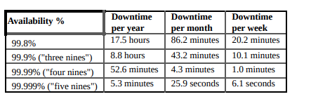
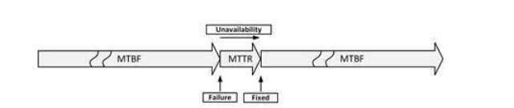
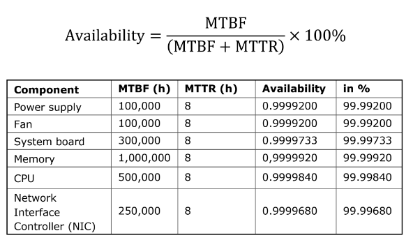
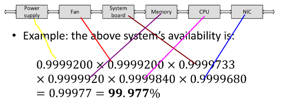
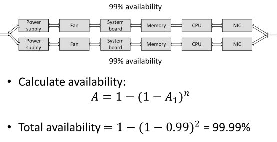
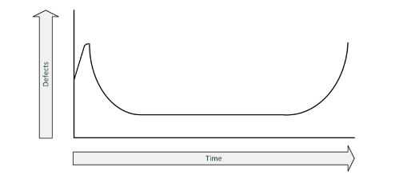
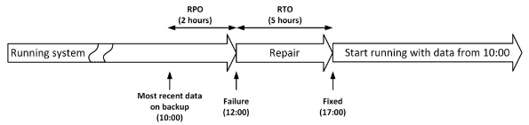

# 5 - Calculating Availability
In general, availability can neither be calculated, nor guaranteed upfront. It can only be reported on afterwards, when a system has run for some years.

## Availability Percentages and Intervals
The availability of a system is usually expressed as a percentage of uptime in a given time period (usually one year or one month).



99.9% availability uptime means 525 minutes of downtime per year, this downtime should not occur in one event, nor should one-minute downtimes occur 525 times a year.

## MTBF and MTTR
Mean Time Between Failures (MTBF): is the average time that passes between failuers.

Mean Time To Repair (MTTR): is the time it takes to recover from a failure.



### MTBF 
The MTBF is expressed in hours (how many hours will the component or service work without failure)

### MTTR
When a component breaks, it needs to be repaired. Sometimes spare parts are kept onsite to lower the MTTR (making MTTR more like Mean Time To Replace).

Some examples of what might be needed for to complete repairs are:
- Notification of the fault (time before seeing an alarm message)
- Processing the alarm
- Finding the root cause of the error
- Looking up repair information
- Getting spare components from storage
- Having technician come to the datacenter with the spare component
- Physically repairing the fault
- Restarting and testing the component

Instead of these manual actions, the best way to keep the MTTR low is to introduce automated redundancy and failover.

### Calculation Time!
Decreasing MTTR and increasing MTBF both increase availability.

#### availability expressed as a percentage


#### availability of a system with serial components
One defect leads to downtime. To calculate the availability of such a
system or device, **multiply the availability of all its parts**.



#### availability of a system with parallel components
To increase the availability, systems (composed of a various components) can be deployed in parallel. This considerably increases the availability, since **the combined system no longer contains a Single Point Of Failure**.



A = Availability

n = Number of systems in parallel

A1 = The availability of one system

#### mtbf of a system with serial components
```
MTBF conjunto = MTBF individual/n
```

#### mtbf of a system with parallel components
```
MTBF redundante = MTBF individual * (1 + 1/2 + ... + 1/n)
```

## Sources of Unavailability

- 80% of outages impacting mission-critical services is caused by people and process issues
- Examples:
  - Performing a test in the production environment (not recommended at
all).
  - Switching off the wrong component (not the defective server that
needs repair, but the one still operating).
  - Swapping a good working disk in a RAID set instead of the defective
one.
  - Restoring the wrong backup tape to production.
  - Accidentally removing files (mail folders, configuration files) or
database entries: drop table x instead of drop table y.
  - Making incorrect changes to configurations (for instance, the routing
table of a network router, or a change in the Windows registry).

### Planned Maintenance
- Sometimes needed to perform systems management tasks:
  - upgrading hardware or software
  - implementing software changes
  - migrating data
  - creating of backups

- Should only be performed on parts of the infrastructure where other parts keep serving clients

- During planned maintenance the system is more vulnerable to downtime than under normal circumstances
  - a temporary SPOF could be introduced
  - systems managers could make mistakes

### Physical Defects
- Everything breaks down eventually
- Mechanical parts are most likely to break first
- Examples:
  - Fans for cooling equipment usually break because of dust in the bearings
  - Disk drives contain moving parts

### Bathtub Curve
- A component failure is most likely when the component is new
- When a component sill works after the first month, it is likely that it will continue working without failure until the end of its life



### Environment Issues
- Environment issues can cause downtime
  - Failling facilities
    - power
    - cooling
  - disasters
    - fire
    - earthquaks
    - flooding

### Complexity of the infrastructure
- adding more components to an overall system design can undermine high availability 
  - even if the extra componenents are implemented to acheive high availability

- Complex systems 
  - Have more potential points of failure
  - are more difficult to implement correctly
  - are harder to manage

- sometimes it is better to just have an extra spare system in the closet than to use complex redundant systems 

## Redundancy
- redundancy is the duplication of critical components in a single system, to avoid a single point of failure (SPOF)
- examples: 
  - a single component having two power supplies, if one fails, the other takes over
  - dual networking interfaces
  - redundant cabling

## Failover
- failover is the (semi)automatic switch over to a standby system or component

## Fallback
- Fallback is the manual switchover to an identical standy computer system in a different location
- typically used for disaster recovery
- three basic forms of fallback solutions
  - hot site
    - A hot site is a fully configured fallback datacenter, fully equipped with power and cooling. The applications are installed on the servers, and data is kept up-todate to fully mirror the production system.
    - Requirer constant maintenance of the hardware, software, data, and applications to be sure the site accurately mirrors the state of the production site at all times.
  - cold site
    - it is ready for equipment to be brought in during an emergency, but no computer hardware is available at the site. The cold site is a room with power and cooling facilities, but computers must be brought on-site if needed, and communications links may not be ready.
  - warm site
    - A warm site could best be described as a mix between a hot site and cold site. Like a hot site, the warm site is a computer facility readily available with power, cooling, and computers, but the applications may not be installed or configured. But external communication links and other data elements, that commonly take a long time to order and install, will be present.

## Business Continuity
- In case of a disaster, the infrastructure could become unavailable, in some cases for a longer period of time
- Business continuity management includes
  - IT
  - Managing business process
  - Availability of people and work places in disaster situations
- Disaster recovery planning (DRP) contains a set of measure to take in case of a disaster, when (parts of) the IT infrastructure must be accommodated in an alternative location


## RTO and RPO
- RTO and RPO are objectives in case of a disaster
- **Recovery time objective (RTO)**
  - The maximum duration of time within which a business process must be restored after a disaster, in order to avoid unacceptable consequences( like bankruptcy)
- **Recovery Point Objective (RPO)**
  - The point in time to which data must be recovered considering some "acceptable loss" in a disaster situation
  
  


## Extended Data Availability and Protection (EDAP)
- Discos requerem atenção especial no planejamento de contingência 
- Estende o conceito de RAID
- Classifica os sistemas em sete níveis, com 3 principais
- Classificação em 3 níveis:
  - Failure Resistant
    - Dados confiáveis permanecem disponíveis imediatamente no caso de falha de um disco
    - O conteúdo do disco é reconstruído on-line em outro disco, mantendo-se um nível aceitável de desempenho de E/S
    - Os dados são protegidos no caso de falha em qualquer unidade substituível em campo (Field Replaceable Unit - FRU) no sistema de armazenamento, canais de E/S e nos hosts. 
    - Mantém-se consistência entre os dados e seu dispositivo de redundância 
    - O usuário é avisado em caso de falha de um componente
  - Failure Tolerant
    - Atende às condições de Failure Resistant
    - Os dados estão protegidos no evento de falha de qualquer cache no sistema de armazenamento
    - Os dados estão protegidos no caso de falha de fontes de alimentação
    - A falha de qualquer componente deve ser comunicado por um aviso (em lugar de indicação)
    - O sistema deve suportar troca de disco com sistema ligado (Hot Swapping) e a utilização de disco de reserva ligado (Hot Spare)
    - Dados confiáveis permanecem disponíveis imediatamente no caso de falha de qualquer componente substituível inclusive cache e fonte de alimentação 
  - Disaster Tolerant
    - Atende às condições de Failure Tolerant 
    - Suporta a capacidade de ligação a múltiplos canais de E/S e a múltiplas fontes externas de energia 
    - Todas as unidades substituíveis em campo são substituíveis com o sistema ligado (hot swappable)
    - Dados confiáveis permanecem disponíveis imediatamente no caso de falha de qualquer zona em um sistema de múltiplas zonas se estas estiverem separadas fisicamente (pelo menos 1 km) 
    - Disater Tolerant + exige que as zonas estejam separadas por mais de 10 km
