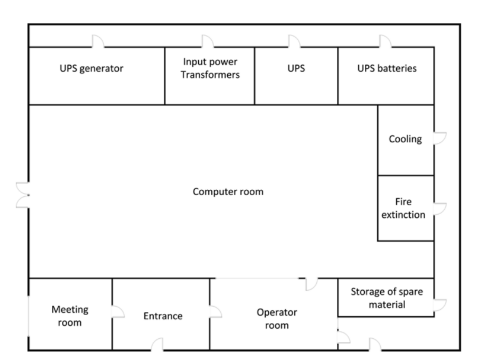
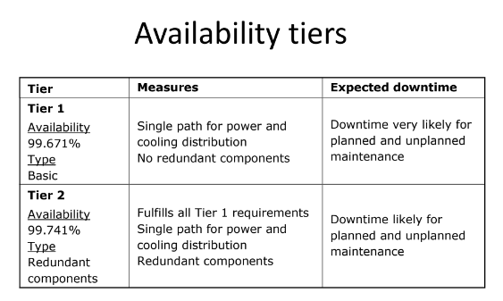
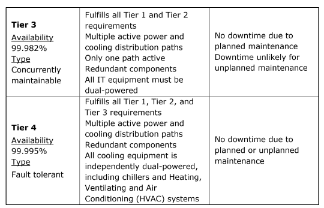

# 6 Data Centers
- Most It infrastructure hardware, except for end user devices, are hosted in datacenters

- A datacenter provides:
  - power supply
  - cooling
  - fire prevention and detection
  - equipment racls

- Today's datacenters are equipped with standardized 19" racks
  - They house servers, storege devices, and network
  - They are installed in rows forming corridors between them

## Datacenter location
- expansion possibility
- environmental risks - flood, natural disasters
- neighbors' risks - collapse, explosion, chemical leak
- personal security
- ease of access

### Location - Questions to think about
```
- Is the datacenter located in a hurricane prone area?
- What is the chance of an earthquake?
- What is the climate like? Datacenter cooling can be easier accomplished and is much cheaper in places with a low ambient temperature with low temperature fluctuations.
- Is the datacenter close to possible external hazards like fireworks  storage, a waste dump, or a chemical plant?
- What is the crime rate? Are there many burglaries in the neighborhood? What about vandalism or the possibility of terrorism?
- Is the datacenter near an airport (chance of crashing airplanes)?
- Is the datacenter near an area that is likely to be closed because of unforeseen circumstances (like a car crash on a nearby highway, a forest fire, a military location, or a nuclear plant)?
- Is the location close to the home or office of maintenance staff, systems managers, and external expertise?
- Can the datacenter be reached easily in case of emergencies?
- Are hospitals, police, and fire fighters located in the vicinity?
```

### Utilities - Questions to Think About
```
- Is it possible to have tw- independent power providers and internet providers?
- Can cabling routes to the building be determined? Is it possible to have double power and data connections leave the building from two different places?
- Can cabling routes inside the building be determined in a flexible way? Are there multiple paths available to the patch panels, floors, and end users?
- Is the datacenter located in a shared building? What if the building must be evacuated? What if the power must be shut down due to maintenance activities performed by another user of the building?
- Is enough power available to supply the datacenter? How reliable is the power supply?
- Is cheap power available? Can the datacenter use renewable energy like wind or water generated power?
- What is the available bandwidth of the external data connections?
Is the datacenter close to an internet exchange point? Are dark fiber connections possible? How reliable are the data connections?
```
### Datacenters Layout


- Computer room – This is where the actual IT infrastructure components like servers, storage, and network equipment are installed.
- UPS generator – A diesel generator providing electrical power in case the utility power input fails. The fuel for the generator should be kept outside of the building or in an isolated room, but also close by and secured.
- Input Power Transformers – Input transformers from the power utility company
- UPS – The Uninterruptable Power Supply system
- UPS batteries – A set of batteries providing short term power used in the system.
- Cooling – The cooling systems.
- Fire extinction – Fire extinction systems.
- Operator room – Room for the datacenter operators. This room has a large window looking into the computer room to spot unusual activity.
- orage room for spare material – Spare hardware and other equipment like tools and boxes can be stored here.
- Entrance – Entrance room to the other rooms. This entrance does not have windows


## Availability Tiers
!
!

## Assembling the Datacenter Infrastructure
Infrastructure can be assembled using the following checklist:
- Build up the physical datacenter room, including raised floors, uninterruptable power supply, cooling facilities, fire prevention and detection, and physical security.
- Install redundant power cabling using separate cables and fuses for every rack.
- Install racks. Ensure enough room is available to walk around the racks and to open all doors. Typically, separate racks are installed for network, storage, and compute components. Check if the computer floor can still be opened (no racks placed on multiple tiles).
- Test the facilities. Test alarms that should respond to a power failure or heating, ventilating and air conditioning (HVAC) failure. Perform a visual check of the facilities. Ensure cables are properly fixed in the racks and labelled. Measure the airflow, temperature, and humidity and test the physical security controls.
- Install the server, networking, and storage hardware in the racks. Ensure not too much equipment is placed in one rack to prevent racks from falling over, using too much power, or obstructing cooling air flow. Ensure cabling is properly installed and labelled. Ensure equipment can be sled out of the racks without damaging cabling. Check if maintenance on a component can be done without interfering with the other components.
- Allow for a burn-in period to ensure the equipment is not “dead on arrival” (DOA) or fails within the first day. Switch the equipment off and on several times to see if it doesn’t break.
- Check the power and cooling usage of the equipment. Are they within the designed and specified range? 
- Configure the infrastructure components. Configure routers, switches, and storage LUNs and install virtualization and operating systems, based on technical designs. Configure DNS, NTP and security configurations like network zoning and firewalls. Perform a basic test to check network connectivity and storage availability.
- Install systems management tools like backup and recovery, monitoring, logging, and IDS/IPS.
- Test systems management processes. Create incidents, create and handle changes, etc.
- Provide as-built documentation to the systems managers. Populate the Configuration Management Database (CMDB).