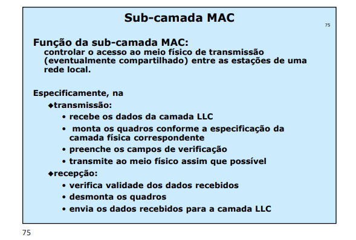
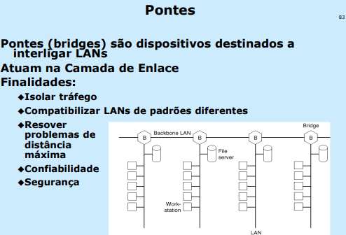

# Medium Access Control Sublayer

## The channel Allocation Problem
how to allocate a single broadcast channel
among competing users. The channel might be a portion of the wireless spectrum
in a geographic region, or a single wire or optical fiber to which multiple nodes
are connected. In both cases, the channel connects each user to
all other users and any user who makes full use of the channel interferes with
other users who also wish to use the channel.

## Multiple Access Protocols
### ALOHA
The basic idea of an ALOHA system is simple: let users transmit whenever
they have data to be sent. There will be collisions, of course, and the colliding
frames will be damaged. Senders need some way to find out if this is the case.

In
the ALOHA system, after each station has sent its frame to the central computer,
this computer rebroadcasts the frame to all of the stations. A sending station can
thus listen for the broadcast from the hub to see if its frame has gotten through.

If the frame was destroyed, the sender just waits a random amount of time and
sends it again.

Problems with collisions

#### Contention Systems
Systems in which multiple users share a common
channel in a way that can lead to conflicts are known as contention systems.

### Slotted ALOHA
In order to improve the efficiency of ALOHA, a new version was created. In this new version there will be time division into discrete intervals called slots, each interval corresponding to one frame.

### Carrier Sense Multiple Access Protocols
In order to improve the performance achieved by the Slotted ALOHA some protocols with specific paradigm were developted. 

Protocols in which stations listen for a carrier (i.e., a transmission) and act
accordingly are called carrier sense protocols

#### Persistent CSMA
When a station has data to send, it first listens to the channel to see if anyone else is transmitting at that moment. If the channel is idle, the
stations sends its data. Otherwise, if the channel is busy, the station just waits
until it becomes idle. Then the station transmits a frame. If a collision occurs, the station waits a random amount of time and starts all over again. The protocol is
called 1-persistent because the station transmits with a probability of 1 when it
finds the channel idle

#### Nonpersistent CSMA
station senses the channel when it wants to send a frame, and if no one else is
sending, the station begins doing so itself. However, if the channel is already in
use, the station does not continually sense it for the purpose of seizing it immediately upon detecting the end of the previous transmission. Instead, it waits a
random period of time and then repeats the algorithm. Consequently, this algorithm leads to better channel utilization but longer delays than 1-persistent
CSMA.

#### p-persistent CSMA
If
it is idle, it transmits with a probability p. With a probability q = 1 − p, it defers
until the next slot. If that slot is also idle, it either transmits or defers again, with
probabilities p and q. This process is repeated until either the frame has been
transmitted or another station has begun transmitting

#### CSMA/CD From Slide

### Sub-layer MAC

### Sub-layer LLC

## Protocols IEEE 802 - Ethernet

### Conection Elements

