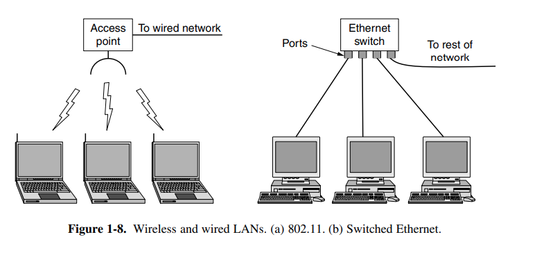
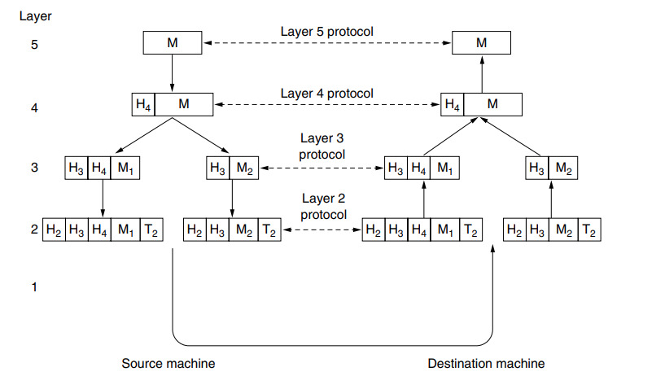
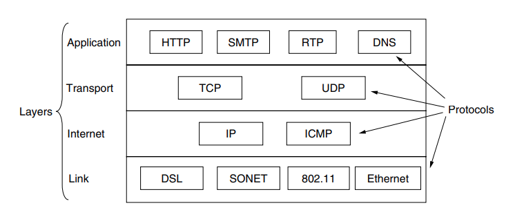

# 7 - Network

## Network Hardware

### Personal Area Networks (PAN)
PANs let devices communicate over the range ofa person. A common example is a wireless network that connects a computer with its peripherals (bluetooth)


### Local Area Network (LAN)
The next step up is the LAN (Local Area Network). A LAN is a privately owned network that operates within and nearby a single building like a home, office or factory. LANs are widely used to connect personal computers and consumer electronics to let them share resources (e.g., printers) and exchange information.

In most cases, each computer talks to a device called an AP (Access Point), wireless router, or base station, relays packets between the wireless computers and also between them and the Internet.

There is a standard for wireless LANs called IEEE 802.11, popularly known as WiFi.

The topology of many wired LANs is built from point-to-point links. IEEE 802.3, popularly called Ethernet.
LA


LANs run at speeds of 100 Mbps to 1 Gbps.

### Wide Area Network (WAN)
A WAN (Wide Area Network) spans a large geographical area, often a country or continent. 

**Componentes**
- Hosts
- Subnet: The rest of the network that connects the hosts;

In most WANs, the subnet consists of two distinct components: transmission lines and switching elements.

Usually in a WAN, the hosts and subnet are owned and operated by different people.

### Internetworks
People connected to one network often want to communicate with people attached to a different one. The fulfillment of this desire requires that different, and frequently incompatible, networks be connected. A collection of interconnected networks is called an internetwork or internet.

The Internet uses ISP (Internet service provider) networks to connect enterprise networks, home networks, and many other networks.


## Network Softwarwe
To reduce their design complexity, most networks are organized as a stack of layers or levels, each one built upon the one below it.

Each layer as its ownp protocol, a protocol is an agreement between the communicating parties on how communication is to proceed.

Each layer passes data and control information to the layer immediately below it, until the lowest layer is reached. Bellow
layer 1 is the physical medium through which actual communication occurs.

Between each pair of adjacent layers is an **interface**. The interface defines which primitive operations and services the lower layer makes available to the upper one.

A set of layers and protocols is called a **network architecture**

### Example information flow supporting virtual communication in layer 5.


## Reference Models

### OSI Reference Model
The OSI model has seven layers.

Note that the OSI model itself is not a network architecture because it does not specify the exact services and protocols to be used in each layer (It just tells what each layer should do).

Three concepts are central to the OSI model:
1. Services.
2. Interfaces.
3. Protocols.
 
Each layer performs some services for the layer above it. The service definition tells what the layer does. A layer’s interface tells the processes above it how to access it. Protocols used in a layer are the layer’s own business. It can
use any protocols it wants to, as long as it gets the job done (i.e., provides the offered services). It can also change them at will without affecting software in higher layers.


#### 1 - Physical Layer
The physical layer is concerned with transmitting raw bits over a communication channel. The design issues have to do with making sure that when one side sends a 1 bit it is received by the other side as a 1 bit, not as a 0 bit.

**Typical questions**
t. Typical questions here are what electrical signals should be used to represent a 1 and a 0, how many nanoseconds a bit lasts, whether transmission may proceed simultaneously in both directions, how the initial connection is established, how it is torn down when both sides are finished, how many pins the network connector has.

#### 2 - Data Link Layer
The main task of the data link layer is to transform a raw transmission facility into a line that appears free of undetected transmission errors.

It accomplishes this task by having the sender break up the input data into data frames (typically a few hundred or a few thousand bytes) and transmit the frames sequentially. If the service is reliable, the receiver confirms correct receipt of each frame by sending back an acknowledgement frame.

#### 3 - Network Layer
The network layer controls the operation of the subnet. A key design issue is determining how packets are routed from source to destination. Routes can be based on static tables that are ‘‘wired into’’ the network and rarely changed, or more often they can be updated automatically to avoid failed components.

If too many packets are present in the subnet at the same time, they will get in one another’s way, forming bottlenecks. Handling congestion is also a responsibility of the network layer, in conjunction with higher layers that adapt the load thyey place on the network.

It is up to the network layer to overcome problems problems like "the package it too large", to allow heterogeneous networks to be interconnected.

#### 4 - Transport Layer
The basic function of the transport layer is to accept data from above it, split it up into smaller units if need be, pass these to the network layer, and ensure that the pieces all arrive correctly at the other end.

#### 5 - Session Layer
The session layer allows users on different machines to establish sessions between them. Sessions offer various services, including dialog control (keeping track of whose turn it is to transmit), token management (preventing two parties from attempting the same critical operation simultaneously), and synchronization (checkpointing long transmissions to allow them to pick up from where they left
off in the event of a crash and subsequent recovery).

#### 6 - Presentation Layer
Unlike the lower layers, which are mostly concerned with moving bits around, the presentation layer is concerned with the syntax and semantics of the information transmitted. **In order to make it possible for computers with different internal data representations to communicate, the data structures to be exchanged can be defined in an abstract way, along with a standard encoding to be used ‘‘on the wire.’’** The presentation layer manages these abstract data structures and allows higher-level data structures (e.g., banking records) to be defined and exchanged

#### 7 - Application Layer
The application layer contains a variety of protocols that are commonly needed by users. One widely used application protocol is HTTP (HyperText Transfer Protocol), which is the basis for the World Wide Web. When a browser wants a Web page, it sends the name of the page it wants to the server hosting the page using HTTP.


#### A Critique to the OSI Model
```
- Devido à sua complexidade
    -a documentação é muito grande para ser bem compreendida
    - é raramente implementado na prática
    - as implementações são grandes e ineficientes

- Devido ao grande sucesso da Internet, que usa o TCP/IP, é
improvável que os protocolos OSI sejam efetivamente usados no futuro
```

### TCP/IP

#### 1 - Link Layer
#### 2 - Internet Layer
- The internet layer is the linchpin that holds the whole architecture together.

- corresponding roughly to the OSI network layer.

- Its job is to permit hosts to inject packets into any network and have them travel independently to the destination (potentially on a different network). They may even arrive in a completely different order than they were sent, in which case it is the job of higher layers to rearrange them

- The internet layer defines an official packet format and protocol called IP (Internet Protocol), plus a companion protocol called ICMP (Internet Control Message Protocol) that helps it function. The job of the internet layer is to deliver IP packets where they are supposed to go.

#### 3 - Transport Layear
Transport layer is designed to allow peer entities on the source and destination hosts to carry on a conversation, just as in the OSI transport layer. Two end-to-end transport protocols have been defined.

- The first one, TCP (Transmission Control Protocol), is a reliable **connection-oriented** protocol that allows a byte stream originating on one machine to be delivered without error on any other machine in the internet.
- The second protocol in this layer, UDP (User Datagram Protocol), is an unreliable, connectionless protocol for applications that do not want TCP’s sequencing or flow control. Used in situations in which prompt delivery is more important than accurate delivery, such as transmitting speech or video. 

#### 4 - Application Layer
On top of the transport layer is the application layer. It contains all the higher-level protocols. The early ones included virtual terminal (TELNET), file transfer (FTP), electronic mail (SMTP), and HTTP.

