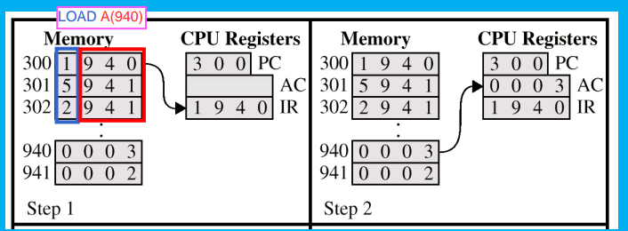
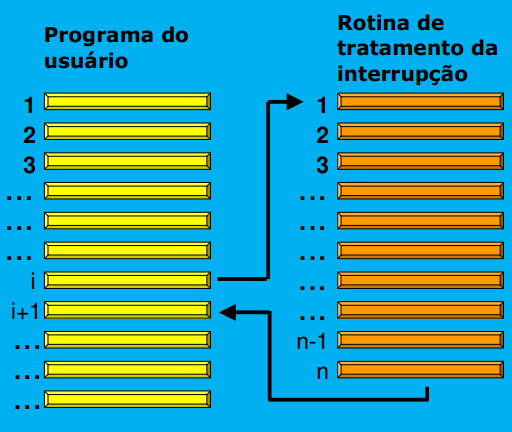
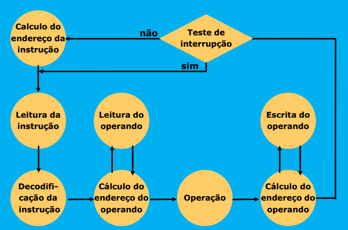

# Notes-References-Resources 1

- [Notes-References-Resources 1](#notes-references-resources-1)
  - [Fabricação CPU](#fabricação-cpu)
  - [Velocidade e Dissipação](#velocidade-e-dissipação)
  - [Lei de Amdahl](#lei-de-amdahl)
  - [Mainframes](#mainframes)
  - [Servidores](#servidores)
    - [Servidores Desktops vs Servidores x86](#servidores-desktops-vs-servidores-x86)
    - [Servidores em Blades](#servidores-em-blades)
    - [Servidores "Open Compute Project"](#servidores-open-compute-project)
  - [Processadores](#processadores)
    - [Modelos Conceituais de Processadores](#modelos-conceituais-de-processadores)
    - [Fluxo de Dados e de Controle](#fluxo-de-dados-e-de-controle)
    - [Componentes Básicos de um Computador](#componentes-básicos-de-um-computador)
    - [Funcionamento Básico de um Computador](#funcionamento-básico-de-um-computador)
  - [Instrução](#instrução)
    - [Diagrama de Estados](#diagrama-de-estados)
    - [Instrução de Desvio](#instrução-de-desvio)
      - [Interrupções](#interrupções)
      - [Diagrama de estados + Interrupções](#diagrama-de-estados--interrupções)
      - [Tipos de Interrupções](#tipos-de-interrupções)
  - [Arquitetura do Conjunto de Instruções](#arquitetura-do-conjunto-de-instruções)
  - [Estados do Processador](#estados-do-processador)
    - [Como SO Garante Proteção Contra Interferências Entre Processos?](#como-so-garante-proteção-contra-interferências-entre-processos)

<small><i><a href='http://ecotrust-canada.github.io/markdown-toc/'>Table of contents generated with markdown-toc</a></i></small>

- Arquitetura de um computador é o conjunto de atributos de um sistema de computação, como é visto pelo programador, isto é, a estrutura conceitual e o comportamento funcional, sem considerar a organização dos fluxos de dados e de controle, nem a implementação física.

## Fabricação CPU
- Lingote de silício monocristalino ultra puro é cortado em fatias, e estas polidas.
- Aplica-se uma camada de material fotossensível, e a seguir a placa é exposta à luz ultravioleta.
- A parte não atingida pela luz é removida com um solvente.
- A parte exposta é corrida por um processo químico, e o restante do material fotossensível é removido.
- O processo é repetido até que todas as operações sobre o silício estejam
completas.
- Aplica-se uma fina camada de cobre. Repete-se as técnicas anteriores para remover as partes desnecessárias.
- O processo é repetido para produzir todas as interconexões necessárias. Os chips são testados ainda no wafer
- Os componentes são cortados e em seguida emcapsulados.

## Velocidade e Dissipação
Quanto mais rápido um circuito opera, maior é a quantidade de energia que consome (e portanto precisa dissipar, sob forma de calor).

## Lei de Amdahl
Aumento de velocidade devido ao melhoramento E:

```
aumt vel (e) = (temp exec sem e) / (temp exec com e)
```

- Se E for pequeno, não há uma diferença significativa no resultado
- O importante é melhorar as parte do processo que consomem um percentual significativo do tempo total


## Mainframes
Mainframes razões para utilização:
- Cultura instituição
- Software Legado
- Segurança

## Servidores
- "Baixa diversidade" fatores relevantes:
  - Compatibilidade com aplicações existentes
  - Tipo de suporte existente
  - Coerência com projeto de evolução

- Múltiplos tipos de servidores implicam em problemas
  - suporte
  - compatibilidade
  - diálogo

### Servidores Desktops vs Servidores x86

- Servidores x86 e desktops não apresentam diferenças em arquitetura e implementação

- A diferença reside na execução:
  - Desktops - menor custo
  - Servidores - maior confiabilidadeservidores desktops vs servidores x86

### Servidores em Blades
- Designa uma execução compacta de servidores.

- Cada blade contém um servidor completo, com:
  - Processador
  - Memória
  - Disco para SO
  - Outras interfaces, pelo menos Ethernet

### Servidores "Open Compute Project"
Projeto de arquitetura aberta, desenvolvido por Facebook, e posteriormente outras grandes empresas, como Microsoft e Intel Objetivos eficiência energética e economia.

## Processadores
### Modelos Conceituais de Processadores
- Harvard: Programas e dados residem em memórias diferentes e específicas.
- von Neumann: programas e dados compartilham a mesma memória.
- PS: Os processadores modernos apresentam aspectos das duas arquiteturas.

### Fluxo de Dados e de Controle
Fluxo de Dados e de Controle

- O fluxo de dados (datapath) representa os caminhosque os dados podem percorrer em um sistema digital.

- O fluxo de controle representa os sinais de controlenecessários para que o fluxo de dados funcione como desejado.

### Componentes Básicos de um Computador
- unidade de processamento: realiza operações
- memória: armazena dados e instruções
- controle: controla a operação de todas as unidades (geralmente não é representado)

### Funcionamento Básico de um Computador
```
start -> (A) obtém a proxima instrução -> executa a instrução -> (A) ou FIM
```

## Instrução
```
 [(oper) (   endereço   )]
 [LOAD A(940)]
 ```


- Instruções são compostas por uma seqüência de bits.


- Tipos de Operando
  - referencia a registradores
  - referencia a endereçõs de memória
  - implícitos
### Diagrama de Estados
```
1. Calculo do endereço da instrução (A)
2. Leitura da instrução
3. Decodificação da instrução
4. Calculo do endereço do operando
     4.1. leitura do operando 
5. Operação
6. Cáculo do endereço do operando
    6.1 Escrita do Operando
7. (A)
```
### Instrução de Desvio
- Função: passar a executar uma instrução em outro trecho do programa.
- pode ser **condicional** ou **incondicional**

#### Interrupções
Há interrupções com a preservação do endereço da proxima instrução. 

Operação de desvio, com PRESERVAÇÃO do endereço dapróxima instrução, causada por um evento externoao processador como E/S.



#### Diagrama de estados + Interrupções


#### Tipos de Interrupções
- Entrada e saída
- Temporizador (relógio)
- Trace
- Falha de página
- Falta de energia
- Operações aritméticas inválidas
- Instruções inválidas
- Erro de endereçamento
- Proteção de memória
- Defeito de hardware

## Arquitetura do Conjunto de Instruções
```
==== Software ====
       |
=-=-Interface-=-=
       |
-----Hardware-----
```

- Qualidade interface:
  - Resiste a muitas implementações
  - é de uso cômodo no nível superior
  - permite uma implementação eficiente no nível inferiror

## Estados do Processador
- Para evitar que programas de usuários interfiram entre si, certas intruções podem ser usadas apenas pelo SO (instruções especiais de controle).
- O processador pode estar em estado de usuário ou de controle
- instruções especiais (de controle):
  - iniciar op. E/S
  - promover alocação de memória
  - Parar o processador

### Como SO Garante Proteção Contra Interferências Entre Processos?
- Memória dividida em blocos
- SO atribui a cada processo um conjunto de blocos que podem ser acessados, lidos e escritos apenas pelo próprio processo.
