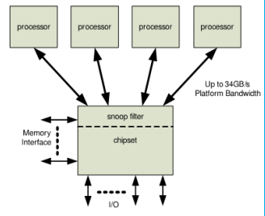
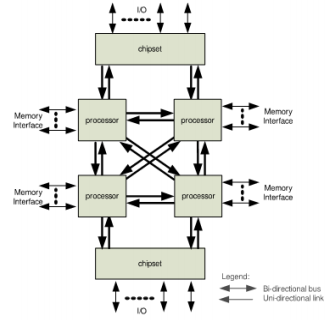
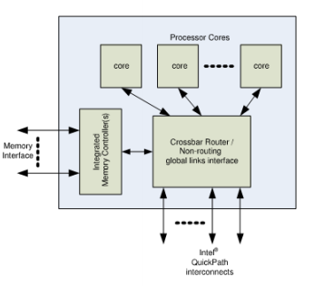
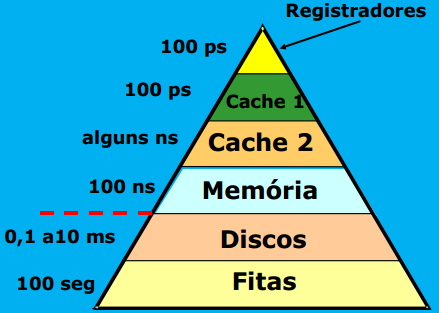
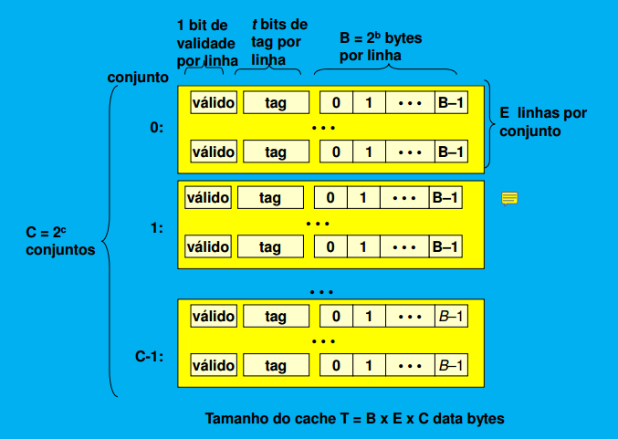

# Notes-References-Resources 2
- [Notes-References-Resources 2](#notes-references-resources-2)
  - [Hyperthreading](#hyperthreading)
    - [Hyperthreading References](#hyperthreading-references)
  - [Evolução da Arquitetura Memória-Processador](#evolução-da-arquitetura-memória-processador)
  - [Memórias](#memórias)
    - [Tipos de Memórias](#tipos-de-memórias)
    - [Conteúdo Fixo](#conteúdo-fixo)
      - [ROM](#rom)
    - [Conteúdo Variável](#conteúdo-variável)
      - [Memória RAM](#memória-ram)
        - [DRAM (Dynamic RAM)](#dram-dynamic-ram)
        - [SRAM (Static RAM)](#sram-static-ram)
        - [DRAM vs SRAM](#dram-vs-sram)
  - [Hierarquia de memórias](#hierarquia-de-memórias)
    - [Princípio da Localidade](#princípio-da-localidade)
    - [Nomeclatura](#nomeclatura)
  - [Como é Organizado o Cache?](#como-é-organizado-o-cache)
  - [Princípio Funcionamento Dos Caches](#princípio-funcionamento-dos-caches)
    - [Processo de transferência de dados](#processo-de-transferência-de-dados)
    - [Mapeamento direto Cache e Memória](#mapeamento-direto-cache-e-memória)
    - [Escrita em memória](#escrita-em-memória)
      - [Write back - escrita realizada somente no cache](#write-back---escrita-realizada-somente-no-cache)
      - [Write through](#write-through)
    - [Desempenho com Cache](#desempenho-com-cache)
      - [Desempenho com Cache de Segundo Nível (L2)](#desempenho-com-cache-de-segundo-nível-l2)
    - [Tipo de Falhas em Cache](#tipo-de-falhas-em-cache)
      - [Solução](#solução)

<small><i><a href='http://ecotrust-canada.github.io/markdown-toc/'>Table of contents generated with markdown-toc</a></i></small>

## Hyperthreading
- Hyperthreading is the hardware solution to increasing processor throughputby decreasing resource idle time.
- the hyperthreadedprocessor, in effect, acts like two CPUs in one.
- Allows multiple concurrent threads to be executed. Threads are interleaved so that resources not being used by one thread are used by others.
- fillexecution slots, thereby making more efficient use of available execution resources by keeping the execution core busier. 

### Hyperthreading References
- [](http://meseec.ce.rit.edu/551-projects/spring2016/2-3.pdf)
- [](http://alvarestech.com/temp/smar/www.delt.ufmg.br/seixas/PaginaATR/Download/DownloadFiles/Introduction%20to%20Multithreading.pdf)

## Evolução da Arquitetura Memória-Processador

1. Acesso por interconexões dedicadas


2. Acesso por interconexões **QuickPath**



## Memórias
### Tipos de Memórias
- Conteúdo Fixo: ROM, PROM
- Conteúdo Quase Fixo: FLASH
- Conteúdo variável: M. estática, M. dinâmica, M. flash
   - Conteúdo Fixo: ROM, PROM
- Conteúdo Quase Fixo: FLASH
- Conteúdo variável: M. estática, M. dinâmica, M. flash

### Conteúdo Fixo
- São memórias cujo conteúdo é fixo e não pode ser alterado.

#### ROM
- ROM é uma memória cujo conteúdo é fixo e não pode ser alterado.
- Há vários tipos de ROMs: todos são não-voláteis, i.e. não requerem energia para manter o seu conteúdo.
- Um importante uso de ROM é em processador CISC para armazenar o microprograma.
- ROM pode ser fabricado com portas NOR ou NAND, com um layout denso.
- Como ROM não pode ser alterada, erro de um bit pode acarretar em discartar um lote inteiro.

### Conteúdo Variável
#### Memória RAM
- Pode ser de dois tipos: DRAM e SRAM, ambos voláteis (o conteúdo se perde quando o computador é desligado e depois religado).
- A unidade básica de armazenamento é uma célula contendo um bit

##### DRAM (Dynamic RAM)
- usada na memória principal.
- O capacitor armazena ou não carga elétrica, representando 1 e 0, resp.
- Quando carregado, o capacitor pode perder carga por vazamento.
- Para manter um capacitor que representa 1 sempre carregado, um pulso de
- refrescamento é aplicado periodicamente. Daí o nome dinâmico.

```
DRAM stores the binary information in the form of electric charges that applied to capacitors. The stored information on the capacitors tend to lose over a period of time and thus the capacitors must be periodically recharged to retain their usage. The main memory is generally made up of DRAM chips.

it is cheaper than SDRAM, because requirer 1 capacitor and one transistor while sram requirers several transistors

reduced power consumption due to the fact that the information is stored in the capacitor.
```

- Leitura destrutiva
  - Assim, o conteúdo deve ser restaurado após cada leitura, levando à existência de dois tempos:
    - tempo de acesso - o necessário para obter o valor desejado
    - tempo de ciclo - o total para leitura e restauração, até que uma nova operação possa ser iniciado.

- A  memoria é organizada como uma matriz bidimensional (linhas vs colunas)
- a leitura afeta toda uma linha
- a coluna é selecionada após a leitura da linha

##### SRAM (Static RAM)
- A memória estática mantém o dado inalterado, **desde que haja energia**. É usada na memória cache, sendo menos densa, mais rápida e mais custosa do que DRAM.
- SRAM 6 transistores por bit vs DRAM1 transsitor por bit.
- Retém o valor indefinidamente, até o equipamento ser desligado.
- Capacidade  << DRAM
- Custo >> DRAM
- Tempo de acesso << que as DRAMs

##### DRAM vs SRAM
- Ambas são voláteis.
- A célula DRAM é mais simples e ocupa menos espaço que uma célula SRAM.
- Portanto DRAM é mais densa (mais células por unidade de área) e mais barata.
- Por outro lado, DRAM requer uma circuitaria de refrescamento. Para memórias grandes, esse custo fixo é mais que compensado pelo menor custo.
- Daí DRAM é preferida para memórias grandes e SRAM (que é um pouco mais rápida) é mais usada em memória cache.

## Hierarquia de memórias

### Princípio da Localidade
Programas tendem a acessar parte pequena de seu espaco de enderçmto em um certo interfavo de tempo

- Localidade temporal: se item foi referenciado, é provavel que será referenciado em seguida.
- Localidade Espacial: se um item foi referenciado, provável que os vizinhos sejam.

### Nomeclatura
```
- TMAM Tempo Médio de Acesso à Memória (AMAT - Average Memory Access Time)
- nível superior mais próximo do processador
- nível inferior mais afastado do processador
- falha (miss) quando a palavra procurada não está no nível superior
- taxa de falhas (miss rate) percentual dos acessos ao cache que resultam em falha
- penalidade por falha (miss penalty) tempo adicional quando ocorre uma falha
- sucesso (hit) quando a palavra procurada está no nível superior
```
## Como é Organizado o Cache?
- É dividido em conjuntos
- Cada conjunto contém uma ou mais linhas
- Cada linha contém um tag e um bloco de dados



## Princípio Funcionamento Dos Caches
- processador gera endereço
- cache verifica se tem info.
    - se estiver manda para processador.
- se não tiver vai até memoria principal.

### Processo de transferência de dados
- cpu & cache: uma única palavra por operação
- cache & mem: bloco por operação
### Mapeamento direto Cache e Memória
- uma única linha por conjunto
- cada posição de memória só pode ser copiada para uma determinada linha do cache
- O mapeamento direto é simples mas tem uma desvantagem. Se o programa acessa repetida e alternadamente dois blocos de memória mapeados à mesma posição na cache, então esses blocos serão continuamente introduzidos e retirados da cache. 
- O fenômeno acima tem o nome de **thrashing**, resultando em um
número grande de hit miss ou baixa hit ratio.

### Escrita em memória
#### Write back - escrita realizada somente no cache
- caso haja necessidade de uma linha conter outra posição de memória, verifica se esta suja. caso esteja
    - A linha é escrita na memoria
    - a outra posição de memória é enviada para o cache

#### Write through 
- todas as escritas são feitas no cache e na memória
- usa buffer para escrever
- nos dois casos, a escrita pode ser feita diretamente na memória ou em um buffer para escrita quando houver tempo.
  
### Desempenho com Cache
```
TMAM (tempo médio de acesso à memória): tempo de hit + Tax de falhas * penalidade por falha
```

**Exemplo**: 
- tempo de hit: 1; taxa de falhas: 2%; penalidade por falha= 50
```
TMAM = 1 + 0,02 * 50 = 1 + 1 = 2
``` 

#### Desempenho com Cache de Segundo Nível (L2)
```
TMAM = tempo de hit1 + taxa de falhas1 x (tempo de hit2 +
taxa de falhas2 x penalidade por falha2
```

### Tipo de Falhas em Cache
- compulsórias: O primeiro acesso a um bloco nunca o encontra no cache; assim, o bloco tem que ser trazido para o cache pelo menos uma vez. (A falha ocorre mesmo com um cache infinito).
- capacidade: Se o cache não conseguir conter todos os blocos necessários durante a execução, falhas por capacidade vão ocorrer, obrigando à remoção de blocos que serão necessários mais tarde.
- conflito: Se a estratégia de alocação de blocos for parcialmente associativa ou por mapeamento diretos, falhas por conflito vão ocorrer pois a posição em que um bloco pode ser colocado pode estar ocupada,
mesmo existindo outras posições livres no cache.

#### Solução
- Falhas compulsórias: eventos inevitáveis.
- Falhas por conflito: aumenta-se o tamanho ou a associatividade do cache.
- Falhas por capacidade: aumenta-se o cache.