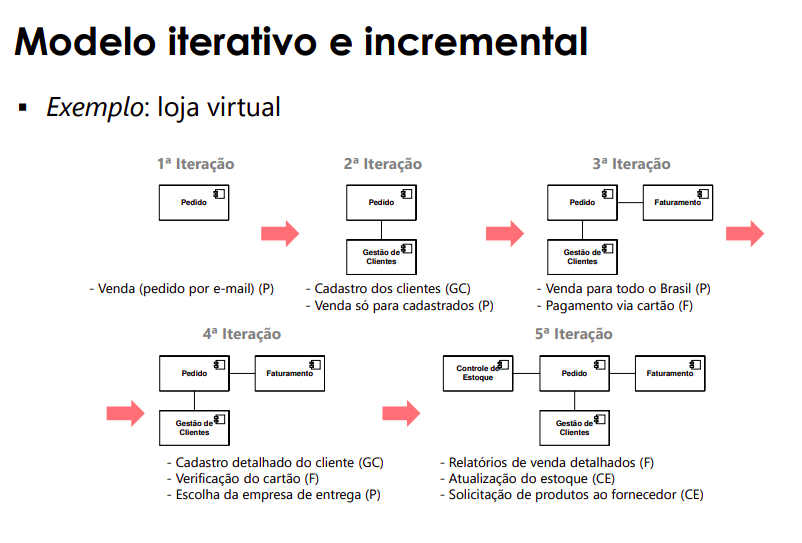

# Processos de Software

## Definição de Processos (ISO, 2017)
Conjunto de atividades inter-relacionadas ou interagindo que transforma entradas em saída

- O processo pode ter um **objetivo**
- Importância do **valor** da saída para a organização
- Um processo tem um **cliente**
- Pode cruzar **fronteiras** organizacionais

## Processo 
Quais são os elementos de um processo? Como descrevê-lo?
```
>>> BPMN é uma sintaxe concreta/notação <<<
>>> PMBOK corpo de conhecimento, mais abrangente, conceitos genéricos<<<
>>> SCRUM é um framework gerencial <<<
```
- etapas, atividades, tarefas
- duração
- entrada
- saída
- ordenação
- relacionamento (critério de entrada e saída)
- marco
- artefato
- papeis
- ferramentas
- métodos

Uma pessoa pode acumular vários papeis dentro de um processo

Para algumas situações um processo se sai melhor que outro. Qual é o melhor processo, sempre depende do contexto que ele será/está inserido.

### Os processos serão sempre iguais? 
**Não**

Algumas influências:
- Tamanho do projeto
- Complexidade do software
- Experiência da equipe
- Uso de novas tecnologias
- Tipo de projeto
- Distribuição da equipe
- Time to market
- Contrato/Questões legais

### Quem decide como será o processo?

Algumas variáveis a considerar:
- Cultura organizacional
- Modelo de ciclo de vida: iterativo, incremental, cascata...
- Processos de desenvolvimento: RUP, XP, UP
- Métodos: métodos de elicitação de requisitos, test-first, Kanban, SCRUM...
- Linguagens de programação: XPTO, BLA, Java
- Tecnologias: ferramentas, máquinas, bibliotecas

### Qual é o problema de se usar um processo inadequado?
- atraso
- custo
- qualidade
- escopo
- retrabalho
- desmotivação
- excesso de burocracia

## Desenvolvimento de Software

### Desenvolvimento de software ou de sistemas?
- Sistema == Software?

- Sistema: Combinação de elementos que interagem, organizados para atingir um ou mais propósitos estabelecidos (ISO, 2017)

Alguns Elementos de um sistema:
- Hardware
- Software
- Dados
- Pessoas
- Processos
- Serviços
- Instalações
- Materiais
- Entidades naturais (água, organizmos e minerais)

O desenvolvimento de software é um dos processos do desenvolvimento de um sistema.

### Em uma empresa que trabalha com software o desenvolvimento é o único processo? Quais são esses outros processos?
**Não, existem muitos outros processos envolvidos**, e uma norma que tenta descrever alguns processos envolvidos é a ISO 12207

Alguns exemplos de processos:
- Processo de contratação de pessoas
- Treinamento
- Processos de áreas de suporte (RH, Marketing etc)
- Gerência 


## ISO 12207
- Define um quadro de referência para os processos de software
	- Terminologia básica: comunicação
	- Pode ser usado para definir processos necessários
		- Adquirentes, fornecedores e outros stakeholders
		- base para a melhoria de processos

- Especifica/Responde para cada processo as perguntas abaixo
	- Quais os propósitos do processo?
	- Quais os resultados que deseja-se obter?
	- Quais as atividadeds e tarefas envolvidas?
	- **PS: A ISO 12207 não da os "detalhes" de como executar o processo, apenas uma visão geral. É uma referencia**

- Não especifica
	- Modelos de ciclo de vida, metodos, ferramentas, tecnicas ou documentos
	
- Necessário instanciar os processos na organização
	- Adição e remoção de atividades e tarefas
	- alteração da ordem definida
	- análise da necessidade dos processos

### Processos definidos na ISO 12207
- Processos de acordo
  - **Estabelecem acordo entre organizações**
    - Processos de aquisição 
    - processos de fornecimento 

- Processos organizacionais habilitadores do projeto
  - Proveem os recursos que permitem que o projeto atenda as necessidades e expectativas dos stakeholders
  - Processos que a empresa precisa ter para permitir que existam processos de criação/desenvolvimento/manutenção de software
    - Processos de gerência do modelo de ciclo de vida (processo que cuida dos processos que a empresa usa, como quais processos, ferramentas, frameworks, métodos que serão utilizados)
    - processo de gerência de infraestrutura
    - processo de gerência de recursos humanos
    - processo de gerência de portfólio
    - processo de gerência da qualidade
    - processo de gerência do conhecimento 

- Processos de gerenciamento técnico
  - Basicamente são os processos de gestão de projetos. O gestor participa/faz vários dos processos descritos abaixo
  - Gerenciam os recursos e ativos alocados pela gestão da organização
  - Aplicam os recursos e ativos para atingir o que foi acordado
    - Processo de planemento do projeto
    - Processo de avaliação e controle de projeto 
    - Processo de gerência de decisão
    - Processo de gerência de risco
    - Processo de gerência de configuração
    - Processo de gerência de informação
    - Processo de medição
    - Processo de garantia da qualidade

- Processos técnicos
  - tratam das ações técnicas durante o ciclo de vida do projeto
    - processo de análise de negócio ou da missão
    - processo de definição das necessidades erequisitos dos stakeholders
    - processo de análise de requisitos de sistema/software
    - processo de definição da arquitetura
    - processo de definição do design
    - processo de análise de sistema
    - processo de implementação
    - processo de integração
    - processo de verificação
    - processo de transição
    - processo de validação
    - processo de operação
    - processo de manutenção
    - processo de descarte
## Processos de desenvolvimento
### Nomeclatura Professor
- Atividades "clássicas"

Definição e analise de requisitos
  - levantar os requisitos do software
  - refinar e estrutar os requisitos

Projeto 
- projetor como o software deve fazer o que foi requisitado

Implementação 
- criar o software
- criar e executar os testes de unitade

Teste
- executar o software criado em busca de defeitos

Implantação
- Colocar o software no ambiente real

### Nomeclatura ISO 12207

## Processos técnicos - Modelos de ciclo de vida
São como frameworks

### Modelo Cascata
- atividades sçao executadas em sequência
	- uma atividade só começa quando a anterior termina
	- resultado de cada atividade é aprovado
- o software é entregue uma vez, no final.


#### Vantagens
- Diminui esforço de gestão - cronogramas simples, etc
- Modelo simples - facil entender as atividades e explicar 

#### Problemas
- Comunicação entre as atividades
- Cliente só vê o software no final
- defeitos demoram para aparecer
- custo maior para corrigir erros
  - alteração afeta outras partes do software
  - indisponibilidade da equipe original
- requisitos ficam congelados, mas o ambiente de negócio muda...
- as últimas atividades sofrem com o atraso

### Modelo Iterativo e Incremental
- software construido aos poucos
- cada fase entrega parte do software
  - software é entregue com mais frequência


#### Modelo Incremental
- O modelo incremental o software é construido em pedaços. Cada incremento entrega um conjunto de requisitos
- Vantagens:
  - Prioriza o desenvolvimentos
  - ultimas atividades não sofrem com atraso, mas os ultimos incrimentos sofrem
- Problema:
  - Pode haver atrasos nos ultimos incrementos
  - não lida com mudanças nos requisitos, pois as partes já criadas não são corrigidas (=cascata) 


#### Modelo Iterativo
- Cada interação **revisa** e **melhora** o software
- participação do cliente
- Vantagens:
  - lida naturalmente com mudanças nos requisitos
  - o ambiente de negócio muda
  - o entendimento do software é melhorado
- Problema:
  - retrabalho
  - primeiras versões têm diversos problemas
  - não prioriza as funcionalidades
  - importância de uma boa arquitetura
  - refinamento infinito


#### Exemplo

### Cascata vs Incremental vs Iterativo vs Iterativo-Incremental

Cascata - Projetos pequenos

Incremental - Projeto com requisitos muitooo bem definidos

Iterativo - Projeto pequeno com requisitos não tão claros

Iterativo e Incremental - Bala de prata/resposta genérica


## Cascata X Agil, Faz sentido essa comparação?
- No comparar, cascata é só um modelo de ciclo de vida, então não faz sentido comparar com ágil.
- Ágil é um conjunto de abordagens que usam o modelo iterativo e incremental


