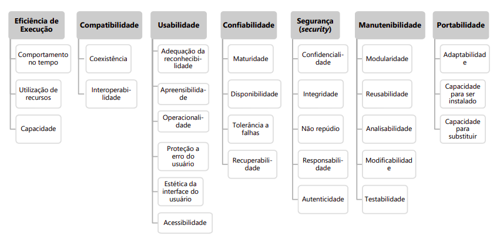
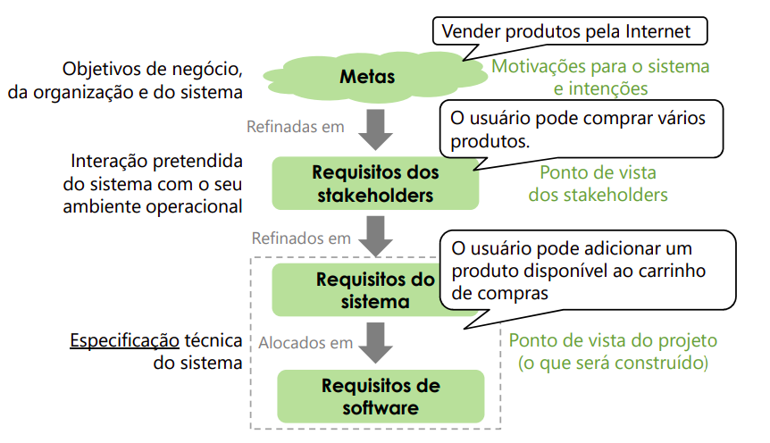
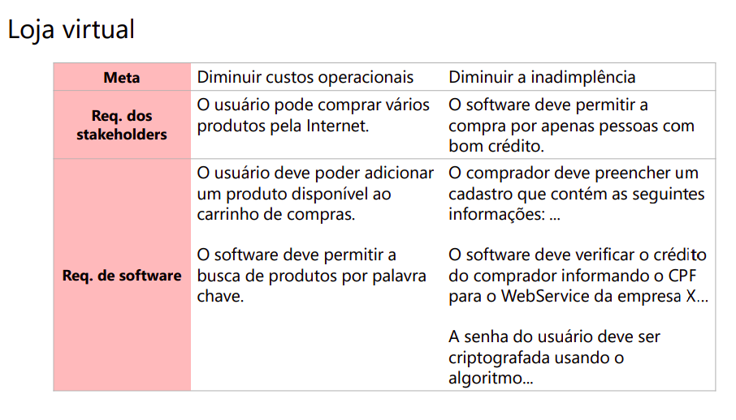
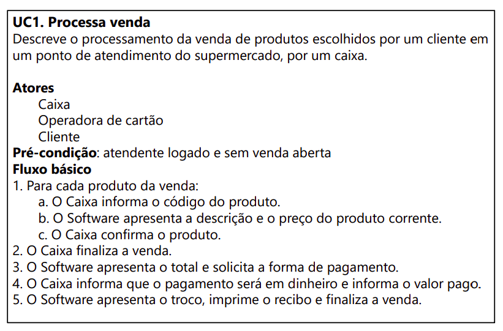
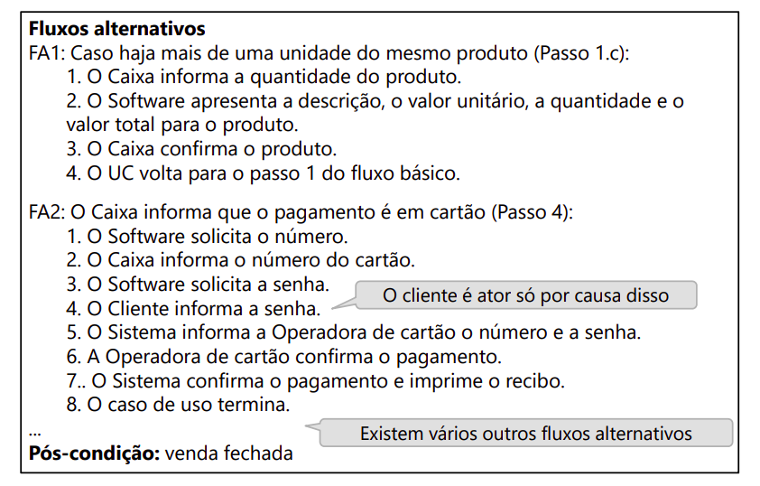

# Engenharia de Requisitos
 
## Definição - Engenharia de Requisitos
função interdisciplinar que media entre os domínios do adquirente e fornecedor para **estabelecer e manter** os requisitos a serem atendidos pelos sistemas, software ou serviço de interesse (ISO, 2018)
 
## Motivação
- defeitos de requisitos são caros
   - custo relativo para corrigir defeitos
- descobrir defeitos durante a fase de levantamento de requisitos diminui o custo a longo prazo do projeto
 
- Algumas razões para projeto de software falharem
   - não entender as necessidades do negócio
   - falta de habilidade de chegar a um consenso de prioridades
   - falta de clareza e estratégia
   - não começar com o cliente final
   - requisitos não claros
   - esperar uma "bala de prata"
   - trabalhar de forma isolada (ignorar o negócio ou o problema)
   - etc
 
## Problemas que geram defeitos no levantamento dos requisitos
- Envolvimento baixo do usuário insuficiente
- planejamento impreciso
   - planejamento feito com poucas informações
- aumento incontrolável dos requisitos
- ambiguidade dos requisitos
- requisitos desnecessários
   - funcionalidade que "usuário vai adorar"
- stakeholders menosprezados
- dificuldade de o stakeholder expressar o que quer
- dificuldade de o Engenharia de Requisitos entender o stakeholder
 
## "O cliente não sabe o que quer"
o cliente sabe o que ele quer, mas o problema é que o cliente não sabe expressar/explicar o que ele quer.
 
- dificuldade de o stakeholder expressar o que quer
- dificuldade de o Eng. Req. entender o stakeholder
 
- ... às vezes eles não sabem bem o que querem
   - processo criativo -> Eng. Req. e stakeholders
   - mas eles sabem **porquê** querem
 
## Definição - Stakeholder
- pessoas ou organizações que têm um interesse no sistema a ser desenvolvido (Pohl,2021)
- pode ser considerada fonte de requisitos
- **desenvolvedor é stakeholder?** Sim, ele leva opções de solução que podem influenciar requisitos, necessidades etc.
- agências reguladoras são stakeholders
 
## Definição - Requisito
- uma afirmação que traduz ou expressa uma **necessidade** e suas **restrições** e condições associadas.
 
### Por que devemos evitar colocar detalhes de implementação nos requisitos?
- porque dessa forma você está restringindo o leque de opções que podem ser utilizadas para a implementação.
 
## Requisitos Funcionais vs. Não Funcionais vs. Restrições
### Requisitos Funcionais
- especificam a funcionalidade que os sistema deve prover aos usuários
   - Resultados de operações a serem automatizadas
   - condições sob as quais as operações devem ser aplicadas
   - exemplos
       - validações das entradas
       - sequência exatas de operações
       - respostas para a situações anormais (ex: tratamento de erros e recuperação)
       - relações entre saídas e entradas (ex: sequências e fórmulas)
 
- **ex: loja virtual**
   - O software deve permitir a busca de produtos por palavra chave
   - Um usuário pode adicionar um produto disponível ao carrinho de compras
 
### Requisitos não funcionais
- definem **propriedades de qualidade** para sistemas
   - **restringem** os requisitos funcionais
   - também chamados de requisitos de qualidade
- **ex: loja virtual**
   - A verificação do cadastro do usuário deve demorar no máximo 5s
   - Apenas um técnico com privilégios de Administrador deve ter acesso aos logs do sistema
 

 
### Restrições
- Restrição **organizacional** ou **tecnológica** que afeta como o software deve ser desenvolvido
   - Orçamento, plataformas, linguagens, leis, soluções tecnológicas etc.
   - Muitas vezes considerada como requisitos não funcionais
- **ex: loja virtual**
   - A interface web deve usar o framework React
   - O software deve ser entregue até dia 02/06
   - O projeto deve usar Scrum
 
## Requisitos
 
- importante perguntar o "porquê" -> _metas_
 - Provêm um racional para o requisito
 - Ajudam a identificar regras de negócio
 - Facilitam encontrar requisitos implícitos
 - Ajudam a entender a importância do requisito
 - Facilitam o entendimento do requisito
### Metas
- Objetivos que o software deve atingir
- Em geral são apresentadas de forma vaga
- exemplos:
   - Diminuir custos
   - Diminuir o número de funcionários
   - Usar tecnologias modernas
## Níveis de abstração

 
### Exemplo - Loja virtual

 
## Atividades de ER
- elicitação
- documentação
- negociação
- verificação e validação
- gestão
### Elicitação
- Objetivo: Elicitar todos os requisitos no nível adequado para o sistema a ser desenvolvido
- Necessário Documentar
- Quais são as fontes de requisitos?
   - Stakeholders
   - Documentos existentes
       - guias, documentos de sistemas antigos, leis, manuais etc
   - Sistemas existentes
       - sistema atual, similares e concorrentes
       - ambiente operacional e empresarial
 
### Documentação
 
### Negociação
- Stakeholders têm diferentes interesses e necessidades
   - Contradições e dificuldades de atender a todos
- Tipos de conflitos:
   - DE INTERESSE: diferentes metas/requisitos
   - DE VALOR: importância dos requisitos
   - DE DADOS: interpretação diferente
### Verificação e Validação
- Garantir que os requisitos são adequados
   - Validação com os stakeholders
       - protótipos
       - revisão
       - simulação
 
- Verificar Propriedades dos modelos
   - métodos formais
   - revisões técnicas
   - argumentação
 
- Verificar o atendimento a padrões
### Gestão de Requisitos
- Principal atividade é a gestão dos artefatos
- Priorização dos requisitos
- Gestão de mudanças
 - Identificar e tratar das mudanças nos requisitos
- Rastreabilidade
 - relação dos requisitos com outros elementos
   
 
## Como Escrever Requisitos de Software?
- um requisito de software precisa ser verificável
### Caso de Uso
- Representação de requisitos em **cenários**
 - Cenário: representa um exemplo concreto de como satisfazer ou falhar a satisfação de uma meta
- Representa a interação entre Atores e o Sistema
 - Ator: elemento externo ao sistema e que interage com ele
 - Foco nos requisitos funcionais
 
-> o que o ator faz --> o que o sistema faz
 
#### Representação Textual
- detalha a sequência de ações
- **descreve o que o sistema faz, sem especificar como**
 
#### Exemplo - Caso de Uso

 
## História Usuário
- Proposta pela Programação Extrema (XP)
- Descreve uma funcionalidade que será de valor para o usuário ou compra do software
- perspectiva de quem quer a característica
 
### Conteúdo
- cartão história
 - descrição escrita
 - "lembrete de uma conversa"
- conversas
 - desenvolvedor e o representante do cliente
 - imediatamente antes da implementação da história
- confirmação
 - como validar a história (teste aceitação)
 
### Exemplo
- O usuário pode procurar por produtos
 - os detalhes são discutido na conversa
 
- Os clientes/Product owner escrevem as histórias
 - podem ter ajuda de desenvolvedores
 - desenvolvedores podem escrever histórias técnicas
 
 

