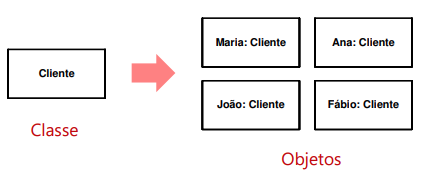
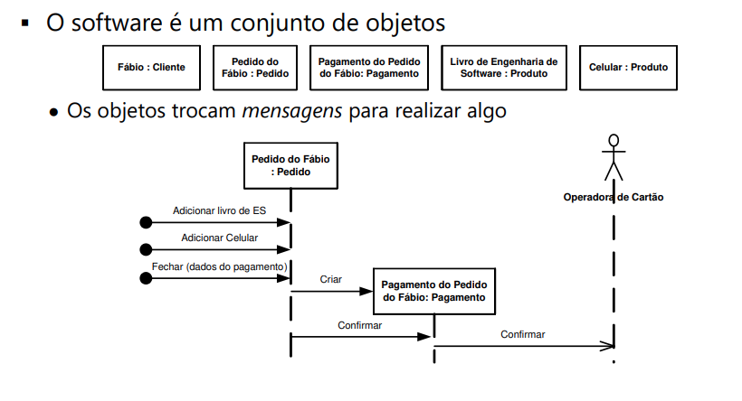
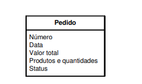
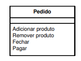
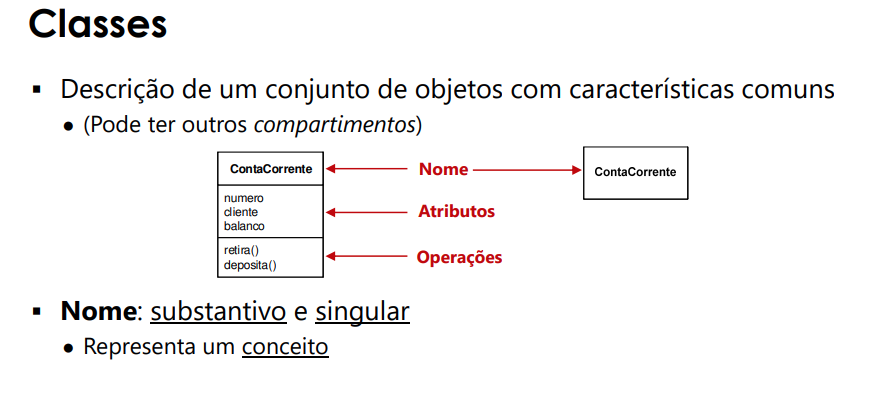
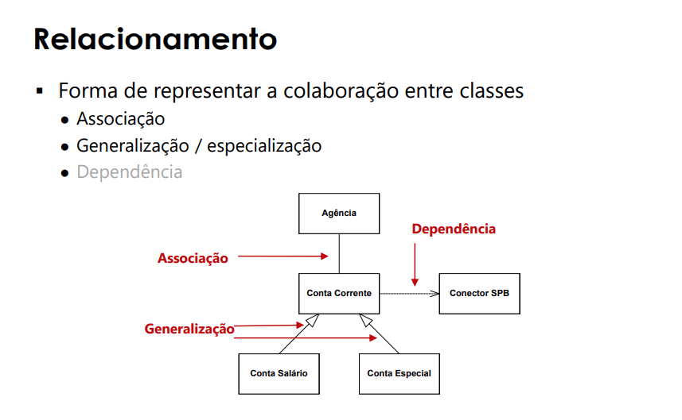
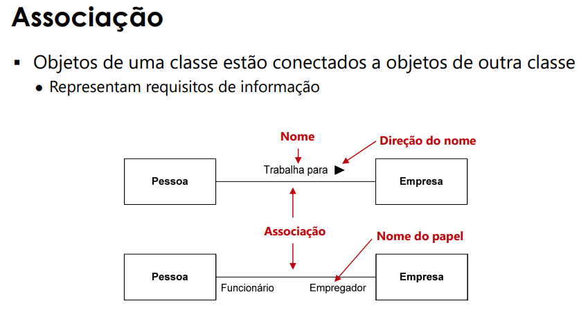
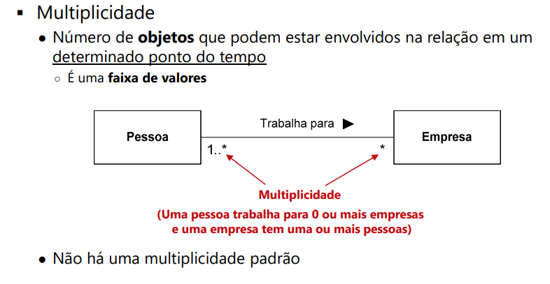
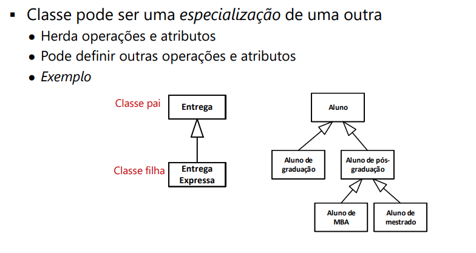

# Arquitetura de Software

## Como desenvolver software?
- lista de requisitos de software
- quais componentes criar
- quais responsabilidades cada um tem
- como eles se relacionam
- considerar os requisitos funcionais e não-funcionais
	- manutenção

**é possível codificar diretamente?**
- Sim (Go Horse), dependendo da quantidade de pessoas e a complexidade;

## O que é arquitetura de software?
**Design == Arquitetura ?**
- **Arquitetura** é alto nível, parte mais geral, da um padrão de organização
	- em geral há uma preocupação com os **requisitos não funcionais**
	- "O sistema tem uma arquitetura"
	```
	Conceitos ou propriedades fundamentais de um sistema em seu ambiente, encarnadas em seus elementos, relações e nos princípios de seu projeto e evolução (ISO, 2011)
	```
- é uma **abstração**
- em geral há uma preocupação com os RNFs
- O **Design** considera a arquitetura, vai no detalhe. Projeta uma solução considerando a arquitetura

## Importancia de Arquitetura de Software
- permite ou restringe características de qualidade
- permite predizer a qualidade do sistema
- **restringe o _design_ e a _implementação_**
    - Encaminha decisões de design
      - Como o sistema será distribuído?
      - Como o sistema será estruturado?
      - Como os componentes do sistema serão decompostos?
      - Qual a melhor organização para tratar dos RNF?
      - Existe alguma arquitetura genérica que pode ser usada como base?
- permite incorporar componentes desenvolvidos independentemente	
- ajuda a pensar sobre mudanças
- melhora estimativas de custo e tempo
- influencia a divisão do trabalho
- melhora a comunicação com stakeholders

> De forma geral o objetivo de uma boa arquitetura é minimizar o custo (em toda a vida do software) e maximizar a produtividade (Martin, 2017)

## Como Representar a Arquitetura de Software?
> Dificilmente um único diagrama conseguiria representar tudo e ser fácil de ler e manter (Pfleeger e Atlee, 2010)

**Diagrama vs Modelo**
- A partir de um modelo, podemos criar vários diagramas
- Modelo é a representação simplificada de uma realidade

Uso de descrições arquiteturais (ISO, 2011):
    - Base para as atividades de design e implementação
    - Base para analisar alternativas de implementação
    - Documentação de aspectos essenciais do sistema
    - Entrada para ferramentas de simulação, análise e geração de código
    - Comunicação entre stakeholders
    - Guia para o suporte da operação e da infraestrutura
    - Suporte para o planejamento, incluindo prazos e custos

## Visão - Arquitetura Possui Várias Facetas
- A descrição da arquitetura inclui várias **visões**
- Representação da arquitetura na perspectiva de um conjunto de **preocupações** (ISO, 2011)
	- preocupações dos stakeholders
- Exemplo: visões na engenharia civil 
	- Encanamento, fiação elétrica, planta...

- Visões podem ser definidas para o projeto ou pode-se usar um framework
  - Arcabouço de Zachman: trata da arquitetura empresarial
  - RM-ODP: padrão para sistemas distribuídos e abertos
  - Modelo 4+1: modelo OO (UML)

## Padrões de Arquitetura
- Padrões: essência de soluções que podem ser usados em problemas semelhantes
- o padrão "captura" a essência de uma solução que podem ser usados em problemas semelhantes
	- capturam a experiência
- Linguagem basica ---> "a conversa entre os devs fica mais facil" 
- Exemplo
  - Modelo em camadas
  - Model-View-Controller (MVC)
  - Dutos e filtros (pipes and filters)
  - Proxy

## Na prática
**Todo software possui uma arquitetura?**
- Sim! Mas nem sempre ela foi adequadamente projetada e nem sempre ela é adequada

**É necessário representar a arquitetura?**
- Não necessariamente, as vezes pode existir uma arquitetura padrão (por meio do framework, ou do estilo já adotado pela empresa) que faça com que o entendimento já esteja implicito.

### Representação em métodos ágeis
- A arquitetura deve emergir
  - (Mas é difícil mudar após tomar decisões importantes)
- Em casos simples não é necessário representar
  - Software arquiteturalmente comum
  - Arquitetura e decisões pré-definidas
- Discussão entre desenvolvedores
- Divulgação para o time (e para os mantenedores)
	- Não precisa ser um documento formal
- Decisões arquiteturais devem ser documentadas
- Um bom arquiteto deve definir políticas

> Um bom arquiteto maximiza o número de decisões não feitas (Martin, 2017, p.142)

# Projeto (Design)

```
Arquitetura -------------> Design
```

## Objeto
> Prover dado e informação suficientemente detalhados sobre o sistema e seus elementos para permitir a implementação consistente com as entidades arquiteturais (ISO, 2017)


- Atividade **extremamente** técnica
  - Conhecimento dos requisitos, da arquitetura, do código e dos testes
  - Proficiência em
  	- Linguagem de programação
    - Frameworks e bibliotecas
  	- Tecnologias em geral
	- Conceitos, princípios e padrões de design

## Design
Cada abordagem trata o projeto de maneira diferente
- Ex: Extreme Programming
	- Várias práticas apoiam o Projeto
	- Exemplo: design incremental, TDD, Cartões CRC (XP1), refatoração, todo time meche no código
	- Tradicionalmente é feita diretamente no código

Algumas abordagens sugerem o uso de **modelos**
  - Mesmo abordagens ágeis
  - Permitem simplificar a comunicação e facilitam pensar sobre a solução
  - DDD, UP, FDD

### Projetos dirigidos por modelos
**Quais os problemas de usar modelos no design?** 
- diferença entre o modelo e o código
- **manutenção** (do modelo)
  - o modelo é custoso para se manter
- é uma abstração
  - a abstração do modelo as vezes não tem implementação viável 
  - dificil de ver como essa abstração se representa no código
- dificuldade de juntar diversas visões
- finguagem específica
	- apesar de mais simples que o código

## Paradigma
- Em geral o projeto (ou parte dele) considera um paradigma de programação
- **O paradigma influencia a arquitetura e, principalmente, o design**
- Definição dos requisitos é conceitualmente independente de paradigma
	- ela pode ser feita independente de paradigma
	- no projeto se pode decidir o paradigma adequado

> Forma de conceituar o que significa realizar computação e como tarefas executadas no computador devem ser estruturadas e organizadas. (Budd, 2001)

**Alguns paradigmas:**
- Imperativo: foco no estado e comandos de mudanças de estado do programa
(global)
	- Linguagens: Pascal, C e Cobol
- Funcional: algoritmos (ponto de vista matemático)
- Operações sobre listas
	- Linguagens: Lisp, Haskel, ML e Scala (também é OO)
- Lógico: metas e lógica de predicados
- Linguagens: Prolog
- Orientado a objetos: conceitos do domínio do problema
	- Linguagens: C++, C#, Java, Objective-C, Ruby
- Algumas linguagens são multiparadigma

### Qual Paradigma Seguir?
- **DEPENDE DO PROBLEMA!!**
- a solução é influenciada pelo paradigma
	- facilidade/dificuldade de representação

- paradigma escala mais fácil by Fabio Levy
	- Pois não tem estado, com isso temos um improviment para aplicar mais paralelismo


## Projeto OO
- Foco nos **conceitos** do domínio do problema
  - sw é decomposto em conceitos
  - dados e funções são organizados por conceitos
    - dados ficam escondidos
  - instâncias dos conceitos colaboram para executar uma função do software

### Classes
- Conceitos são representados como classes
  - Definem um novo **tipo**
  - São instanciadas ("materializadas") em objetos
  



- Classes definem estrutura e comportamento comum para um conjunto de objetos
- **Estrutura**: Atributos
  - propriedade dos objetos
  - definem o estado do objeto
  
  


- **Comportamento**: operações
  - Serviços disponibilizados pelos objetos
  




### Relacionamento


### Associação



### Generalização/Especialização


grasp software
https://sketchboard.io/

Documenting Software Architectures: Views and Beyond 
Designing Software Architectures: A Practical Approach 
Software Architecture in Practice: Book
