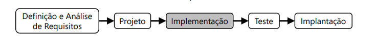
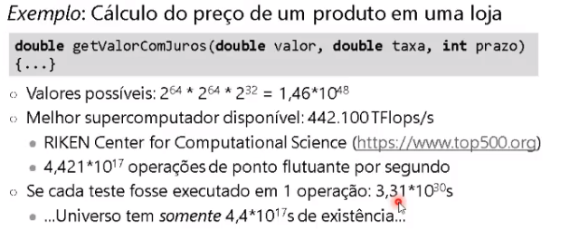
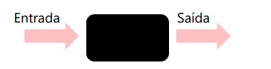
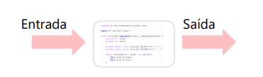
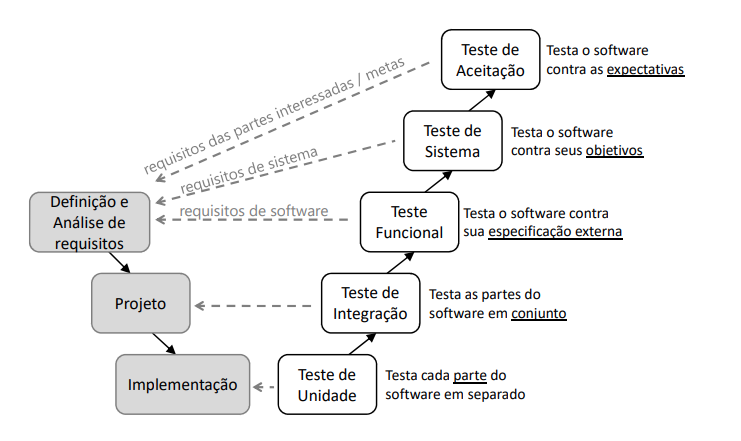
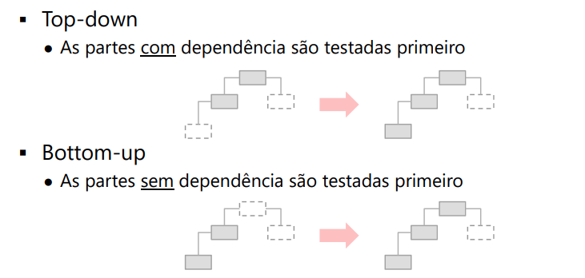
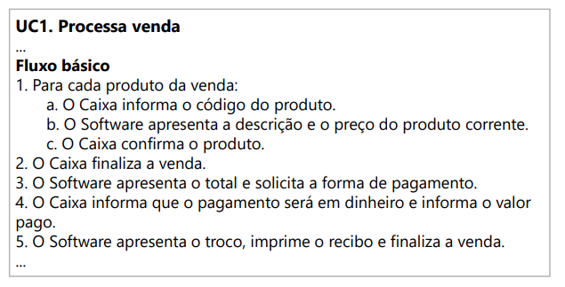

# Implementação e Teste

## To Study
- Problema da Parada 
	- Teoria onde se diz que não é possivel determinar se um programa termina ou não
- Agile Software Development, Principles, Patterns, and Practices by Robert C. Martin 
- [Mocks Aren't Stubs by Martin Fowler](https://martinfowler.com/articles/mocksArentStubs.html)
- [TestDouble by Martin Fowler](https://martinfowler.com/bliki/TestDouble.html)

## Implementação
Responsabilidades:
- Gerar o código fonte
	- algoritmo adequado/detalhes tecnológicos
	- pode envolver diversas linguagens
- executar alguns níveis de teste
- Integração
- gerar executáveis, bibliotecas e componentes

- a implementação é baseada no projeto
### Preocupações (SWEBOK, 2014)
minimizar complexibilidade
-	correção, eficiencia e elegância (legível)

**Antecipar mudanças** 
- desperdício X retrabalho
- (na prática é a arquitetura que acaba tendo maior nessa parte de retrabalho e mudanças futuras)

**Permitir a verificação**
- Facilitar as atividades de Verificação e Validação 
- Facilitar a depuração

**Reuso**
- usar libs, frameworks, códigos e componentes
- criar elementos reusáveis -> planejamento

**Padronização**
- padrões de código
	- uso de recursos
	- comunicação entre elementos de software
	- acesso a plataformas
- documentação
- ferramentas

## Test-Driven Development (TDD)
- Testes de unidade são feitos antes do código
- abordagem usada pelo `Extreme Programming`

## Integração
**Juntar o trabalho dos programadores **
- Gera uma versão "completa" do software 
- Baseado na versão atual de cada item 
- Verifica o trabalho dos desenvolvedores 
  - As partes do software funcionam em conjunto?

**Juntar o software a outros elementos **
- Software e hardware

Importância da **gerência de configuração**

**O ideal é integrar com alta frequência**
- mas a integração tem um custo envolvido.
- Algumas questões a considerar
	- Complexidade do software (e de seus módulos)
	- Complexidade da integração
		- Equipes distribuídas
	- Duração das iterações 
- Pode ser necessário um plano de integração
  - Dependência entre componentes
## Testes
- Atividade de controle da qualidade do produto

- Parte do processo de Verificação e Validação
	- Forma mais comum V&V

**O que é Teste?**
> Teste é o processo de executar um programa com o objetivo de encontrar erros
> \- (MYERS, 2012, p.6)

- Teste não é a atividade para garantir que o software não tenha erros
  - Saídas corretas em um teste não garantem que o produto é adequado

**Então por que não testar tudo?**
- existem um número muito grande de cenários de teste para serem testados, o que torna a execução de todos eles impraticável.

## Estratégia de Teste
- Ajudam a escolher **conjuntos de dados** que têm maior probabilidade de existência de erros

**Duas estratégias principais** 
  - Estrutural: caixa branca
  - Funcional: caixa preta

### Teste Caixa Preta
- Alvo do teste como uma caixa preta
	- Não se usa nenhum detalhe interno

- **Foco na especificação**
	- A saída obtida para uma determinada entrada é a esperada?

### Teste Caixa Branca
- O teste é feito considerando o conhecimento da estrutura interna do código

- **Foco nos caminhos **
	- Condições, laços e comandos

### Estratégia de Testes
Alguns tipos de defeitos só são encontrados aplicando uma das estratégias

- **Caixa branca**: não se percebe a falta de caminhos
	- Exemplo: faltou considerar alguma condição

- **Caixa preta**: não se percebe alguns tipos de falhas da lógica interna
	- Exemplo: considerou-se um caso a mais

## Níveis de Teste
- A forma de realizar os testes depende do processo
- Normalmente o teste é realizado em vário níveis
- **Teste em V**
	- Cada teste considera aspectos de uma atividade de desenvolvimento

### Teste em V

- **teste funcional** testa a funcionalidade
- **teste de sistema** testa o software junto com o hardware
- **teste de aceitação** considera as necessidades do stakeholder

### Teste de unidade
- Testa cada **módulo** do software
	- Menor elemento do software
	- Comparar sua função à interface definida
- Tradicionalmente feito pelo desenvolvedor
- Algumas questões
	- Qual é a cobertura ideal? É 100%?
	- Deve ser funcional ou estrutural?
	- Quando criar o teste de unidade?
		- Antes de programar a classe **(TDD)**
		- Depois de programar a classe

- Podem ser necessários drivers e stubs
	- **Driver**: elemento que aceita dados de entrada e os passa para o elemento a ser testado
	- **Stub**: substitui um elemento que é chamado
    	- Implementação simples, apenas para testar
  	- O termo mais genérico é dublê

### Teste de Integração
- Testa as partes trabalhando em conjunto
	- **Trata de problemas com as interfaces dos elementos**
	- Considera outros componentes / serviços
	- Também chamado de **teste de serviço**
	- Necessário testar integração com o BD / serviços externos
- Duas estratégias principais
	- Big bang
		- As partes são integradas de uma vez
		- Problema: identificar a origem de um defeito
	- Incremental
		- As partes são integradas aos poucos
		- Top-Down ou Bottom-Up

#### Top-Down & Bottom-up

### Teste Integração OO
- Teste baseado em Thread
	- Integra as classes que tratam de uma "thread de funcionalidade" / evento específico do
sistema 
	- (Teste de serviço)
- Teste baseado em Uso 
	- Testa primeiro as classes independentes e adiciona as classes dependentes
	- Similar à integração Bottom-Up

### Teste Funcional
- "Teste da especificação"
	- Procura por diferenças entre o software e seu **comportamento externo**
	- **Testa o software como um todo**
	- Normalmente **realizado como um teste caixa-preta**
	- Também chamado de teste de UI
	- PS: Cucumber faz o teste funcional!!!

#### Exemplo c/ Caso de Uso

- para testar funcionalmente, informamos um código de produto (ex: 123), verificamos o retorno descrição e preço (passo b), apos isso há a confirmação (passo C) 

### Teste de Sistema
- Testa o software frente aos seus "objetivos"
- Atendimento aos requisitos do sistema
- Software como parte do sistema

- Sistemas intensivos de software
	- Exemplo: Se um software será um sistema web
	- O que se deve considerar quando for realizar os testes de Sistemas são:
    	- Diversos navegadores
    	- SOs
    	- Servidores
	- Tradicionalmente aborda os requisitos não funcionais

**Alguns tipos de teste:**
- Teste de stress
- Teste de usabilidade
- Teste de segurança
- Teste de desempenho
- Teste de documentação

### Teste de Aceitação
- verifica a espectativa dos stakeholder
- Realizado pelos clientes/usuários
- Apoiados por desenvolvedores
- Usado para aceitação do software pelo cliente
- Alguns tipos de teste de aceitação
  - Teste alfa
    - Uso do software dentro do ambiente de desenvolviment
    - Em geral para software personalizado
  - Teste beta
    - Usuários em seu ambiente normal
      - Permite analisar diversos ambientes
    - Forma de marketing
    - Em geral para software de prateleira

