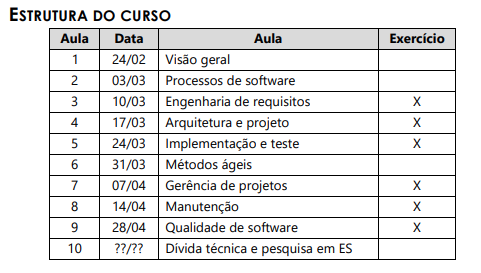

# Software Engineering
## Objectives
To present the basic concepts of Software Engineering, through models of the process of software development, and appropriate techniques and methods.

## Course Structure

## Evaluation Criteria
M = (Activities + Final Project) / 2 