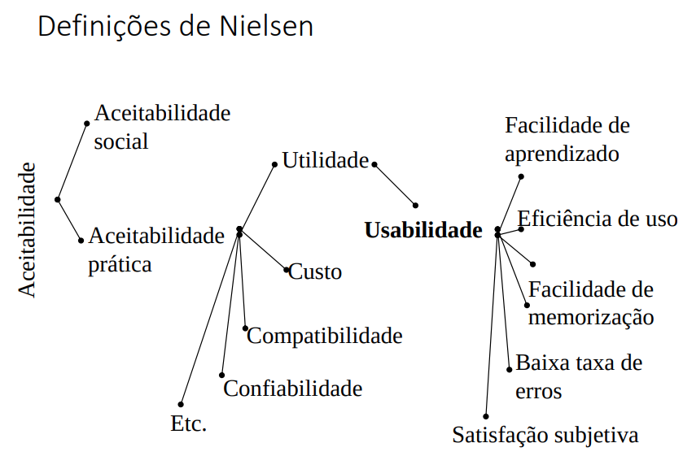

# Interface e interação
*Interfaces*: **é o que há no limite entre duas fases de um sistema heterogêneo**. Sistema humano / sistema computacional (conversam pela interface).

*Interação*: ato de comunicação. (utiliza linguagem artificial)
Linguagem artificial: possui elementos léxicos, sintáticos e semânticos.

Por ser artifical, **necessita de design**. Portanto, O que é 'design' de 'linguagem artificial'?
- É o processo de criar formas, funções, serviços de forma a torná-los adequados às necessidades dos usuários. 

## Léxico, sintático, semântico
- Léxico: símbolos com siginificados. 
- Sintaxe: validade na ação.
- Semântico: significado da ação.

## Perspectiva de interação
- sistema (computador/maquina);
- parceiro de discurso (responsivo [interação linguistica?]);
- mídia é o meio, comunicação (texto, audio, video);
- ferramenta utilização como instrumento para realizar tarefas. 

## Affordances
*Affordances:* característica que indica como deve ser utilizado. 

### Norman propõe três elementos
- Modelo conceitual
  - Formulação de um modelo mental do que é o objeto, suas características e modo de funcionamento, por meio de exploração tentativa e erro, até que o modelo seja plenamente consistente.
- Restrições
  - São limitações impostas pelo objeto ao uso – físicas, lógicas ou culturais. São aprendidas pelo uso e exploração as limitações.
- *Affordances* 
  - Característica que indica como deve ser utilizado. 

## Qualidade na Interação
ISO 8402 características que satisfazem as necessidades explícitas e implícitas. Conceito relativo (usuários) e dinâmico (evolução).  

- déc. 40-50: adequação funcional e disponibilidade, baixa qualidade;
- déc. de 60: utilidade (desempenhar funções) e desempenho; 
- déc. 70: inteligibilidade, interoperabilidade e confiabilidade da operação; 
- déc. 80: novos usuários, computação pessoal + interfaces gráficas, ideia de usabilidade →  eficácia, eficiência e satisfação; 
- déc. 90: Nielsen, usabilidade, 5 elementos, 1. facilidade de aprendizado, 2. eficiência, 3. facilidade de memorizar, 4. baixa taxa de erros, 5. satisfação subjetiva; 
- final déc. 90: introdução da web, ligação entre criação e consumo de conteúdo, → comunicabilidade, navegabilidade, facilidade de encontrar coisas;
- Anos 2000: portabilidade, responsividade, acessibilidade, sensibilidade a contexto e jogabilidade; 
- déc. 2k10: qualidade = interação multidimensional, ISO 25010 → capacidade de reconhecimento, facilidade de aprendizado, operabilidade, proteção contra erro do usuário, estética da interface, acessibilidade. 

## Usabilidade
Usabilidade é uma característica de qualidade dos sistemas interativos, que permite proporcionar ao usuário uma experiência de uso positiva.

- Usabilidade é dependente
  - Do conjunto de usuários considerado
  - Da intenção de uso (tarefas)
  - Do contexto em que o sistema se insere (físico, social)

### Aceitabilidade - Definições de Nielsen

### Usabilidade segundo Nielsen
Facilidade de aprendizado
  - o sistema deve permitir aprendizado fácil de forma que o usuário rapidamente possa cumprir suas tarefas
- Eficiência
   - uma vez aprendido o sistema, o usuário deve poder cumprir suas tarefas com alta produtividade
- Facilidade de memorização
   - as funções devem ser lembradas facilmente, de forma que um usuário ocasional possa retornar sem ter que reaprender
- Erros
  - O usuário não deve ser induzido ao erro e deve poder recuperar o estado do sistema se os erros acontecerem
- Satisfação subjetiva
   - O usuário deve relatar uma sensação positiva com o uso.

## UX - User Experience
- Qualidade da interação, perspectiva diferente. 
- Consequências emocionais e cognitivas decorrentes da interação.
- Diferença: experiência → do usuário (percepção) vs. usabilidade → da aplicação. 

### Dimensões de Hassenzahl para UX: 
1. Pragmática (metas do fazer, motivação/razão)(conteúdo, funcionalidade, apresentação).
2. Hedônica (metas do ser, sensação/sentimento/ idedntificação).

### UX é abrangente e longitudinal
- Abrangente: vai além da interface, vários pontos de contato (marketing, loja, manual, instalação, suporte, descarte, etc)
- Longitudinal: momentos, uso ao longo do tempo. (antecipação, primeiro uso, uso esporádico, uso continuado). 

## USABILIDADE vs USER EXPERIENCE
- Difícil/fácil de usar, péssima/boa expericência.
- Usabilidade → intrínseco do produto.
- UX → perspectiva individual.