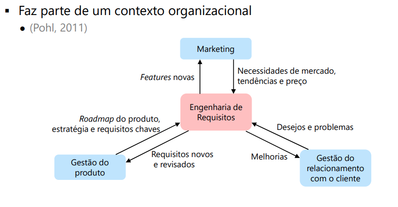
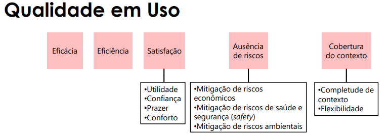
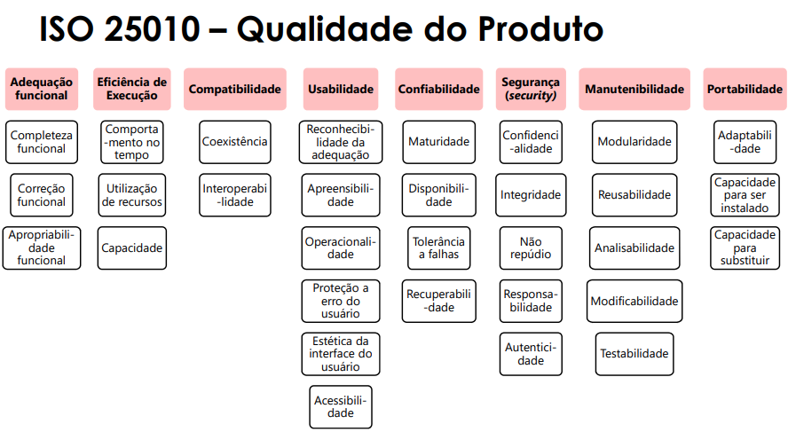
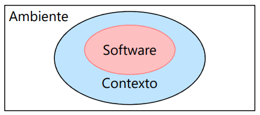
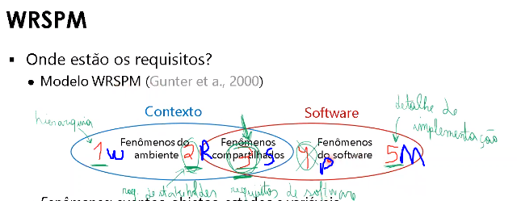
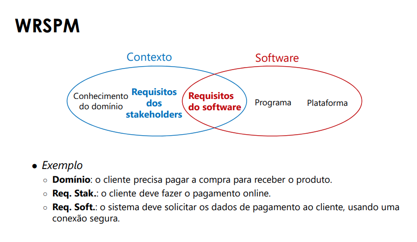
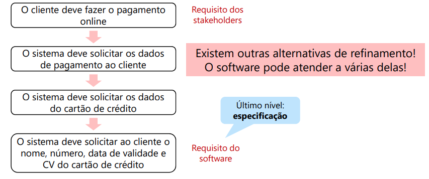
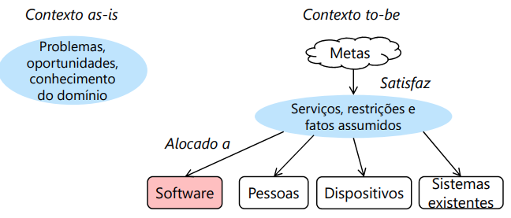
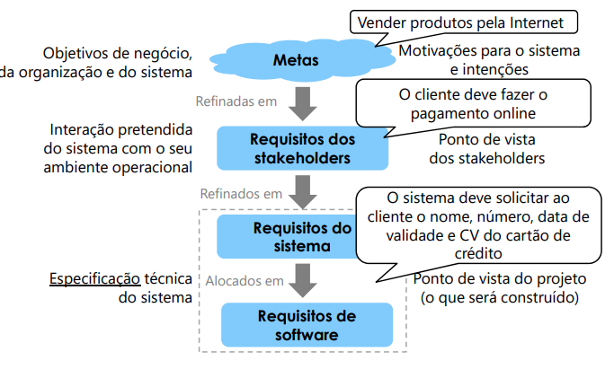

# Engenharia de Requisitos - Introdução
## Livros
- Software Requirements (Developer Best Practices) 3rd Edition - Joy Beatty e Karl Wiegers
- User Stories Applied: For Agile Software Development

## Intrudução
> Função interdisciplinar que media entre os domínios do adquirente e fornecedor para estabelecer e
> manter os requisitos a serem cumpridos pelo sistema, software ou serviço de interesse (ISO, 2018).

## Problemas ER
Alguns problemas para a ER (Wiegers e Beatty, 2013) 
- Envolvimento do usuário insuficiente
- Planejamento impreciso
	- Planejamento feito com poucas informações
- Aumento incontrolável dos requisitos
- Ambiguidade dos requisitos
- Requisitos desnecessários
	- Funcionalidade que o "usuário vai adorar"
- Stakeholders menosprezados
- Dificuldade de o stakeholder expressar o que quer
- Dificuldade de o ER entender o stakeholder

## Stakeholder
> Pessoas ou organizações que tem um interesse no sistema a ser desenvolvido
> \- (Pohl, 2011)

- Tipicamente tem seus próprios requisitos
- Uma pessoa pode representar vários stakeholders

- Tipos (Leffingwell, 2011)
	- Stakeholders do sistema
		- Usa o sistema diretamente
		- Trabalha com os resultados de quem usa o sistema
		- Será impactado com a implantação e operação do sistema
	- Stakeholders do projeto
		- Tem investimento no orçamento ou no cronograma
		- Tem interesse em entender como a solução será desenvolvida
		- Estará envolvido em propagandear, vender, instalar ou manter

- Envolvimento do Stakeholder (Leffingwell, 2011)
	- Precisam ser informados
	- Precisam ser consultados
	- São parceiros no desenvolvimento
	- Tem controle dos resultados (tem a decisão final)

- **Exemplos**
	- Usuários
	- Cliente
	- Agências regulatórias
	- Desenvolvedores

## Requisito
**Definição 1**
> Uma afirmação que traduz ou expressa uma **necessidade** e suas **restrições** e **condições** associadas. 
> \- (ISO, 2018, p.4)

- Não devem (em teoria) ter detalhes de implementação

**Definição 2**
> a) Uma **condição** ou **capacidade** necessária por um **usuário** para *resolver um problema ou atingir um objetivo*.
> b) Uma **condição** ou **capacidade** que deve ser cumprida ou possuída por um sistema ou componente do sistema para **satisfazer** um *contrato, padrão, especificação, ou outros documentos formalmente impostos*

### Tipos de requisitos
	- Funcionais
	- Não funcionais (ou de qualidade)
	- Restrições

### Requisitos Funcionais
- Ligado com entrada e saída - ações realizadas envolvendo entrada e saída
- Especificam a funcionalidade que o sistema deve prover aos usuários
> Ações fundamentais que devem acontecer no software ao aceitar e processar as entradas e ao processar e gerar as saídas 
> \- (IEEE, 1998, p.16 )

- **Exemplos (IEEE, 1998)**
	- Sequência exatas de operações
	- Validações nas entradas (ex: email possuir um `@`) 
	- Respostas para situações anormais (ex.: tratamento de erros e recuperação)
	- Relações entre saídas e entradas (ex.: sequências e fórmulas)
	- O calculo para o hash de verificação deve usar essa função `ABC`

- **Exemplo: loja virtual**
	- O software deve permitir a busca de produtos por palavra chave
	- O usuário só pode adicionar ao carrinho de compras os produtos disponíveis

### Requisitos não funcionais
- Definem **propriedades de qualidade** do sistema a serem desenvolvidas
	- Afetam todo o sistema ou uma parte dele
	- **Influenciam a arquitetura**
	- Também chamados de **requisitos de qualidade** (~ Requisitos não Funcionais)
	- Relacionadas a **desempenho**, **segurança**, **usabilidade** etc.

- **Exemplo: loja virtual**
	- A verificação do cadastro do usuário deve demorar no máximo 5s
	- Apenas um técnico com privilégios de Administrador deve ter acesso aos logs do sistema

### Restrições
- Restrição **organizacional** ou **tecnológica** que **afeta como o software deve ser desenvolvido**
	- Orçamento, plataformas, linguagens, leis, soluções tecnológicas etc.
	- Muitas vezes considerada como requisitos não funcionais
- Exemplo: loja virtual
	- A interface web deve usar o framework React
	- O software deve ser entregue até dia 02/06
	- O projeto deve usar Scrum

- **Quais são os tipos de requisitos dessas afirmações?**
	1. Ao cadastrar uma senha, o sistema deve verificar se a senha de acesso tem no mínimo 8 caracteres. (req funcional)
	- O DDD do telefone deve ter 2 dígitos.
	2. As senhas armazenadas no sistema devem ser criptografadas, sendo protegidas contra roubo. (req não-funcional)
	3. As senhas devem ser criptografadas usando o algoritmo AES e usando salt aleatório de 8 bytes. (restrição ou req não-funcional)

## Taxonomia - Requisitos Não Funcionais
### ISO 25000
- SQuaRE
	- *Software Product Quality Requirements and Evaluation*
- Família de normas
	- Reorganização e **revisão de outras normas**
		- ISO 9126 e ISO 14598
	- ISO 25010 (2011) é a parte que define o modelo de qualidade
- **Define características** que podem ser **usadas** para **especificar, medir e avaliar a qualidade**
	- Características são divididas em subcaracterísticas
	- Característica/subcaracterística consideram **graus**
		- **O grau em que algo é atendido**

- **Define dois modelos**
	- **Qualidade em uso**
		- Trata, basicamente, do usuário (é subjetiva)
		- Representa o quanto o uso do software **cumpre as necessidades** e **atinge as metas** de um usuário
		- Resultado do uso do software
		- Características
			- Eficácia
    			- Acurácia ou completude com que o usuário atinge os objetivos
			- Eficiência
    			- Recursos despendidos em relação à acurácia e completude com o quais o usuário atinge os objetivos
			- Satisfação
    			- O grau que as necessidades do usuário estão satisfeitas ao usar o produto
				- Utilidade
				- Confiança
				- Prazer
				- Conforto
			- Ausência de riscos
				- Mitigação de riscos de saúde e segurança (safety)
				- etc
			- Cobertura do Contexto
    			- Grau que o produto pode ser usado com eficiência, eficácia, ausência de risco e satisfação nos contextos definidos ou em outros contextos
		- As características dependem do **contexto de uso**
			- Outros fatores além do software
				- Características do usuário, características da tarefa, hardware, ambiente de operação e características do ambiente social
		- 

	- **Qualidade do produto**
    	- Considera um ambiente diferente do contexto de uso real
        	- Uma "estimativa" da qualidade em uso
    		- abstração para linhas gerais de **qualidade em uso**
		- Trata de propriedades de qualidade do produto
		- Útil para especificação ou para a **avaliação de um produto**
		- Pode ser usada como **taxonomia de requisitos não funcionais**
		- 
    		- Adequação funcional
        		- Em geral não se considera como RNF
      		- Eficiência de execuç~ao
        		- O desempenho relativo a quatidade de recursos usados
      		- Compatibilidade
        		- O quanto o produto pode compartilhar informações e recursos
      		- Usabilidaded
        		- O quanto é fácil usar o produto
      		- Confibialidade
        		- O quanto produto executa suas funções nas candições especificadas e no período de tempo especificado
      		- Segurança
        		- O quanto as informações são protegidas
      		- Manutenibilidade
      		- Portabilidade

## Escopo do Sistema
### Contexto
- Um software está sempre em um ambiente
	- Ambiente **as-is**
		- Ambiente que existe antes do software
	- Ambiente **to-be**
		- Ambiente que se espera ter com o software (ideal)
	
- **Requisitos tratam do ambiente to-be**
	- (Mas o ambiente **as-is** é *importante para entender os requisitos*)

- Nem toda informação do ambiente é relevante
	- **Contexto**: parte **relevante** do ambiente para definir, entender e interpretar os requisitos do software
	- 
	- o software será parte do contexto no ambiente **to-be**

- Existem duas fronteiras
	- Fronteira do software
		- **Escopo** do software
			- **(O que o software tratará)**
	- Fronteira do contexto
		- Informações relevantes ao sistema

- **O que define o escopo do software?**
	- Os requisitos definem, mas o que limita seria o orçamento, o tamanho da equipe disponível 
	- Decisão do negócio
		- quais são os benefícios esperados para o negócio?
		- quais são as oportunidades de negócio?
		- qual é a meta de negócio?
	- Restrições
		- prazo, orçamento

### WRSPM
- W=World, R=Requirement, S=specification, P=Platform, M=machine
- onde estão os requisitos?
	- modelo WRSPM 
		
		- contexto
			- possui fenômenos do ambiente
			- 2 (R) - são os requisitos do stakeholder (reflexo do software no ambiente)
		- software
			- possui fenômenos do software
		- Software `^` Contexto
			- Fenômenos compartilhados
			- 3 (S) - requisitos de software (o que o desenvolvedor implementa)
		- Fenômenos: eventos, objetos, estados e variáveis
	

---
- os requisitos são afirmações do ambiente
---

- Artefatos importantes
	- Domínio
		- Afirmações que **descrevem propriedades que sempre são verdadeiras**, **independentes do software**
	
	- Requisitos dos stakeholders (**requisitos**)
		- Afirmações que descrevem propriedades que os usuários **querem que sejam verdadeiras** no ambiente com a presença do software

- Requisitos do software (**especificação**)
	- Afirmações que descrevem **o que o software precisa fazer** para atender os requisitos
	- **Informação suficiente para o desenvolvedor construir o software**

## Refinamento 
- Mas o requisito de sistema está detalhado o suficiente para ser implementado?
	- Ex: O sistema deve solicitar os dados de pagamento ao cliente, usando uma conexão segura.
	- Answer: No!!!
- Requisitos são **refinados em requisitos mais detalhados**
	- 
	- modelos de refinamento
		- tropos
		- i* (i-star)
		- kaoes

## Metas
-  **Os requisitos são originários de** **metas**
	- Objetivos que o software deve atingir **(porquê)**
	- Diferentes stakeholders têm diferentes metas
	- Em geral são apresentados de forma vaga
	- Exemplo
		- Diminuir custos
		- Diminuir o número de funcionários
		- Usar tecnologias modernas
- Metas mudam lentamente
	- Requisitos e o escopo mudam com mais frequência
- **Relação das metas e o contexto**
  - 
    - Explicando a Imagem: metas serão satisfeitas por meio de serviços, restrições e fatos assumidos
    - Nem toda meta será traduzida em software!!

### Níveis de Abstração
- 
- Metas são refinadas em outras metas
	- Metas contribuem para outras metas
	- Exemplo
		- TODO get images
## Requisitos e Arquitetura
Requisitos não devem ter detalhes de implementação
- Mas decisões arquiteturais afetam os requisitos
  - Alguns refinamentos só são possíveis em uma arquitetura
    - Exemplo
      - Se for aplicativo Android, é possível usar GPS ou giroscópio
    - Se usar a autenticação do Google, já confirmamos que a pessoa é válida

- não é possível separar arquitetura dos requisitos
  - O arquiteto deve participar das atividades de ER
