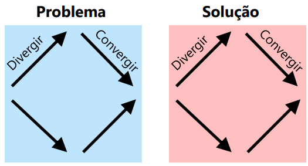

# Requisitos e Inovação
## Atividades de ER
- Seguindo (POHL, 2011)
  - Elicitação
  - Documentação
  - Negociação
  - Verificação e Validação
  - Gestão

### Elicitação
- Elicitar todos os requisitos no nível adequado para o sistema a ser desenvolvido (Aulas 4 e 5)
1. Identificar fontes relevantes de requisitos
2. Elicitar os requisitos existentes
3. Desenvolver requisitos novos e inovadores

- **Porque a palavra “elicitar”?**
  - Não é simplesmente obter / juntar
  - Merriam-Webster (https://www.merriam-webster.com/)
    - “trazer a tona uma informação ou resposta”
  - Atividade colaborativa e analítica
  - trazer a tona os requisitos   

### Documentação
- Documentar apropriadamente as informações obtidas durante as atividades de ER (Aulas 4, 7 e 8)
- Exemplo
	- Metas, requisitos e prioridades
	- Resultados das técnicas de elicitação
	- Conflitos, resolução de conflitos e mudanças

- **Por que documentar?**
	- Preserva o conhecimento
		- também ajuda a não esquecer de decisões tomadas
	- serve de referência comum
	- promove comunicação com os stakeholders
	- ajuda a refletir sobre o problema

### Negociação
- Stakeholders tem diferentes interesses e necessidade
	- contradições e dificuldades de atender a todos
- Atividades
	- 1. identificar conflitos
	- 2. identificar a causa dos conflitos
	- 3. resolver os conflitos
	- 4. documentar a solução do conflito e o racional

### Verificação e validação
- Garantir que os requisitos são adequados
	- Validação (com os stakeholders)
		- "perguntou para o usuário é validação"
		- revisão de artefatos pelos stakeholders
		- protótipos
		- simulações (especificação formal)

	- Verificar propriedades dos modelos
		- "o desenvolvedor consegue fazer sozinho"
		- "forma mais comum de verificar é **revisando**"
		- métodos formais
		- revisões

	- Conferir o atendimento a padrões
		- garantia da qualidade

### Gestão
- Segundo Pohl (2011), existem **três** grupos de atividades
	- Gerência do contexto do sistema
    	- Entender que o contexto muda!!!
		- Observar o contexto, detectar mudanças e adaptar as atividades de ER
	- Gerência do processo de ER
	- Gerência dos artefatos (Aula 6 e 9)
		1. Definir os atributos necessários para os requisitos
			- Identificador, tipo, nome, prioridade, etc.
		2. Rastreabilidade de requisitos
		3. Gestão de mudanças
		4. Gestão de configuração dos requisitos
			- Quais são as informações armazenadas
			- Versionamento	

## Design Thinking
### Contextualização ---> Inovação
- Tradicionalmente
	- O time é alocado/contratado para lidar com uma **ideia definida ou um problema específico**
- Projetos de Inovação
  - Mas o que fazer em projetos de inovação?
	- **Encontrar uma ideia nova / oportunidade de mercado**
		- Potencialmente disruptivo
	- Encontrar necessidades latentes
- ...mesmo em projetos tradicionais
	- E se a ideia não for boa o suficiente?
	- E se o problema não for realmente **o problema**?

### Introdução 
- Existem algumas abordagens para esses casos
	- Lean startup (Ries, 2011)
		- Abordagem para criação de Startups
		- Startup
			> “Uma instituição humana projetada para criar novos produtos e serviços sob condições de incerteza extrema” 
			> \- (Ries, 2011).			
		- Foco na experimentação
		- Viés de tecnologia, mas pode ser aplicado para outras áreas
- Sprint (Knapp; Zeratskym; Kowitz, 2016)
	- "Google Sprint"/"Design Sprint"
	- Abordagem bem definida para avaliar um desafio em 5 dias
	- "Pode ser entendida como uma instância do Design Thinking"
- Design thinking
	- Abordagem da área de UX

### Definição de Design Thinking
> é uma disciplina que usa a sensibilidade e métodos do designer para corresponder a necessidades das pessoas com o que é tecnologicamente factível e que uma estratégia de negócio viável pode converter em valor para o cliente e oportunidade de mercado
> \- (Brown, 2008, p.86).

- Foco nas pessoas: empatia
- Prototipação
	- Validação frequente
- Colaboração
	- Equipe com perfis diferentes
- Processo iterativo

### Processo
- "Diamante Duplo"
  - Divergir
    - desenvolver o máximo de ideias novas
  - convergir
    - focar em necessidades individuais, funcionalidades e soluções

  - Problema
	- Divergir para encontrar os problemas
	- Convergir para tratar problemas focais/principais
  - Solução
	- Divergir para encontrar diversas soluções
	- Convergir para trabalhar com as soluções principais e mais efetivas

 

- **Como o executar o "diamante duplo"?**
	- Seguindo Lewrick, Link e Leifer (2018)
    
	- **Entender**
		- Entender a tarefa, o mercado, os clientes, a tecnologia, restrições e critérios de otimização 
		- **Reconhecer** um problema e **definir o problema**
	- **Observar**
		- Observar e analisar o comportamento de pessoas reais na tarefa 
			- Entender como elas se sentem ao usar o produto 
		- Ir aonde os usuários estão, conversar com eles, vê-los trabalhar e até trabalhar com eles 
			- Simpatizar com a pessoa (empatia)
	- **Definir Ponto de Vista**
		- Usar, interpretar e ponderar as descobertas 
		- Estabelecer um conhecimento comum sobre o assunto
	- **Idear**
		- Sugerir ideias e conceitos para tratar dos problemas 
		- Em geral é feito em sessões de brainstorming
	- **Prototipar**
		- Criar protótipos simples para estimular as ideias
			- Filtrar melhor as ideias sugeridas 
		- Tipos de protótipos 
			- Físicos
				- Papel, lego ou outros materiais 
			- Digitais 
				- Vídeos, apresentações ou software
	- **Testar**
		- Testar os protótipos com colegas e com usuários em potencial
		- Ter uma retroalimentação rápida das ideias

### Detalhes
- As atividades são altamente interrelacionadas
	- Não é sequencial
- Existem vários métodos/técnicas que podem ser usados
	- Um mesmo método/técnica pode ser usado em diferentes atividades
		- Personas
		- Jornada do usuário
		- Mapa de empatia
		- Brainstorm de ideias
		- AEIOU (Activities, environments, interactions, objects, and users)
		- Jobs to be done
			- Pode ser uma representação de requisitos
		- Como podemos fazer (How might we)

## DT e ER
- Usos do DT na ER 
	- DT é uma caixa de ferramentas
		- técnicas e métodos usados dentro de um processo de ER
		- algumas técnicas do DT são tecnicas usuais da ER
	- Processo
		- DT como um processo a ser seguido
		- Em geral o processo é executado antes das atividades ER
        	- Resultado é usado como entrada para ER

### Comentários do Professor  
- "O resultado do DT é um protótipo testado que pode conter alguns requisitos, mas ele não os declara, ele não tem a declaração dos requisitos como objetivo."
- "Podemos usar o DT para pensar em uma solução para que assim possamos realizar o processo de elicitação de requisitos."

### Alguns Problemas do DT
Não delimitar bem as necessidades de negócio ou o cliente claramente
- Gastar muito tempo fazendo pesquisa e aprendendo
  - Sempre há algo mais para aprender...
- Não aprender com as pessoas
  - Assumir que o que você sabe está correto
- Tentar resolver vários problemas
  - Importante em focar em um problema por vez
- Apenas os designers contribuem com ideias de soluções
- Não considerar outras soluções
- Não se preocupar com o custo de construir a solução
- Dificuldade em elicitar outros requisitos não funcionais (além de usabilidade)
  - Protótipo pode menosprezá-los
- Priorização dos requisitos definidos
  - Projeto pode alterar requisitos / mudar prioridade
    - Criação de uma expectativa não realista
- Dificuldade de rastrear informação
  - Criação coletiva