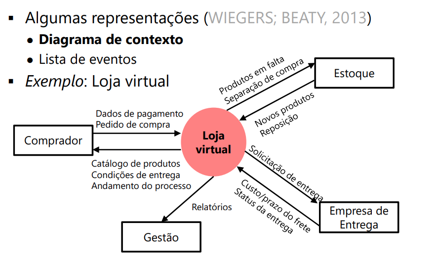

# Atividades de ER e Visão
## Visão
- Diferentes stakeholders têm diferentes objetivos de negócio
- Importante definir uma visão comum
	- Entender (e acordar) o problema a ser resolvido
	- Definir o escopo do sistema
	- Entender quais são os stakeholders
	- Capturar as metas e requisitos básicos dos stakeholders
		- **Features**
- Se for usado **Design Thinking como processo**
	- A visão comum já foi decidida?
	- Necessário decidir o que exatamente será feito
	- Decisão estratégica da empresa
	- Dificuldade: Diferentes expectativas/priorização

<br>

- **Objetivo de negócio muda lentamente **
- O **escopo** muda durante o projeto 
	- Afetado por prazo, orçamento, recursos e outras restrições
- **Importante alinhar o _escopo_ ao objetivo de negócio**
	- Fronteira do que está dentro ou fora do projeto
	- Software e o que interage com o software
<br>

- Com quem deve-se conversar para decidir a visão comum?
	- Patrocinador do projeto
	- Cliente
	- também envolve conversas com
		- alta gerência da empresa
		- visionário do produto
		- usuários

### Atividades para Definir Visão Comum
- Identificar os stakeholders 
- **Definir o problema**
- Descrever as features principais
- **Definir o escopo**
- Posicionamento do produto 
- **Identificar outras restrições**

### Stakeholders
- Explicitar quais são os stakeholders
- Stakeholders definição:
    > Pessoas ou organizações que tem um interesse no sistema a ser desenvolvido (POHL, 2011)

- Em especial, quais são os **usuários** do sistema 
- Descrever o perfil básico deles e o ambiente que os usuários trabalham
- Pode-se detalhar os perfis
	- Exige um maior entendimento ou até mesmo uma pesquisa / análise de mercado
	- Fundamental para produtos de “prateleira”

<br>

- Algumas perguntas para identifica-los (LEFFINGWELL; WIDRIG, 2003; BITTNER, SPENCE, 2003): 
	- Quem são os usuários do sistema?
	- Quem é o cliente (quem está pagando)?
	- Quem será afetado pelo sucesso ou falha do sistema?
	- Quem será afetado pelas saídas do sistema?
	- Quem irá avaliar e aprovar o sistema quando ele for entregue e implantado?
	- Existem outros usuários internos/externos cujas necessidades precisam ser endereçadas?
	- Existem órgãos regulatórios ou padrões que o sistema precisa atender?
	- Quem irá desenvolver, instalar e manter o sistema?
- Exemplo: loja virtual
	- Compradores
	- Embaladores / estoque
	- Atendimento ao cliente
	- Contadores / departamento financeiro
	- Empresa de entrega
	- Gerência da loja
	- Fornecedores de produtos
	- Operadoras de cartão de crédito

### Definir o Problema
Acordar o problema a ser resolvido
- Uma outra opção é descrever a oportunidade de negócio
- Um formato útil (LEFFINGWELL; WIDRIG, 2003)
    ```
    - O problema de: Descrever o problema
    - Afeta: Identificar os stakeholders afetados pelo problema
    - Tem como impacto: Descrever o impacto desse problema nos stakeholders e no negócio
    - Uma solução de sucesso seria/teria: Indicar alguns benefícios principais
    ```
- Exemplo
    ```
    - O problema: de Vender os produtos apenas nas lojas físicas
    - Afeta: Clientes que não desejam ir à loja, clientes que tem dificuldades de ir às lojas, clientes que desejam comprar em horários diferenciados
    - Tem como impacto: Menor venda de produtos e menor espaço no mercado 
    - Uma solução de sucesso seria: Permitir a venda e entrega de todos os produtos disponíveis na loja física através da Internet, a qualquer hora
    ```
### Features
- **Descreve em alto nível o produto em questão**
	- Não é técnico: visão dos stakeholders e de **marketing**
		- Não precisam ter uma definição tão precisa
		- Benefícios e aspectos excitantes
			- O que distingue o sistema dos competidores
	- Podem ser funcionais ou não funcionais
		- Metas e requisitos dos stakeholders (de alto nível)
- Representam um conjunto de requisitos
- Podem ser usadas várias técnicas para obtenção
	- Pode ser o resultado do processo de DT
#### Exemplos - Loja Virtual
- Pagamento de compras usando cartão de crédito e boleto bancário
- Controle de estoque
- Compra de qualquer produto da loja em estoque
- Compatível com qualquer navegador

### Escopo do Sistema
- Definir os atores envolvidos:
	> Ator: alguém ou algo **fora do software** que interage com o software
  - Algumas perguntas
  	- Que irá fornecer, usar, ou remover informação do sistema?
  	- Quem irá operar o sistema
  	- Quem irá realizar a manutenção?
  	- Onde o Sistema será usado?
  	- De onde o sistema obtêm informação?
  	- Quais outros sistemas externos interagem com o Sistema?


### Posicionamento do Produto
- Descreve a razão para construir o sistema
```
Para:               Cliente/Usuário alvo
Que:                Necessidade ou oportunidade
O:                  Nome do sistema
É:                  O tipo do sistema
Que:                Benefício principal (motivo principal para comprar)
Diferentemente de:  Concorrentes, alternativas, atual
Nosso produto:      Diferença principal
```

### Outras restrições
- Restringem a liberdade em prover a solução (**não é o requisito não funcional**)
	- Recurso, custo máximo e prazo
	- Questões de negócio
	- Leis, padrões e regulamentos
	- Tecnologias
		- Proibições ou obrigações
	- Sistemas existentes
		- Comunicação entre sistemas ou compatibilidade
	- Política organizacional

## Visão comum
- Como capturar / documentar a visão comum do ponto de vista do negócio?
- **Documento visão**
- Project charter
- Business case
- Datasheet do produto
- Press release preliminar

### Documento Visão
- **Busca capturar a essência do produto**
  - Alto nível
  - Representa o consenso sobre a necessidade do produto e sua utilidade
    - “Porquê” e o “o quê”

- Uso
	- Acordo sobre o projeto
	- Decisão sobre a viabilidade do projeto
	- Facilita o entendimento do projeto

- Cobre análise do negócio e requisitos
	- Visão de negócio
		- Marketing e produto
		- (Não entra no plano de negócio)
	- Metas e requisitos principais
		- Não entra nos requisitos de sistema (normalmente)

- Documento conciso
	- Simples e objetivo
		- Normalmente de 5 a 10 páginas (Leffingwell, 2011)
	- O nível de detalhe do conteúdo varia com a
necessidade do projeto

- Conteúdo simplificado (WIEGERS; BEATY, 2013)
	1. Requisitos de negócio
		1. Background
		2. Oportunidade de negócio
			- Definição do problema
		3. Objetivo de negócio
			- Exemplo
				- Capturar um market share de X% em Y meses
				- Reduzir os custos de $X para $Y em Z meses
		4. Métricas de sucesso
			- Saber se o projeto irá atender os objetivos de negócio
		5. Posicionamento do produto
		6. Riscos de negócio
		7. Fatos assumidos de negócio e dependências

	2. Escopo e limitações (diagrama de contexto)
		1. Features principais
		2. Escopo da primeira versão (features)
		3. Escopo das próximas releases
		4. Limitações e exclusões

	3. Contexto de negócio
		1. Perfil dos stakeholders
		2. Outras restrições
		3. Considerações de entrega