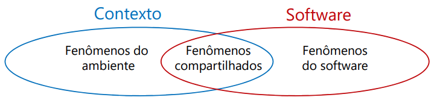
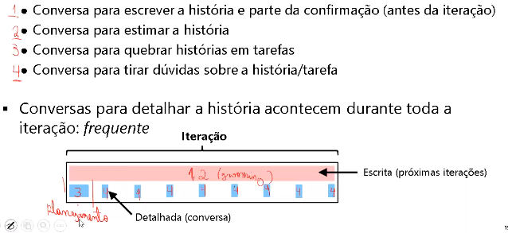

# História do usuário

## Representação de Requisitos
- Requisitos representam fenômenos no ambiente
  - O que os usuários desejam no ambiente com o software
  - Não são detalhes do software

  - “Especificação”: fenômenos compartilhados
  - A parte do fenômeno que deve ser atendida pelo software

<br>

- Independente do formato, um requisito deve ser (ISO 29148, 2018)
  - Necessário
  - Apropriado (nível de abstração apropriado para representa-lo)
  - Não ambíguo
  - Completo (descrição suficiente para o seu uso)
  - Singular (depende da representação)
  - Factível
  - Verificável (conferir se ele foi implementado)
  - Correto
  - Em conformidade com o padrão definido

<br>

- Características importantes para o modelo como um todo (ISO
29148, 2018
)
  - Completo
    - ...não é possível garantir a completude...
    - Mas não deve haver requisitos com “a ser definido”
    - "Como posso saber que não está faltando requisito na minha especificação?" - "Não tem como saber..."
  - Consistente
    - Não pode haver situações como: 
      - 1-Requisito: A; 
      - 2-Requisito: NÃO A;
  - Factível
  - Compreensível (estar claro o que é esperado pelo sistema)
  - Possível de ser validado

<br>

- Texto
  - Termos a evitar
    - Superlativos (ex.: "melhor" e "pior")
    - Linguagem subjetiva ("amigável" e "rápido")
    - Pronomes vagos (ex.:"isso" e "aquilo")
    - Advérbios e adjetivos ambíguos (ex.: "quase sempre")
    - Termos abertos e não verificáveis
    - Frases comparativas
    - Aberturas (ex.: "se possível" e "conforme apropriado")
    - Referências incompletas (dificulta verificação)
    - Afirmações negativas (confuso)

<br>

- Exemplo
  - Como escrever requisitos de software usando linguagem natural?
    - `A interface dese ver amigável`
      - Amigável == adjetivo
    - `O usuário deve ser capaz de gerenciar os pedidos`
      - Gerenciar == ambíguo
        - O que é gerenciar?
        - Qualquer pedido?
  - Melhorando os requisitos que usam linguagem natural
    - `O usuáro deve ser capaz de fechar uma compra pela primeira vez em no máximo 5 minutos`
    - `O usuário deve ser capaz de cancelar e editar a quantidade de produtos nos pedidos feitos por ele enquanto os pedidos não estiverem no estado "em separação"`

## História
- Proposto pela Programação eXtrema (XP)
	- **Descreve uma funcionalidade que será de valor para o usuário ou comprador**
do software (COHN, 2004)
	- Perspectiva de quem quer a característica

<br>

- **Premissas**
	- Ambiente turbulento / inovação
		- Não é possível definir **todos** os requisitos desde o começo
		- Requisitos e o ambiente mudam
			- Evitar situação onde requisitos podem não ser mais necessários (Desperdício)
			- Custo de detalhar algo / custo de atualizar (Desperdício)
	- Dificuldade de expressar todos os detalhes necessários para os desenvolvedores em um documento

<br>

- Conceitos Relacionados
	- **Épico**
		- História Grande
		- Ajuda para o planejamento de release
			- História que não serão tratadas não precisam ser detalhadas
	- **Tarefas**
		- Detalhes dos desenvolvedores
			- Como eles irão implementar a história
		- (É opcional)

<br>

**Conteúdo: 3C**
- Cartão (descrição escrita)
	- “Lembrete de uma conversa”
	- **"tipo um requisito de um stakeholder"**
- Conversas
	- Entre o desenvolvedor e o representante do cliente
	- Imediatamente antes/durante a implementação da história
	- **"na conversa que obtemos o requisito de software"**
- Confirmação
	- Como confirmar que a história está completa
	- **Critério de aceitação da história**

<br>

### Cartão
- "é só um lembrete"
- Manifestação da história
	- ...mas é só um lembrete para a conversa...
	- Cartão/Post-it
- Naturalmente imprecisas
	```
	Como um comprador quero acompanhar o pedido feito para que eu saiba quando os produtos chegarão
	```
- Os clientes/Product Owners escrevem as histórias
	- Podem ter ajuda de desenvolvedores
	- Desenvolvedores podem escrever histórias
		- O PO ainda precisará concordar: ele quem irá priorizar!
- Existem diferentes formatos 	
    1. Afirmação em linguagem natural
        ``` 
        Exemplo:
        Buscar produtos na loja
        ```
	2. Formato estruturado (COHN, 2004) 
	- Como um `<TIPO DO USUÁRIO>`
	- Eu quero `<ALGUM OBJETO>`
	- Para que `<ALGUM MOTIVO>`
        ``` 
        Exemplo:
        Como um comprador 
        Eu quero buscar produtos disponíveis na loja
        Para que eu possa comparar seu preço e compra-los
        ```
	- **No “para que” aparecem metas do usuário**
- **Deve-se evitar detalhes de implementação e interface**

### Conversas
- Permitem que os desenvolvedores entendam os detalhes necessários para implementar

- Exemplo
    ```
    Como um comprador eu quero buscar produtos disponíveis na loja para que eu possa comparar seu preço e compra-los
    ```
  - A busca deve consultar só o nome e a descrição?
  - Como é o resultado da busca?
  - O que acontece se nenhum produto for encontrado?
  - O usuário precisa estar logado?

- Conversas não são apenas para detalhar a história, também servem para: 


#### Problemas
- Problemas
	- Disponibilidade do representante
	- Conhecimento do representante
		- **Ideal: usuário ou representante da área de negócio**
		- Gerente do usuário: não são usuários reais
		- Vendedores: foco na venda e não no uso
		- Especialistas do domínio: pode não conhecer o dia a dia
		- Analista de sistema: precisa conversar com o usuário/cliente (intermediário)
- Poder de decisão do representante do cliente (não pode ser baixo, evitar situações onde o representante do cliente necessite precise consultar alguém antes de tomar decisão)
	- Representatividade
- É possível ter um time de representantes

### Confirmação
- **Condições de satisfação da história**
	- **Capturam como saber se a história foi implementada corretamente**
	- Perspectiva do PO: especificada por ele
	- Critério de aceitação **básico**
		- **Não é a descrição da funcionalidade: é um critério (algo a verificar / testar)**
		- **Não são casos concretos de teste**
- "Ajudam a implementar a história e no direcionamento da conversa"
- Ajudam a refinar a história
	- **Anotações de condições relativas a comportamento esperado/casos excepcionais**
- Anotação de detalhes durante a conversa
	- Condições para testar a história
- Originalmente escrita no verso do cartão de história


---
#### Exemplo 1
> DICA: O que Você quer verificar nesse cenário?

> DICA: acceptance criteria specify conditions under which a user story is fulfilled.

> DICA: Pensar como se fosse uma atividade do usuário, ele pode verificar.

```
Como um comprador eu quero pagar a compra com o meu cartão de crédito para que eu possa receber os produtos
```
- Possíveis critério de aceitação
    - Verificar cartões Visa e Mastercard
    - Verificar números de cartão com menos/mais dígitos
    - Verificar números de cartão inexistentes
    - Verificar cartões expirados
    - Verificar valores acima do limite do cliente
    - Verificar valores baixos
- As situações acima são aquelas que devem ser conversadas com o representande do cliente

#### Exemplo 2
```
Como um comprador eu quero me cadastrar na loja para que eu possa realizar uma compra
```
- Possíveis critério de aceitação
  - Verificar comprador já cadastrado
  - Verificar CPF inválido 
      - Já está entrando em um detalhe: terá CPF. Adequado se for importante para o cliente ou se for durante / imediatamente antes da implementação
  - Verificar cliente com produtos já no carrinho de compra
  - Verificar cliente sem produtos

#### Exemplo 2 com Critérios de Aceitação Ruins
```
Como um comprador eu quero me cadastrar na loja para que eu possa realizar uma compra
```
- Critérios de aceitação ruins
  - Enviar e-mail de confirmação
  - Confirmar e-mail
    - São atividades e não condições a serem testadas
    - “Enviar...” pode ser reescrito, mas “Confirmar e-mail” é uma atividade do usuário!
  - Cadastrar CPF, e-mail, telefone e endereço
    - Está detalhando as informações necessárias: especificação
  - Apresentar dados do cliente corretamente ao visualizar perfil
    - Não é uma confirmação desta história – depende de outra
  - Cadastrar com CPF 123456789-09, nome “Fábio”, ...
    - Muito detalhado: quase um caso de teste

### Confirmação 
- Quando escrevê-la? (Cohn, 2004) 
  1. Em qualquer momento que o desenvolvedor conversa com o PO
     - Durante a conversa é de forma mais detalhada
  2. No início da iteração (Sprint)
  3. A qualquer momento que se pensa em uma nova condição
     - Durante ou depois do desenvolvimento da história
- Idealmente deveria ser escrita antes de implementar
  - Ajuda a entender a história
- Testes mais detalhados podem ser criados durante a iteração
  - PO com ajuda de um desenvolvedor
  - “Testes de aceitação”  testes funcionais/sistema

### Problemas das Histórias do Usuário
- Não são uma documentação de requisitos
  - Pode-se perder os detalhes dos requisitos
  - Importância da confirmação
  - Pode ser necessária uma documentação adicional
- Necessidade de um PO disponível
  - Tirar dúvidas frequentemente
    - Decisão: o que será implementado
- Criar, detalhar e priorizar histórias
  - **Continuamente**
- Criar as confirmações
- Dificuldade de rastreabilidade
  - Essa história atende a quem?
  - Esse defeito afeta quais histórias?
- Dificuldade de entender relações entre histórias
  - User Story Mapping (PATTON, 2014)
- Time pode perder uma visão do todo
- Problemas com times grandes
  - Comunicação é um pré-requisito

### INVEST
- Características de uma **boa história**
	- **I**ndependentes
	- **N**egociáveis
	- **V**aliosos para o usuário/cliente
	- **E**stimável
	- **S**mall (pequenas)
	- **T**estável
- **Independente**
	- Deve-se **minimizar** as **dependências** entre as **histórias**
		- Dificuldade de estimar e priorizar
		- Exemplo:
            > Como um comprador eu quero pagar a compra com o meu cartão Visa para que eu possa receber os produtos
            
            > Como um comprador eu quero pagar a compra com o meu cartão Mastercard para que eu possa receber os produtos
		
          - **Uma solução: generalizar para cartão de crédito** 
			- Na confirmação se faria o teste para cada operadora
- **Negociável**
	- História não é um contrato: é um lembrete
		- Não deve ser tão detalhada!
	- Espaço para o PO negociar os detalhes
- **Valiosas para o usuário/cliente**
	- Importância para que ele priorize
	- **Mesmo histórias técnicas** precisam ter um benefício para usuário/cliente
	- Se a história for muito técnica, ela deveria ser uma tarefa
- **Estimável**
	- Importante para priorizar **(Aula 6)**
	- Problemas
		- História muito grande
			- Quebrar a história em histórias menores
		- Desenvolvedores não tem conhecimento técnico
			- Fazer um estudo (pode-se gerar uma história para isso)
		- Desenvolvedores não tem conhecimento de domínio
			- Conversa com o Product Owner
- **Pequena (Small)**
	- Tamanho que caiba em uma iteração
	- Alguns dias (História) X maior que a iteração (Épico)
	- Como quebrar uma história?

### Requisitos Não Funcionais
- Como representar requisitos não funcionais
  - Histórias normais
    - Cartões anotados como restrições
      - Pode ser difícil organizar
    - Exemplo
      - A confirmação do pagamento deve demorar menos do que 5s
- Defini-los no critério de pronto (Scrum)
  - RNF costumam ser ortogonais às funcionalidades
  - Exemplo
    - Testar página no Chrome, no Firefox e no Edge

### Bugs
- Cohn (2004) sugere criar um cartão para cada Bug
  - Especialmente se o tamanho for similar ao de uma história
  - Se forem simples, podem ser combinados para facilitar a estimativa
    - “Grampear”
  - Podem ser usadas diferentes cores de cartões para diferenciar histórias

### Nível de detalhe
- Tamanho: duração (RUBIN, 2013)
  - Épico: maior que o tempo de uma release
    - Maior que uma iteração
  - História: tamanho em dias
    - Cabe em uma iteração
  - Tarefa: horas
    - Não é uma história: é uma atividade
    - Pode ser feita em um dia
- Histórias são continuamente refinadas
  - Estão em diferentes níveis de detalhe
    - Épicos: histórias para próximas releases
  - Só as histórias importantes são detalhadas

### Conclusão
- Histórias não são só o texto
  - Confirmação e, principalmente, a conversa
- Histórias evoluem com o tempo
  - Nível de abstração (épico)
  - Confirmação
  - Em conversas pode-se identificar novas histórias
- Evita o desperdício de detalhar algo que não será necessariamente implementado
