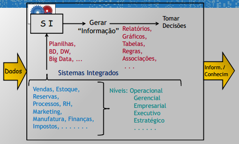
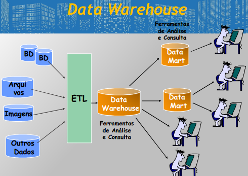
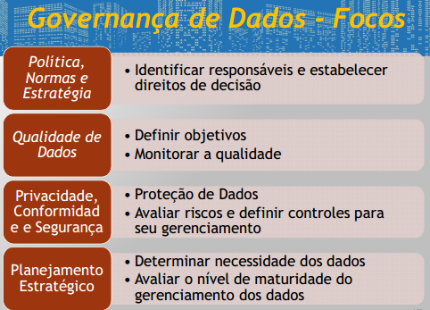

# Grandes Sistemas de Dados
- Data warehouse
- Big data
- Data lake
- Data mining

## Motivações
- Valor dos dados: Reconhecimento da valiosidade dos dados
- Uso intensivo de Dados
- IoT: produção de dados super elevada através do IoT
- Formato diversos dos dados
- Dados históricos
- Integração de dados
- Análises
- Entender os Clientes
- Reter Clientes
- Dados Primários ---> geram ---> dados secundários
- Empresas mais competitivas (velocidade de operação e ação)
- Tomada de decisões com confiança
- Vendas cruzadas
- Predizer tendências
- Otimizar o planejamento
- Otimizar os processos
- Corrigir deficiências do CRM, ERP, Supply chain, PLM (Product Lifecycle Management)

- Engenharia de dados: Prepara a estrutura de dados para os cientistas de dados
- Ciência de Dados: Criar e aplicar métodos para a análise dos dados
- Pattern Warehouse: Padrões obtidos por meio de Data Mining (qdade de dados reduzidas em relação ao DW)
- Data Journalism: Aplicação maciça de análise de dados por jornalistas
- Data Driven Medicine/healthcare: acesso a dados de pacientes para tratamento

### Data Gravity - Dace McCrory
> Data Gravity is a theory around which data has mass. As data (mass) accumulates, it begins to have gravity. **This Data Gravity pulls services and applications closer to the data**. This attraction (gravitational force) is caused by the need for services and applications to have higher bandwidth and/or lower latency access to the data

- Muitos dados atraem mais dados e por consequência atraem mais pessoas
- Com maior quantidade de dados aumenta a responsabilidade e dificuldade em movimentar ee dar acesso a tais dados, bem como protege-los

**Massa de dados** = Volume (tamanho do conjunto de dados) x Densidade (taxa de compressão)
**Massa da aplicação** = Volume (qtde de memória x qtde de disco) x Densidade (taxas de compressão x taxa de utilização de cpu)

## Definição Grandes Sistemas de Dados
- **Sistema de Base de Dados**
  - Sistema computadorizado de armazenamento de coleções de registros/fichas
  - funções basicas: armazenar/recuperar/atualizar/excluir dados 
  **Dados vs Informações**
  - Dados ---> (significado) ---> informação ---> (análise) ---> conhecimento ---> (tomar decisões) ---> "Sabedoria"

### Características Básicas
- Grande volume de dados
- Sistemas para análise de dados
- Tipos variados de dados
- Conjunção de dados variáveis origens
- Isolar o ambiente transacional
- Necessidade de novas equipes de desenvolvimento
- Dados históricos
- Grande disponibilidade
- Excelente desempenho
- Dados não padronizados


```
- Dados
    - Processamento
        - Armazenamento
            - Controle Geral
                - Decisões Estratégicas
```

## **Sistemas de Informação**

- **Definição**: Conjunto de componentes computacionais inter-relacionados que coletam, processam, armazenam e distribuem informação para apoiar o processo de tomada de decisões e o controle de uma organização
  - Contêm informações sobre pessoas, lugares e coisas significativas à organização e ao ambiente ao seu redor
- **Características desejadas de um SI**
  - Flexibilidade
  - Suportar modelos analíticos
  - Manter trilha de alternativas e consequências
  - Refletir entendimento dos grupos da empresa
  - Sensível aos procedimentos operacionais

## Sistemas de Bancos de Dados
- **Aplicações Convencionais/Tradicionais**
  - Dados uniformes
  - Grande número de registros "pequenos"
  - Dados alfanuméricos
  - Transações curtas

## Data Warehouse

- **Obter melhor desempenho nos negócios**
    ```
    Explorar dados -> obter informações -> tomar decisões acertadas
    ```
  - Principal Origem dos Dados: BDs Operacionais
  
- Tipos de dados
  - Registros Tradicionais
  - Documentos completos
  - Planilhas
  - Figuras, gráficos, desenhos técnicos, etc

- Por que DW?
  - Ambiente distinto
  - dados historicos
  - decisões: levar em conta todas informações disponíveis
  - Rapidez



### Suporte à Tomada de Decisões
- Tendência de consumo
- Aumento/redução produção
- Regulação de estoques
- simulação de aalterações
- estratégia de vendas

## Data Mining

- **Data Mining**
```
Data Warehouse ----> (estatísticas/IA) ----> conhecimento (regras/padrões)
```

## Big Data 
- Aumento da geração e armazenamento dos dados
  - IOT
  - Internet, Mídias sociais
  - UP capacidade armazenamento
  - Aumento da capacidade de processamento em geral

- **Motivações**
  - Dados contêm informações/conhecimento significativo e que pelo seu custo e tempo de obtenção merecem tratamento adequado
  - **Compreensão** : análise, captura, tratamento, armazenamento, compartilhamento, consulta e visualização
  - **Problema**: tomar grandes/complexos conjuntos de dados que os aplicativos tradicionais não consigam processar em tempo adequado

- Nova geração de tecnologias e arquiteturas que visam extrair valor a partir de bases de dados muito grandes, com grande variedade de origens, com grande velocidade de captura e análise
- “Big” no Big Data não é somente o tamanho da base de dados
- Não se refere a nenhum patamar de volume de dados
- Os dados são “big” quando seu tamanho se torna elemento ativo do problema

## Data lake
- armazenar dados sem se preocupar como vai ser seu uso
  - armazenar também os metadados
- Dados estruturados, semiestruturados e não estruturados, todos armazenados na forma “nativa
- “Ingestão” de dados em qualquer formato
- Disponibilidade imediata dos dados
- O trabalho fica para o momento da análise
- Tipos de dados: Web, Sensores, Logs, Redes Sociais, Imagens, ...

### Fluxo de Dados Data Lake
1. Ingestão de dados
2. Seleção dos dados a serem analisados
3. Aplicação de ferramenta analítica de dados
4. Utilização dos resultados da análise

## Governança de Dados
- Definição: organização de pessoas, processos e tecnologia para habilitar uma organização a alavancar os dados como recurso
- Visa obter maior taxa de sucesso, entregar mais valor e reduzir tempo de entrega de projetos
- Prover as condições para um gerenciamento eficiente das atividades de TI
- priorizar e direcionar os objetivos



## Gerenciamento de Dados
- Colocar em prática as linhas mestras da Governança
- Aplicar controles e processos para alcanãr os objetivos estratégicos estabelecidos na Governança
- Vai de ações estratégicas até ações operacionais
- Tratar a informação como um recurso muito valioso