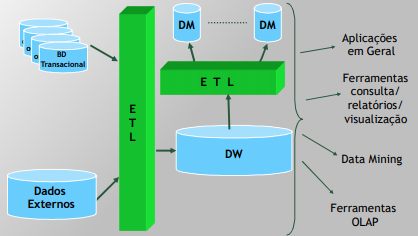
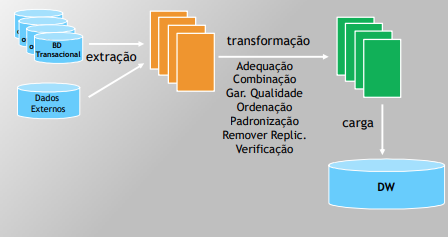
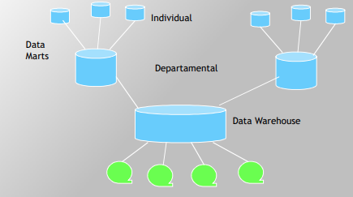
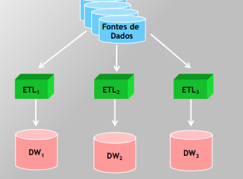
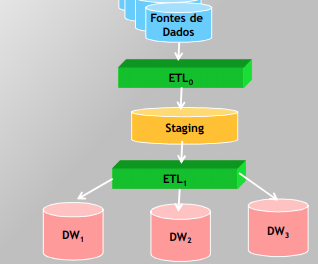
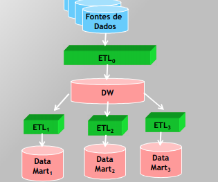
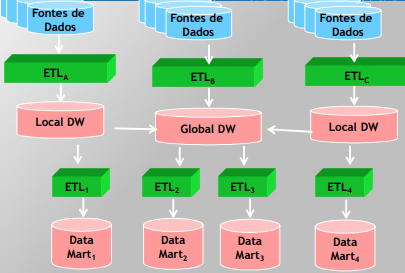
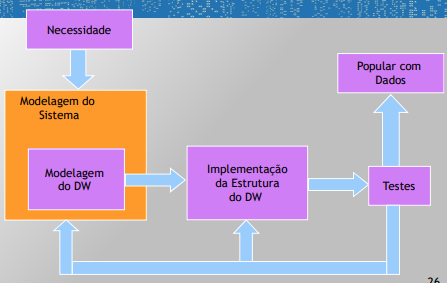
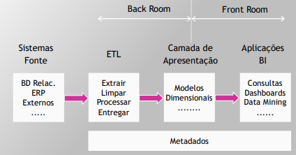

## Qualidade de Dados
- Possui impactos nos lucos
	- (DW: tomada de decisões estratégicas)
- Exemplos: ataques a locais errados, perda de equipamentos, questões médicas
- QD: pode ser melhorada pelo incentivo ao uso dos dados (analogia com fenômeno biológico da atrofia - Ken Orr)
  - Dados não usados == atrofia dos musculos
- Comparação da má QD com a presença de colesterol no sangue (Bill Inmon)

### Baixa Qualidade dos Dados - Principais Causas
- Digitação
- Degradação ---> obsolescência
- Uso incorreto - não conhecimento do significado/má interpretação
- Reestruturação frequente, troca de SGBDs/BDs, SOs, Servidores
- Baixo acompanhamento/monitoração do desempenho da base de dados (isso faz com que os problemas não sejam detectados)

## Data Warehouse

### Definições
> Data Warehouse é uma coleção de dados orientados por assuntos, integrados, variáveis com o tempo e não voláteis, para dar suporte ao processo gerencial de tomada de decisões.
> \- (Inmon)

> Data Warehouse é um processo em andamento que **aglutina dados de fontes heterogêneas**, incluindo dados históricos e dados externos **para atender à necessidade de consultas** estruturadas (consultas já criadas mas parametrizadas) e ad-hoc (através de ferramenta criar a consulta ao vivo), relatórios analíticos e de suporte à decisão. (Harjinder)

> **Data Warehouse é o _processo de integração_ dos dados corporativos de uma empresa em um único repositório**, a partir do qual os usuários podem facilmente executar consultas, gerar relatórios e fazer análises. (Singh)

> Data Warehouse é o um sistema que extrai, limpa, trata e entrega dados de várias fontes em um modelo dimensional e suporta/implementa consultas e análises para o processo de tomada de decisão. (Kimball)

### Motivações
- Motivos para se ter um Data Warehouse
  - Necessidade de Disponibilidade
  	- SGBD disponível 24/7 365 (meta)
  - Dados são distribuidos
  	- Muitos bancos de dados distribuido dentro da propria empresa
  - Desejável bom desempenho
  	- Consultas para tomar decisões estratégias (médio, longo prazo)
  - Processamento transacional
  	- **Não podemos atrapalhar o transacional para fazer, por exemplo, uma consulta estatística**
  - Segurança
  - Prazo para Armazenamento dos Dados
  	- Conforme tabelas crescem, as consultas realizadas crescem proporcionalmente
  	- Não da para ficar armazenando nos bancos transacionais uma quantidade de dados muito grande, por isso o "prazo de validade'
  - Dados não Padronizados
 
### Estrutura

#### Estrutura Básica

#### Ações - Extração, Transformação e Carga

### Fragmentação do DW

  - Os simbolos verdes são fitas magnéticas

- ETL: Extration Transformation Load
- DM: Data Marts "mini dw"
	- podemos ter vários níveis de DM
		- Ex: DW do brasil todos e DM representando regiões (Sul, Suldeste, Nordeste, etc)
	- abrange dados novos e antigos
	- dados completos e resumidos
	- dados convertidos ou não

### Arquitetura - Data Marts Independentes

### Arquitetura - Jub and Spoke

### Arquiteturas – Hub and Spoke

### Arquitetura - DW Distribuído

### DW vs BD Transacional
- Objetivo
  - BDT 
	- Rodar o negócio
	- Operações diárias
  - DW
    - análise do negócio
    - decisões estratégicas de longo prazo
- Tipo de informação
  - BDT
    - Operacional
  - DW
    - Informativo/analítico
- Unidade de trabalho
  - BDT
    - Consulta, Inserção, Alteração, Exclusão
  - DW
    - Carga e consulta
- Volume
  - BDT
    - MB-GB
  - DW
    - MG-TB
- Granularidade
  - BDT
    - Dados detalhados
  - DW
    - Dados detalhados e resumidos
- Dados
  - BDT
    - Atuais/Operacionais
  - DW
    - Históricos
- N Registros/Transações
  - BDT
    - Pequeno/médio
  - DW
    - grande
- Acesso
  - BDT
    - Grande volume de transações
  - DW
    - Médio volume de análise
- Utilização
  - BDT
    - Constante (alta)
  - DW
    - Picos

### Ambientes DW
- Interação com o Gerenciador de Arquivos
	- Utilizar o SO
- Garantir integridade
	- Impor restrições nos dados
	- Verificar se violam regras de integridade
- Garantia da Segurança
	- Nem todo usuário do DW deve ter acesso a todo conteúdo/operações do DW
- Recuperação e Backup
	- Falha: mecanismo de recuperação -> restaurar DW à situação original
	- Facilidades de recuperação - copias de segurança
- Controle de concorrencia
	- controle da interação - usuarios concorrentes -> não violar consistências de dados

### Ciclo de Desenvolvimento
1. necessidade
2. Modelagem do sistema
	2.1 - Modelagem do DW
3. Implementação da estrutrua do DW
4. testes
5. popular com dados

#### Back Room(end) e Front Room(end) DW

### Modelagem Dimensional
- Estrutura de dados **Medições** e **Dimensões**
  - **Medições:** Dados numéricos: Tabela Fato
  - **Dimensões:** 
    - Parâmentro do negócio
    - Tabela satélites vinculadas à tabela fato central: **Tabelas Dimensão**
    
#### Star Join Schema - Slide 36
- Tabela "grande" (tabela fato)(quantidade de dados) no centro rodeada por tabelas "auxiliares" (tabelas dimensão)

## Exercício 
> Tendo como base os conceitos apresentados, quais são os principais aspectos positivos decorrentes da implantação de um Data Warehouse? E os aspectos negativos? 

Uma das grandes vantagens/aspectos positivos decorrente da implantação do Data Warehouse de acordo com Inmon é o suporte adicional dado ao processo gerencial de tomada de decisões. Através do Data Warehouse análises e informações estratégicas para o negócio podem ser produzidas. As informações contidas dentro do DW são provenientes de fontes diversas e o DW permite a centralização destas informações. Antes de se armazenar os dados, ocorre um processo transformação dos dados o que permite armazenar dados mais "limpos" conterão a informação que interesa no formato certo, ou seja, estarão padronizados. Outro aspecto positivo da utilização do DW é o não impacto nos sistemas transacionais, por se tratar de um sistema apartado, consultas e interações com o DW não degradam o desempenho do ambiente, sistemas e serviços do transacional da companhia.

Podemos citar como aspectos negativos a dificuldade de capturar, transformar e padronizar em dados significativos para o DW os dados que são proveniente de diversas fontes. O volume 