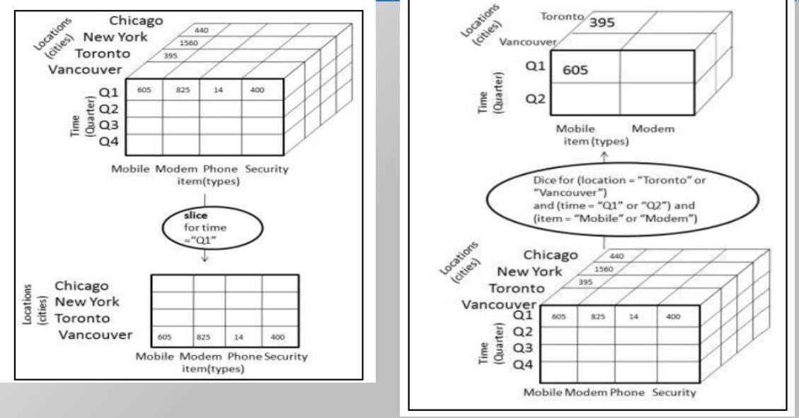
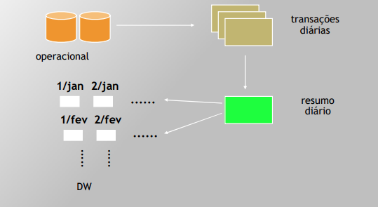
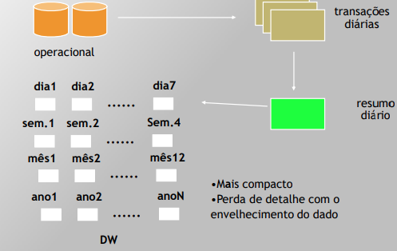
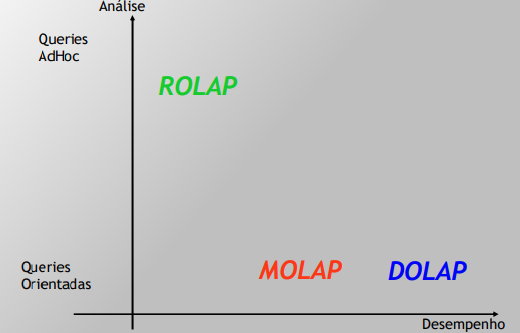

# DW Aspectos e Modelo Dimensional

## DW Aspectos
- **Aspectos positivos e negativos decorrentes da implantação do Data Warehouse**
	- Aspectos positivos
		- Integração de diversas fontes de dados
		- Acesso facilitado a dados históricos
		- Possibilidade de analisar diferentes janelas de tempo
		- Separar operações de operações convencionais e de tomada de decisão
		- Acesso a relatorios estruturados ad-hoc
		- redução do tempo total para análise
		- Análises e informações estratégias para o negócio podem ser produzidas
		- Armazenar dados mais limpos e padronizados
 
	- Aspectos negativos
		- amplia possíveis problemas com garantia de segurança
		- dificilmente implementação de alterações na implementação dos modelos
		- custos de projeto, instalação e manutenção
		- curva acentuada de aprendizado e aceitação

## Modelo Dimensional (Slide 28)
### Modelagem do DW
- Tabela fato
	- Chaves estrangeiras
	- Valores **Fato** que representam a medição do item que está sob foco.
    	- Valores numéricos (medições)
    	- Cada valor: Interseção de todas dimensões
    	- Exparso: Não há dados em todas interseções
    	- Nível de detalhe da tabela fato -> **granularidade**
   	- contém indicadores importantes para uma área de negócio
- Tabelas dimensão
	- Chaves primarias ficam aqui
	- Atributos descritivos
	- definem propriedades da dimensão
    - Campo numérico: fato ou atributo?
      - Se varia a cada amostragem -> fato
      - Se é uma descrição praticamente constante de um item -> atributo

- star schema
- exige estar pelo menos na primeira forma normal
---

- Dimensões desnormalizadas 
- Modelo simples 
- Diminui necessidade de junções --> melhora no desempenho 
- Expansão simplificada do modelo do DW
---

- Cubo de Dados: denominação de uma estrutura dimensional produzida por uma consulta 
- Dimensões originais: produto, loja e tempo
- Cube. Another term for a **fact table**. It can be represented "n" dimensions, rather than just three (as may be implied by the name).
---

- Roll up - menos detalhes
- Drill Down - mais detalhes
- Slice and Dice - ex: trocar dimensão tempo por localização
  - 
- Pivot/rotation - ex:  mobile-typeXcities --> citiesXmobile-type

Search uolps### MDX - Multi-Dimensional eXpressions
- linguagem de consulta utilizada em bases de dados multidimensionais

## Granularidade
- Nível de detalhe/resumo nos dados
	- Maior detalhamento ==  maior granularidade
	- Menor detalhamento == menor granularidade
- Afeta diretamente
	- Volume de dados
	- Tipos de consultas que podem ser atendidas
- Necessidade de encontrar um **equilíbrio**
	- Armazenamento X Necessidade de detalhamento
- O data warehouse não é o ambiente adequado para responder a consultas detalhadas
### Estruturação dos Dados
#### Cumulativa

#### Rotativo

## Ferramentas de Acesso ao Data Warehouse
### Ferramentas de Consulta/Relatórios / Visualização
- Geração de relatórios padronizados
- Questões estruturadas
- Apresentação em gráficos e tabelas

### Ferramentas OLAP
> Tecnologia de software que permite que analistas, gerentes e executivos obtenham, de maneira rápida, consistente e interativa, acesso a uma ampla variedade de visualizações possíveis de informações que reflita a dimensão real do empreendimento do ponto de vista do usuário

### O que é OLAP
- Suportar análises e Consultas AD Hoc 
- Acesso às informações no modelo multidimensional 
- Informações: visualizadas por gráficos / relatórios / tabelas 
- Visão Multidimensional: visualizar cubos de informação sob diferentes ângulos (sliceand-dice) e níveis de agregação (drill/down)

### ROLAP - Relational OnLine Analytic Processing
- Extrair dados diretamente do esquema dimensional 
- Acesso a todos os dados (sumarizados/detalhados)
- Maior tempo de acesso em relação ao MOLAP e ao DOLAP

### MOLAP - Multidimensional OnLine Anaytic Processing
- Cubos pré-montados armazenados no servidor 
- Tempo de acesso reduzido 
- Restrição a consultas (cubo pré-montado)

### DOLAP - Desktop OnLine Analytic Processing
- Cubos pré-montados armazenados no cliente 
- Tempo de acesso reduzido
- Restrição a consultas (cubo pré-montado) 
- Transmissão do cubo pela rede de comunicação

### DOLAP vs MOLAP vs ROLAP

### Características Ferramentas OLAP
- Paging: apresentação em várias páginas
- Filtering: filtragem de dados
- Rotacionamento: rotação do cubo
- Breaks: separar grupos de informações
- Sorts: ordenamento de informações
- Exceções: restringir grupos de valores
- Visualização de limites: diferenciação de cores/fontes
### Thinking Before Get OLAP
- Definir necessidades de negócio antes de contatar fornecedores
  - Descobrir o que os usuários realmente
precisam, não o que eles dizem precisar
  - Envolver usuários finais em todos os estágios
  - Volume de dados (atual e futuro)

## Matriz de Barramento
TODO