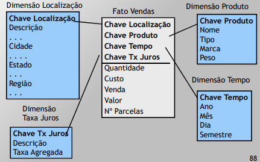
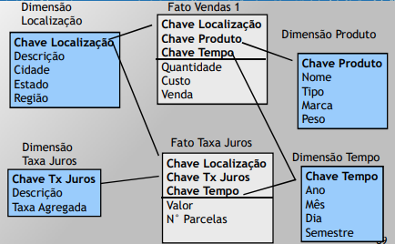
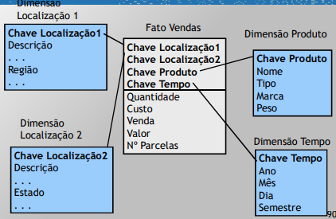
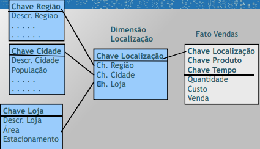
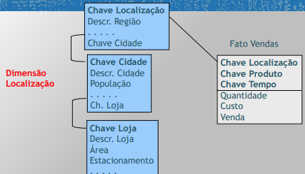
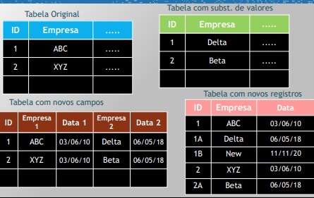

# 20210601

- [data-warehouse-tipos-fatos](https://rafaelpiton.com.br/blog/data-warehouse-tipos-fatos/)

## Variantes do Modelo Dimensional Partial Star
- Múltiplas tabelas para cada dimensão e/ou para os fatos
- Separação/criação em função do nível de sumarização

### Star Completo

### Star Particionado da Tabela Fato

### Star Particionado das Tabelas Dimensão

## Snowflake Chain
- "É tipo uma normalização"
- Normalizar tabelas dimensão
- desvantagens: complexidade maior e menos intuitivo
- vantagem: espaço de armazenamento
- snowflake parcial: normalizar algumas dimensões
- duas variantes: **lookup e chain**

### Lookup

### Chain

## Modelagem Tabela Fato e Dimensão Atores
- O administrador de dados define os atributos das tabelas fato e dimensão.
- O administrador do DW define e implementa a estrutura técnica.

## Dimensões de Modificação Lenta
- **Dados das tabelas dimensão podem sofrer modificações **(estado civil, endereço, filhos, nomes de dptos, . . .)

### Exemplos de Modificações Lenta
- Substituição de valores antigos 
	- Perda da capacidade de análise histórica, pois há a substituição do valor antigo
	- Usado quando o valor antigo perde significado

 

- Criação de novos campos para indicar o estado atual do objeto

 

- Criação de novos registros com os novos valores
	- Necessidade de usar chaves generalizadas
	- Divisão do histórico considerando os diversos registros
	- Mantém histórico

