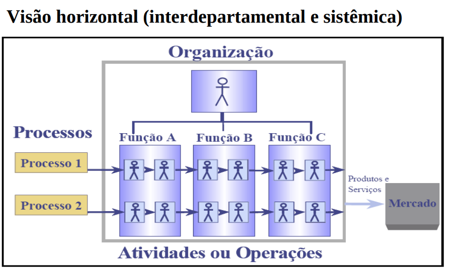
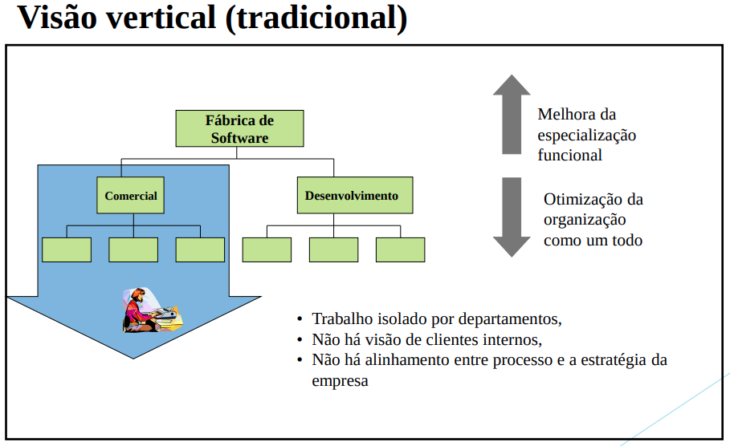
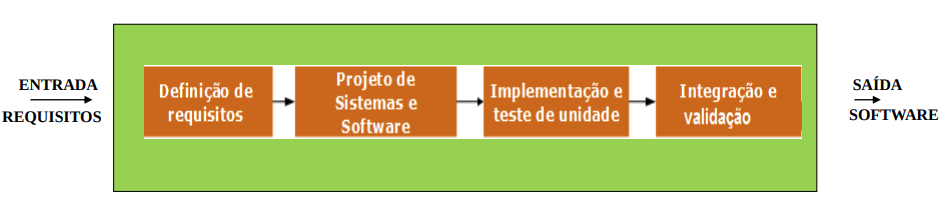
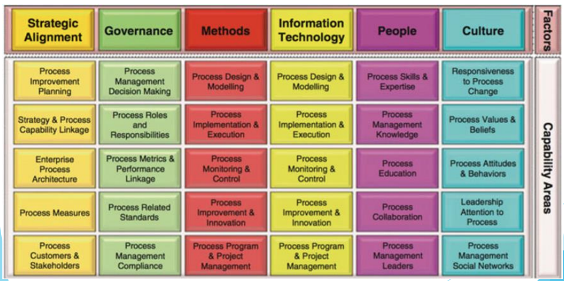
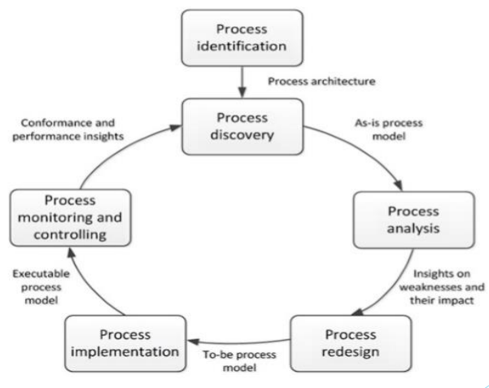
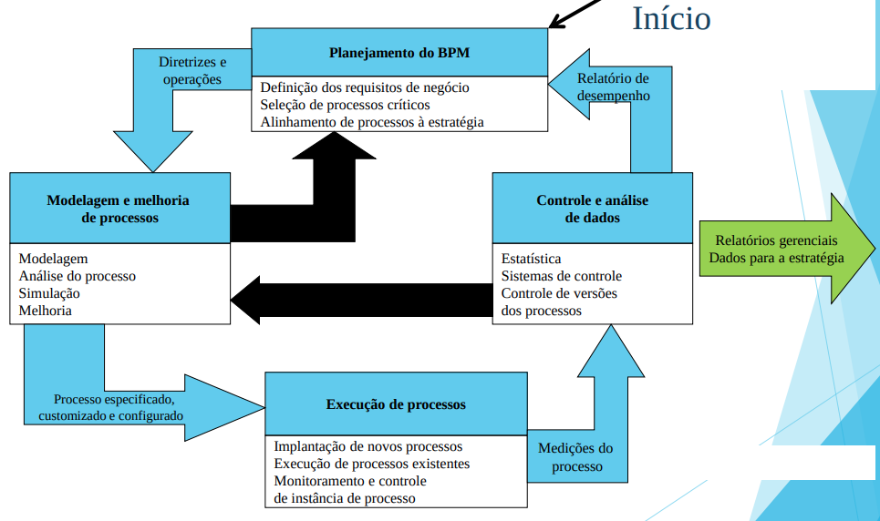

# Business Process (BP), Business Process Management (BPM) e Business Process Modeling Notation (BPMN)

## Arquitetura de Processos
Os processos organizacionais podem seguir um Padrão de Arquitetura denominado **APQC PCF* (Process Classification Framework)** publicado pela **American Productivity and Quality Center (AP&QC)**

- A arquitetura considera doze categorias de processos agrupadas em: 
	- **Processos Operacionais** 
	- **Processos de Gerência e de Serviços de Apoio**

- Arquitetura PCF favorece a visão horizontal dos processos (**visão sistêmica**) e não uma visão funcional (hierárquica)

- Processos horizontais perpassam as áreas (ou departamentos) organizacionais, eliminando barreiras e favorecendo a comunicação interdepartamental.




### Processos de Desenvolvimento de Software


### Gestões Pirâmide
```
                    ###
                ###########
            ### Estratégica ###
         ######### Tática #########
    ############ Operacional ############
################## Processos ##################
```

## Business Process (BP)
- "pode ser um processo de software, mas pode ser outros tipos de processos"
- Define os papeis e a relação entre os papeis

> Is normally used within the context of an organizational structure **defining functional roles** or relationships.
> \- Chinosi & Trombetta

> Is a set of one or more **linked procedures or activities** executed following a **predefined order** wich collectivelly **realize** a **business objective** or policy goal.
> \- Chinosi & Trombetta

- Ponto de atenção sobre o BP
> BP or Business Process collaboration across enterprise is a **complex task** due to the **lack of unique semantics** for the terminology of BP models and the use of various standards in BP modeling and execution.
> \- Chinosi & Trombetta

## Business Process *Management* (BPM)
- Gerênciamento do (BP)
> Provides governance of a business’s process environment to improve agility and operational performance
> \- Chinosi & Trombetta

> Is a systematic **approach to improve any organization’s BP**
> \- Chinosi & Trombetta

- Facilita a **cooperação** entre as **estratégias** e competências organizacionais e as atividades diárias
	- estratégias de negócio e de tecnologia
- Apresenta um ciclo de vida próprio que favorece sua institucionalização dentro da organização

---
- **BPM refere-se a gestão concentrada na melhoria do desempenho corporativo por meio do gerenciamento e controle dos processos do negócio**

---

> BPM is not a technology and it is not related to diagram creation or systems architecture
> \- Chinosi & Trombetta

> Uses an integrated **set of corporate capabilities**, including strategic alignment, governance, methods, technology, people, and culture, to **analyze, design, implement**, continuously **improve**, and disruptively innovate **organizational processes**

### BPM Developmental Paths
- BPM as a management discipline is characterized by two developmental paths

#### **Process Improvement** 
> Focused on **analyzing existing business processes in pursuit of continuous or incremental process improvement**. Examples of developments on this path are Total Quality Management (TQM), Lean Management, and Kaizen). Studies on statistical process control provided basic principles by conducting systematic analyses of processes.

#### **Process Reengineering**
> Demanded the radical redesign of extant processes from end-to-end in light of organizational goals, particularly capitalizing on the potential of information technology (IT) as a major driver of innovation

### BPM Six Core Elements Model
1. Strategic Alignment: BPM contributes to the organization’s superordinate, strategic goals.
2. Governance: BPM must be implemented in the organizational structure.
3. Methods: BPM must be supported by methods for process design, analysis, implementation,
execution, and monitoring.
4. Information Technology: BPM must use technology, particularly process aware information
systems, as the basis for process design and implementation.
5. People: BPM must consider employees’ qualifications in the discipline of BPM and their expertise with relevant business processes.
6. Culture: BPM must be met with a common value system that supports process improvement and
innovation.

<br>



### Lifecycle BPM Model
- Illustration of how a BPM project can be organized



<br>




## Business Process MODELING 
> is the activity or representing processes of an organization that the current (**“as is”**) processes may be analyzed and improved in future (**“to be”**) processes.
> \- Chinosi & Trombetta

> is typically performed by business analyst and managers who are involved in process improvement for better efficiency and quality

### Gestão de Processos: técnicas de mapeamento
- Entrevista – em geral aplicada a um número reduzido de pessoas envolvidas nos processos
- Questionário – aplicado a muitos envolvidos no processo
- Workshop – iteração, discussão aberta
- Observação – verificação in loco, com reduzida interferência

### Gestão de Processos: técnicas de modelagem
- A partir da criação dos fluxogramas, as técnicas para modelagem de processos evoluíram.
- Dentre as técnicas para padronização da notação, verifica-se:
  - BPMN (Business Process Model and Notation) (OMG)
  - UML (Unified Modeling Language) (OMG)
  - IDEF (Integrated DEFinition) (DoD) (NIST)
  - EPC (Event-driven Process Chain) (ARIS/IDS-Scheer)

## Business Process Modeling Notation (BPMN)
- É uma notação de modelagem de Processos de Negócio desenvolvida pelo BPMI (Business Process Management Initiative) e incorporado pela OMG (Object Management Group)* após fusão das duas entidades. 
- é um padrão para a modelagem de processos de negócio
- diminui a distância entre o mapeamento de processos e a implementação técnica destes processos

- BPMN has four categories of graphical elements to build diagrams (BPD)
	- BPMN consist of: 
		- Flow objects
		- Connecting objects
		- Swimlanes
		- Artifacts