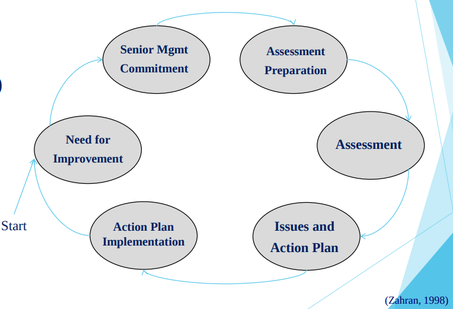
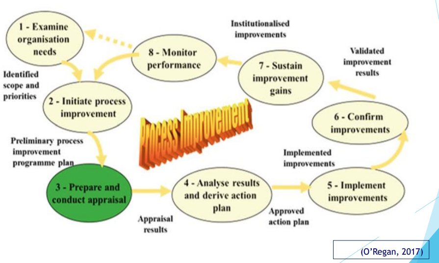
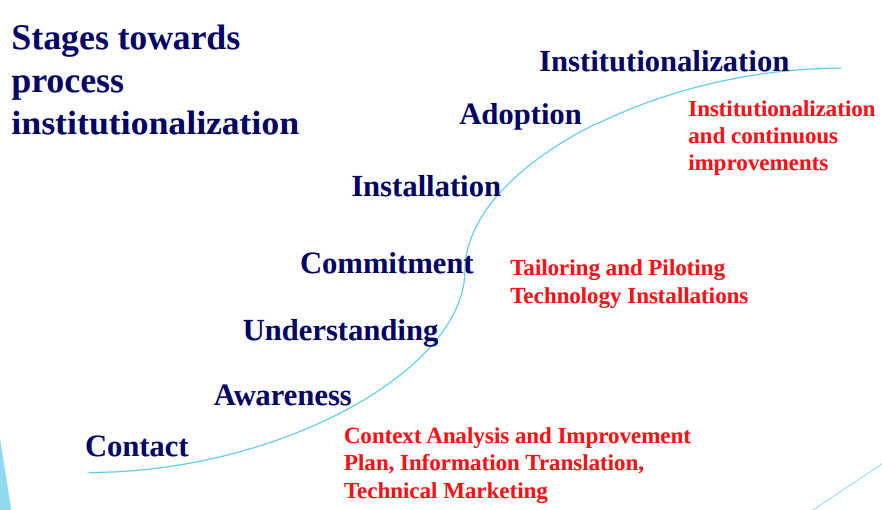
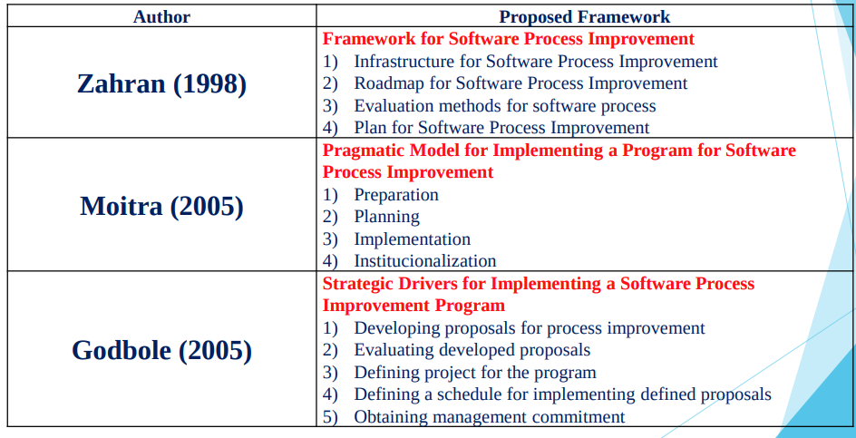
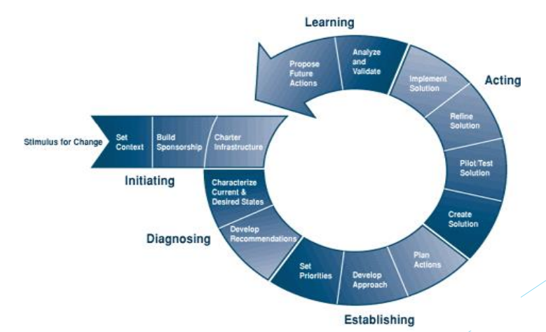
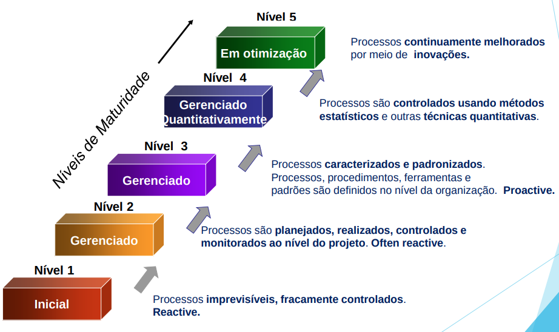
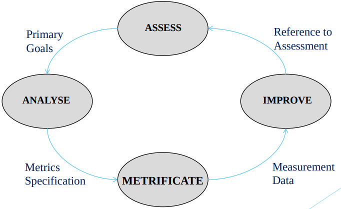

# Melhoria de Processos de Software - Process Improviment
 - Gestão por Processos
 - Metodologia pega passos do processo e agrupa passos do processo

## Standards and Models for Software Process Improvement (SPI)
- **Standards define the minimun to be achieved**
- A standard measure compass in “pass” or “fail”
- In general, standards are owned and maintained by the National or International Standards Organizations
- Models are flexible and can be customized by the organizations
	- Depending on the scope and focus they are owned and maintained by an industry consortium or by na specialized institution
	- **CMMI** is the most notable example of model for software process
	- Brazil also have the **MPSBR** Program for SPI
	- **Bootstrap Process Model** and **Trillium Model** are examples of models maintained by an industry consortium

## SPI Program Implementation
- Process should be always improved to not deteriorate
- SPI should be a continuous effort practiced by the overall organization
- Organization structure should be established to sustain the process improvement effort

### SPI LifeCycle

### Principles of an SPI Program Implementation
- necessidade de "aculturamento"
- [Creating an SPI Action Plan](#--creating---an-spi-action-plan)
- [**Allocation** Responsibilities for SPI](#--allocation---responsibilities-for-spi)
- [**Implementing** SPI actions](#--implementing---spi-actions)
- [**Institutionalizing** the SPI Program](#--institutionalizing---the-spi-program)

#### **Creating** an SPI Action Plan
- Recommendations based on internal or external assessments
- Process behavior has to be embedded into the organization (organization process focus)
- Dedicated resources should be allocated
- Management sponsorship and staff commitment are vital

#### **Allocation** Responsibilities for SPI
- Roles and responsibilities should be well allocated for the implementation of the SPI Program
- Management and tecnical staff should be encouraged to participate in the implementation

#### **Implementing** SPI actions
- Process should be mapped, designed (or **redesigned**), defined and implemented
- Measuring shoud be defined

#### **Institutionalizing** the SPI Program
- Process thinking and process discipline should be instituionalized
	- "não implementar a cultura da imposição" 
- Managers and tecnical staff should use and propose improvement to the process

#### Process Improvement

## SPI Program Institutionalization

### Managing the Change
- Cultural changes – change the culture is a trivial matter
- Behavioral changes – involving people who will have to change
- Organizational changes – being aligned from the organization
- Technological changes
- Environmental changes

## Frameworks for SPI
1. Framework for Software Process Improvement (Zahran, 1998)
2. Pragmatic Model for Implementing a Program for Software Process Improvement (Moitra,2005)
3. Strategic Drivers for Implementing a Software Process Improvement Program (Godbole, 2005)

### Framework for Software Process Improvement
- [Infrastructure for Software Process Improvement](#infrastructure-for-software-process-improvement)
- [Roadmap for Software Process Improvement](#roadmap-for-software-process-improvement)
- [Evaluation methods for software process](#evaluation-methods-for-software-process)
- [Plan for Software Process Improvement](#plan-for-software-process-improvement)

#### Infrastructure for Software Process Improvement
- basically considering two infrastructures to support the software process; the first one organizational and managerial, the second, technical

#### Roadmap for Software Process Improvement
- a logical approach with identified steps should be defined to provide effective implementation of software processes. In this case, models and standards can be adopted as the CMMI or ISO / IEC 15.504 or adopting customized versions to meet the needs of the organization

#### Evaluation methods for software process
- this evaluation method must be applied to assess the current situation of software processes used by the organization. Perhaps this assessment is performed according to what is prescribed in the roadmap adopted (item 2). Improvement actions should gradually satisfy what is established by the roadmap (model and / or standard adopted by the organization)

#### Plan for Software Process Improvement
- this plan involves the transformations identified during the evaluation phase (item 3). Actions must be understood and specified so that they are effectively applied to the processes to effectively achieve the desired improvements

### Pragmatic Model for Implementing a Program for Software Process Improvement [Moitra (2005)]
#### Preparação
- uma visão sobre as mudanças desejadas deve pautar-se nos processos que necessitam de melhorias, porquê necessitam de melhorias, bem como definir-se uma ordem de prioridades para realização das melhorias.

#### Planejamento
inclui a formulação de objetivos mensuráveis para se realizar as melhorias e a projeção dos esforços a serem realizados para se alcançar tais melhorias. Isto envolve a definição de atividades atendendo-se a restrições de tempo e a definição de papéis e responsabilidades para se realizar as mudanças sugeridas na preparação.

#### Implementação
nesta fase deve se operacionalizar o plano e realizar os objetivos de melhoria de processos de software conforme definidos em tempo de planejamento. Deve se comunicar os benefícios das melhorias alcançadas para perpetuar a visão de melhoria contínua dos processos.

#### Institucionalização
deve se verificar que a mudança (melhoria) é permanente na organização. É tornar claro que o processo foi definitivamente melhorado, deixando de ser utilizado somente em projetos pilotos, mas sendo utilizado por todos os colaboradores para que os benefícios que foram intencionados para sejam alcançados

### Strategic Drivers for Implementing a Software Process Improvement Program [Godbole (2005)]
For Godbole (2005) strong attention should be given to the following actions that favor the success of the implementation of a SPI Program.
- Strong relation with the organization's business processes;
- Selection and involvement of the "right" people to implement this plan;
- Productive communication and sharing of ideas among those involved in
the program; and
- Approach that provides an objective view on the proposed actions.

### Zahran Vs Moitra Vs Godbole

## IDEAL Model
O IDEAL Model, numa abordagem cíclica, propõe cinco fases que definem o caminho para a implementação de um Programa de Melhoria de Processo de Software (SPI Program).

### Initiating 
- Se estabelece a infraestrutura para a mudança
- Os papéis e responsabilidades são definidos e os recursos são assinalados
- O SPI Plan é criado, é aprovado e os compromissos para implementá-lo devem ser estabelecidos.

### Diagnosing (Diagnosticar)
- Inicia-se as atividades com o objetivo de se identificar os
processos organizacionais num formato “as-is”
- Se define uma baseline do processo atual

### Establishing (Estabelecer)
- Priorizam-se as ações que direcionam as atividades de mudanças
- Define-se uma visão organizacional dos processos num formato “should be”
- Definem-se os gaps (lacuna) entre o formato atual e o proposto para se delinear as mudanças

### Acting (Agir)
- São mapeados, definidos e implementados os novos processos
- As mudanças são verificadas por meios de projetos “pilotos”
- As mudanças são institucionalizadas no âmbito organizacional

### Learning (Aprender)
- Registram-se as lições aprendidas conforme as ações realizadas
- Realiza-se as medições quanto as melhorias identificadas
- Os dados são coletados e os resultados são divulgados.

## SPI Model- CMMI
- O CMMI é uma estrutura que **descreve os principais elementos de um processo de software efetivo**, ou seja, de um processo que pode ser caracterizado como praticado, formalizado, indispensável, medido e passível de melhorias.
- O CMMI propõe um caminho gradual que direciona as organizações a se aprimorarem continuamente na busca da sua própria solução dos problemas inerentes a melhoria de processos

 

- O CMMI focaliza a capacitação da gerência de processo, na qual a qualidade do produto, é determinada principalmente pelos processos utilizados.
- O CMMI considera práticas para Planejar, Desenvolver, Gerenciar, e Manter processos de Engenharia de Software.
- Quando essas práticas são seguidas rotineiramente, as organizações estão habilitadas a aprimorar o controle de custo, cronograma, produtividade e qualidade

 

- O CMMI **não é um método**, pois não estabelece ações operacionais específicas. É um Modelo que **necessita ser estudado, compreendido e adaptado às características de cada organização**.
- **Cada organização deve determinar como desenvolver e manter software** de modo que as práticas do CMMI sejam satisfeitos

### SPI Model- CMMI Níveis de Maturidade

### CMMI Fluxo de Implantação

## Process Measurement Program
- Measurement Program is part of an SPI Program
- Measurement roles and responsibilities should be allocated
- Measurement should cover process, project and product
- Define clear objective of the Measurement Program

### Goals of Measurement Process
- Parameters for managing the process
- Key Indicators for measuring process performance
- A Measure Process should be SMART (Specific, Measurable, Attainable, Relevant, Traceable)

### Activities for Process Measurement

- ASSESS
  - Assess the environment
  - Define primary goals
  - Check the goals against the assessment
- ANALYSE
  - Break down management goals into sub-goals
  - Check consistency
  - Identify metrics for each sub-goal
- METRIFICATE
  - Write and validate measurement plan
  - Collect primary data
  - Verify primary data
- IMPROVE
  - Distribute, analyse and review
  - Validate the metrics
  - Relate the data to goals and implementation actions.

### Quantitative benefits
- Increased productivity
- Early error detection and correction
- Improved maintainability (process and product)
- Process simplification
- Employee morale
- Motivation
- Staff turnover
- Disciplined culture
- Improved communication