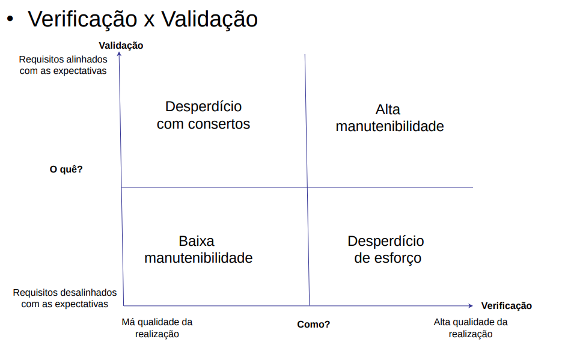
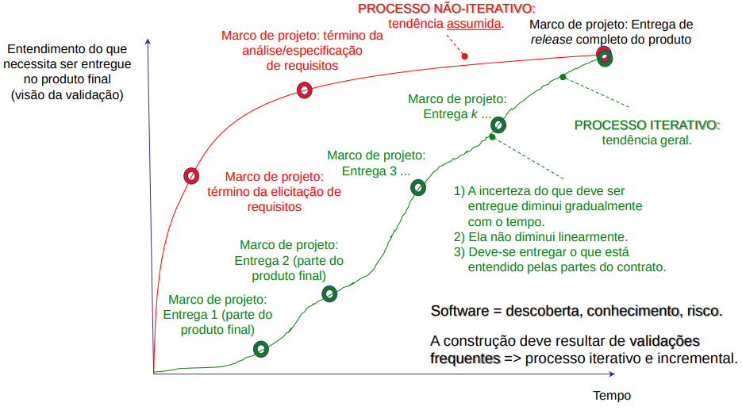

# Aula 1 - Introdução
e-mail: paulo.muniz@usp.br

## Apresentação da Disciplina
- Apresentar conceitos e técnicas básicos para:
	- Os principais tipos do teste funcional de software: unidade, integração e aceitação
	- Uma visão geral da automação dos testes e da integração contínua/entrega contínua (CI/CD)
	- projetar casos de testes e depois projetar os testes
- Restrição
	- Trataremos apenas a representação dos requisitos em história de usuário
- Restrições ao escopo da disciplina
	- Na disciplina optamos por trabalhar com poucos métodos e técnicas utilizados nos tópicos abordados, para que possamos aplicá-los de modo prático. A ideia é dominar os métodos e técnicas fundamentais
	- Consequência: não trataremos vários tópicos desta vasta área do conhecimento do engenharia de software, como, por exemplo, teste de requisitos não funcionais de software, teste exploratório, técnicas mais sofisticadas para casos de testes.
	- Não discutiremos o uso de frameworks específicos

### Metodologia
- grupos 4 pessoas
- atividades baseadas no projeto integrado do curso
- Apresentações: aulas 5 e 10
- As aulas 1-4 e 6-9 têm duas partes
	- Primeira parte: Exposição de conceitos
	- Segunda parte: Exercício da aula.
- Em até duas semanas após o término das aulas, **ocorrerá a entrega do trabalho final**
```
Sumário
1. Introdução (Apresentação do documento)
2. <Tema da Apresentação 1> (Para cada objetivo definido,
	2.1 – <Objetivo 1> justificar as decisões tomadas)
	... (O trabalho final NÃO é um conjunto
3. <Tema da Apresentação 2> de transparências! Deve ser
	3.1 – <Objetivo 1> um texto objetivo, inteligível.)
	...
n. Considerações Finais (Benefícios e dificuldades)
```


- **Nota**
```
Nota individual = Apresentação do Grupo * 0,1
 + Participação individual na apresentação * 0,2
 + Comprometimento nos exercícios das aulas * 0,2
 + Trabalho final do Grupo * 0,5. 

```


---

- **vocabulário**
	- manutenível

## Verificação e Validação
### Verificação
- "Estamos construindo certo o produto?"
	- o sw deve estar conforme à especificação
	- **resultados**: correto e incorreto.

### Validação
- "Estamos construindo o produto certo?"
	- O sw deve fazer oque os interessados no produto realmente esperam dele
	- **resultados**: apropriado e inapropriado




## Evolução Projeto - Processo Não-Iterativo vs Processo Iterativo


- Uma conclusão para o teste
  - A **validação frequente** da construção do software é essencial para **diminuir a incerteza** sobre o que tem de ser feito.
  - O teste é, portanto, **mais do que a checagem dos resultados** da execução dos casos de teste, ele **avalia o produto de software pelo aprendizado sobre ele**, usando a exploração e experimentação. 
  - devemos distinguir duas noções interligadas, mas distintas: a atividade humana do projeto dos testes e a automação da base de código de teste


## Histórias de Usuário e Testes
- Preparação das histórias para os testes
	- Testes permitem aprender sobre o conhecimento representado em história de usuário
	- Um meio que também ajuda a melhorar esse aprendizado é a avaliação dessa representação
	- Antes de projetar testes das histórias de usuários, é muito útil que as **histórias** devam ser **avaliadas quanto à sua qualidade**

<br>

- Enfoques típicos de revisão de histórias
	- baseados nos critérios heuristicos do **INVEST**.
		- Independent - histórias idealmente são independentes uma da outra ou com independencia minimizadas
		- negotiable - a história não é uma especificação final, ela é variável
		- valuable
		- estimable - propriedade da história de ser possível de ser estimada
		- small
		- testable

<br>

- o problema que temos nem sempre é trivial (1)
	- primeiro: existem dezenas de variantes de representação de histórias de usuário
	- segundo: como minimizar uma avaliação genérica da qualidade das histórias de usuário?

> Podemos dizer que as histórias de usuário constituem uma linguagem controlada (ou restrita) que denotam uma concepção a respeito de um domínio de interesse.