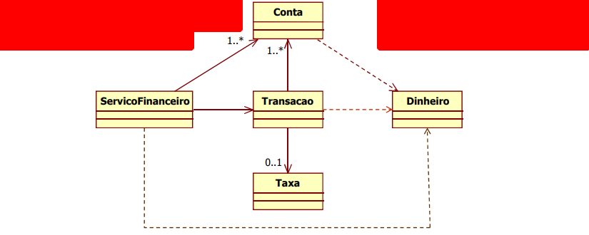
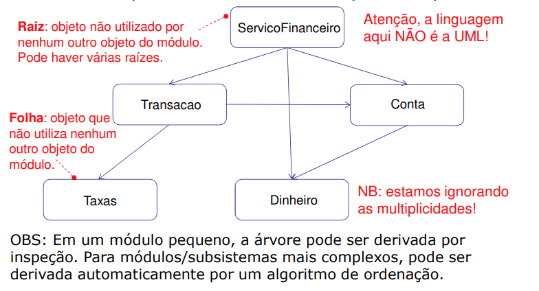
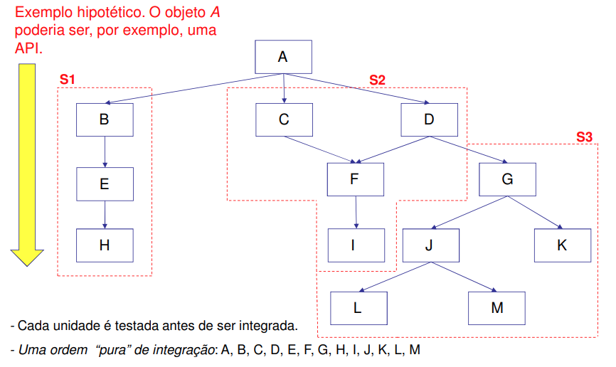
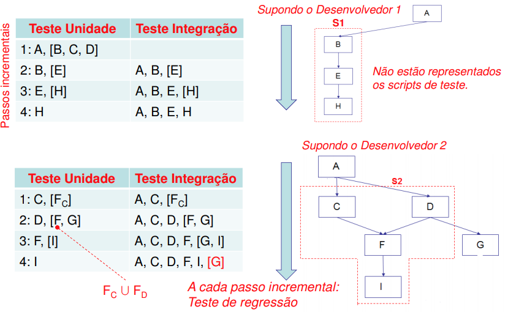
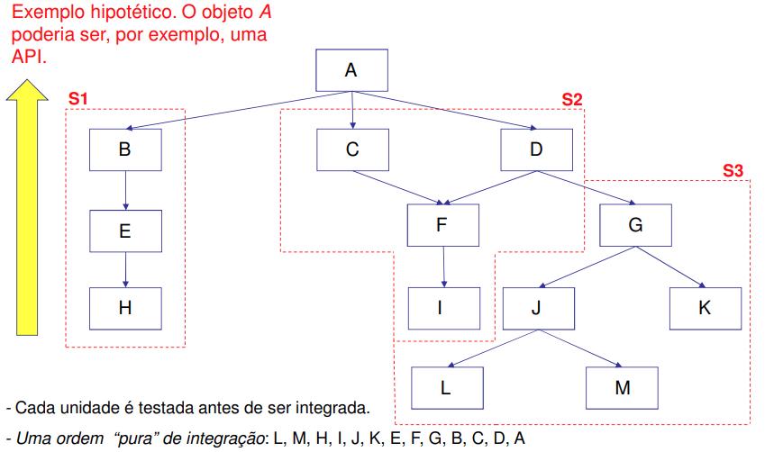
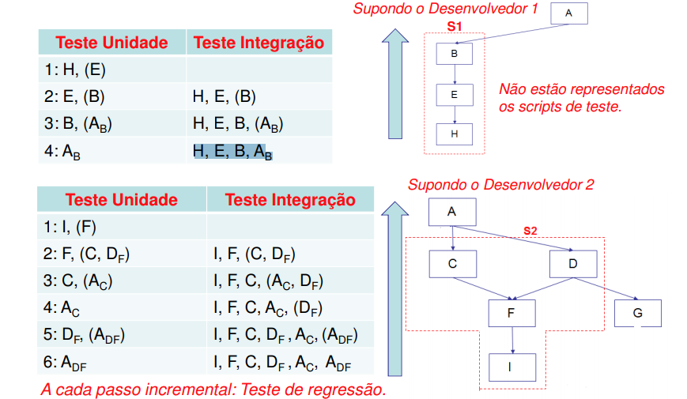

# Aula 6 - 20210908

**Integração** 
- “O processo que combina componentes de software, componentes de hardware, ou ambos em um sistema total.” (ISO/IEEE 24765:2010)

 

**Teste de Integração** 
- “A ligação progressiva e o **teste** de programas ou módulos para assegurar seu funcionamento apropriado no sistema completo.” (ISO/IEEE 24765:2010).

 

**Lição aprendida e reforçada no enfoque ágil**
- O processo de desenvolvimento deve entrelaçar o teste de unidade com o teste de integração.

## Observações 
O termo “integração” tem mais de um significado na prática:

1.  Na maioria das vezes, quando se fala em “integração” fala-se de integração do software em questão (SUT) com partes externas a ele. Aqui, vamos denominá-la de integração externa. 

2. Mas, a integração tem também um significado mais amplo, abrangendo também a integração de unidades que passaram no teste de unidade. Aqui, vamos denominá-la de integração interna.

**Objetivo dos Teste de Integração**
O objetivo do **Teste de Integração** é expor defeitos manifestados em falhas observadas nas interfaces e nas interações entre elementos que foram (ou estão sendo) integrados.

## Integração Interna
Os casos de teste de integração (nível do programa) devem ser desacoplados dos casos de teste de aceitação (nível dos requisitos). Normalmente, empregam-se técnicas de teste baseadas em especificação (Aulas 2 e 3).

1. Critério de aceitação
2. Cenário de teste (executável)
3. Testes de aceitação do Cenário
> Teste de aceitação do cenário vai se refletir no teste de unidade.

Idealmente, as unidades que passaram pelos testes de unidade são integradas incrementalmente, uma por uma. Após cada integração, efetua-se o Teste de integração.

Os casos de teste de integração devem ser desacoplados dos casos de testes de aceitação.
> **os testes de integração não podem depender do programa**

## Introdução à integração OO - Nível Interno
### Análise básica da dependência

- As dependências são necessárias para implementar colaborações entre objetos e realizar a separação de responsabilidades.

- **A integração e seus testes baseiam-se em dependências explícitas para mostrar a interoperabilidade mínima**, i.e., o comportamento dos objetos associados.

- Simplificação inicial: todos os métodos dos objetos estão implementados e todas as multiplicidades têm valor 1.

Suponha um módulo bem simples de serviços financeiros, cujo ponto de entrada é a classe ServicoFinanceiro que pode efetuar transações financeiras em contas de clientes.

## Estratégia de integração interna das classes

### "Estratégia" Big-bang
- Inicialmente, os objetos são implementadas e testados unitariamente de forma isolada.
- Ao final, todos os objetos são integrados em um único passo para formar um módulo (componente) de software.
- Neste caso, frequentemente, o teste de sistema, ou de aceitação, faz o papel de teste de integração do produto de software.

**Principal deficiência:** Falta de isolamento de falhas, pois podem estar em qualquer uma das 13 dependências entre os objetos, supondo que cada um tenha passado no teste de unidade.

### Estratégia Top-down
- Implementação de objetos no nível superior da árvore de dependências, com cada um dos seus colaboradores simulados por dublês de teste.
- Ordem de implementação/integração: intercalar os testes de unidade e de integração seuindo os caminhos de dependência da aplicação: das(s) raiz(es) para as folhas.

**vantagens**
- **Isomanto das falhas**
- Validação incremental da implementação do comportamento do sistema antes da entrega.
- Os objetos de nível mais elevado são testados precocemente e com maior frequência
- Distribuição razoável dos recursos de teste
- Aparecimento mais rápido do comportamento esperado
- Visibilidade do progresso do projeto.

**desvantagens**
- os **dubles** de teste às vezes não são triviais.
	- um dublê de teste que simula um comportamento complexo pode não ser simples de implementar.
	- os objetos de nível mais baixo tendem a ser menos testados.
	- a implementação de stubs parametrizados inferiores muitas vezes é pouco produtiva.

### Estratégia Bottom-up
- Implementação de objetos no nível inferior da árvore de dependências, com os colaboradores imediatamente superiores simulados por direcionadores (drivers)
- Intercalar a implementação e os testes de unidade e de integração seguindo as dependências: da menor dependência para a maior dependência, isto é, das folhas para a(s) raiz(es).

**vantagens**
- Tendência a um melhor isolamento de falhas. 
- As “folhas” são mais frequentemente testadas.

**desvantagens**
- Ausência, ou pouco emprego, da automatização dos testes pode implicar o desperdício de drivers.
- No caso de dependências complexas, os objetos do topo podem ficar ‘engessados’.
- Maior dificuldade relativa com respeito ao top down para a obtenção de versões intermediárias.

## Noções Fundamentais da Integração Interna

- Objetivo
  - Demonstrar a estabilidade do comportamento do software em desenvolvimento, adicionando os componentes necessários para realizar uma colaboração específica de objetos.

- Contexto
  - Exercita as interfaces entre os elementos de uma colaboração.
  - A ordem da integração normalmente segue as restrições dos cenários – ou caminhos - de execução: descrições de como grupos de objetos colaboram para efetuar determinados comportamentos esperados do SUT.
  - Escolha da estratégia de integração em cada colaboração.

-  Por que apresentamos inicialmente as estratégias de integração **sem os métodos dos objetos**?
   -  Para o entendimento geral das estratégias, sejam elas aplicadas à orientação por objetos ou a outro enfoque.
   -  Porque no início de uma iteração não se tem normalmente uma ideia clara dos métodos que serão implementados, mas tem-se alguma ideia das prioridades dos objetos.

- Por que nos preocupamos em denotar o caso de dependência compartilhada, mesmo se o enfoque do curso é a OO    (invocação de método)?
  - Porque ele permite apreender as implicações do processamento, tanto no caso de execução sequencial, como no caso de execução concorrente. 

---

## Exercício
- Estratégia de integração interna das classes que implementam o cenário
- Aplicar a técnica de integração de colaboração apresentada para a estratégia escolhida