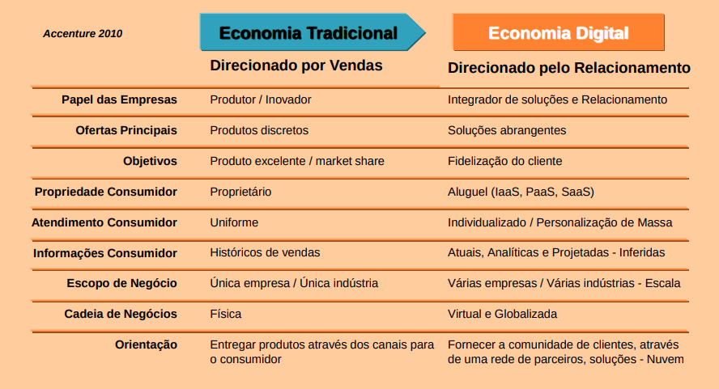

# Aula 2 - 20211014

## Agenda
- Introdução aos Sistemas de Informação
- Tecnologias Aplicadas aos Sistemas de Informação
- Introdução ao Sistema de Gestão Corporativa
    - Dos sistemas In House ao SMS em Cloud
- Paradigmas de Gestão: Processos x Departamentos
- O processo de transformação empresarial
    - Fatores críticos de sucesso
- Gestão da mudanças (Change Management)
- Ciclo de vida do projeto de Implementação do ERP
    - Estudo de Caso – Trabalho em grupo
- Supply Chain Management (SCM = SCP + SCE)
- Business Intelligence (Big Data, Predictive Analysis)
- Os novos ERP (EPM; HCM; ASCP, PLM, etc.) 

## Desafios para as Empresas
1. Identificar características dos sistemas competitivos e eficazes
2. Entender requisitos de sistemas no ambiente de negócios global
3. **Criar arquitetura de informação que suporte os objetivos da organização**
4. **Determinar o valor dos sistemas de informação para o negócio** – Diferencial competitivo?
5. Projetar sistemas inovadores que as pessoas possam controlar, entender e usar de maneira social e eticamente responsável

## Por que Sistemas de Informação?
- Mudanças do ambiente
    - Emergência da economia global conectada
        - Gestão e controle em um mercado global; 
        - Competição em mercados mundiais;
        - Grupos de trabalho globais; 
        - Sistemas de entrega globais
    - Transformações das economias industriais
        - Economias baseadas no conhecimento e na informação; 
        - Produtividade; 
        - Novos produtos e serviços;
        - Conhecimento: um ativo produtivo e estratégico fundamental Concorrência baseada em tempo; 
        - Produtos de vida mais curta; 
        - Ambiente turbulento; 
        - Base de conhecimento do funcionário limitada
    - Transformações das empresas
        - Achatamento; 
        - Descentralização; 
        - Flexibilidade; 
        - Independência de localização;
        - Baixos custos de transação e coordenação;
        - Empowerment; 
        - Trabalho colaborativo e em equipe
    - Emergência da empresa digital - convergência
        - Relacionamentos possibilitados digitalmente com clientes, governo, fornecedores e funcionários; 
        - Processos do negócio principal realizados via redes digitais;

## Evolução dos Sistemas de Informação
1. Desenvolvimento de sistemas ad hoc ~ tecnologia proprietária
2. Vários pacotes + sistema ad hoc ~ Várias tecnologias e linguagens
3. Sistema ERP + Soluções pontuais ~ Uma tecnologia principal interfaceada/integrada a soluções pontuais

## Evolução do mercado
1. Produzir
2. preço
3. qualidade
4. customer service
5. customização de massa (mais recente)

## Evolução dos Sistema
1. sistemas proprietários
2. sistemas isolados
3. vários pacotes
4. sistemas de gestão empresarial
5. sistemas modulares especialistas (mais recente)

## Evolução dos profissionais
1. especialistas técnicos
2. especialistas funcionais
3. generalistas
4. multidisciplinares
5. business partners (mais recente)

## Evolução dos RPs
1. MRP
2. MRP2 
3. ERP
4. SCM
5. Funcionais (mais recente)

## Mudanças do Modelo de Negócio
