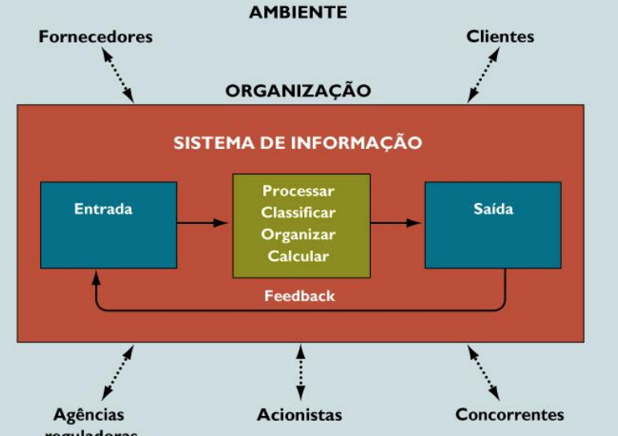
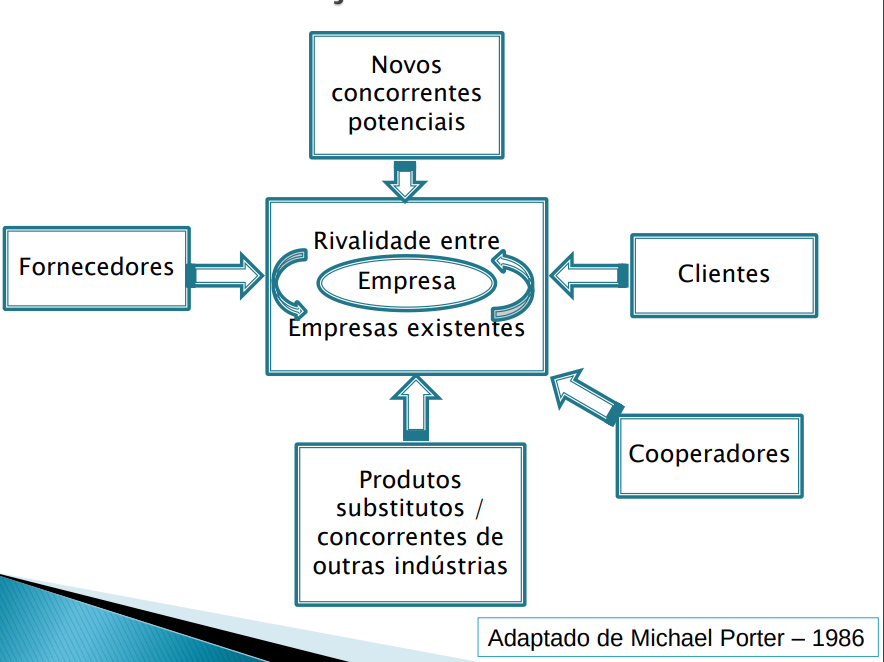
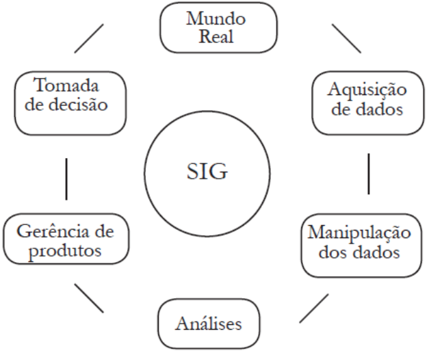

# Aula 3 - 20211018

## O que é um Sistema de Informação Corporativo
- “Um conjunto de componentes interrelacionados que coleta (ou recupera), processa, armazena e distribui informações destinadas a apoiar a tomada de decisões e o controle de processos de negócios em uma organização empresarial.”

## Dados `->` Informação `->` Conhecimento
- DADOS: de DATUM `->` Algo dado são aqueles fatos que podem ser recolhidos e para os quais existem medidas;
- Quando os dados são colocados em um sistema ou em um contexto, criam significado e formam a INFORMAÇÃO;
- Com a informação podemos ficar “informados” ou elucidados;
- A informação pode então ser colocada em um contexto e ser utilizada, acrescentando experiência;
- Esta experiência possibilita a interpretação da informação, sua aplicabilidade, efeitos e outros pontos fortes e fracos;
- Como resultado, o **CONHECIMENTO** é desenvolvido.

## Funções de um Sistema de Informações Corporativas

## Modelo de 5 Forças de Porter

## Organizações - Elementos-chave
- Pessoas
- Estrutura (organograma, grupos de especialistas, produtos, geografia)
- Procedimento Operacional 
- Política (poder para persuadir, para conseguir que as coisas sejam feitas)
- Cultura (comportamento habitual)

## Administração - Níveis
- Gerentes seniores
- Gerentes de nível médio
- Gerentes Operacionais

## Pilares do Sistemas de informação Gerenciais (SIG)

## Aplicação do escopo dos sistemas de informação
- Década de 1950: Mudanças técnicas
- Décadas de 60-70: Controles gerenciais
- Décadas de 80-90: Atividades institucionais fundamentais
- Décadas de 00-10: Atividades institucionais Especializadas
- Década de 10-30: Atividades Sociais Personalizadas Importância crescente

## Princiáis Funções Empresariais
- Empresa
    - financeira
        - contabilidade
        - CAP/CAR/AF
    - comercial
        - Compras/vendas/transporte
        - MKT
    - operações
        - Estoques
        - Produção/serviços
    - recursos humanos