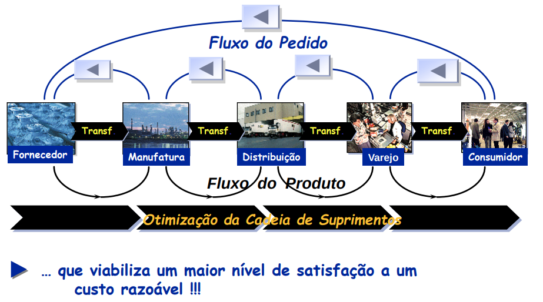
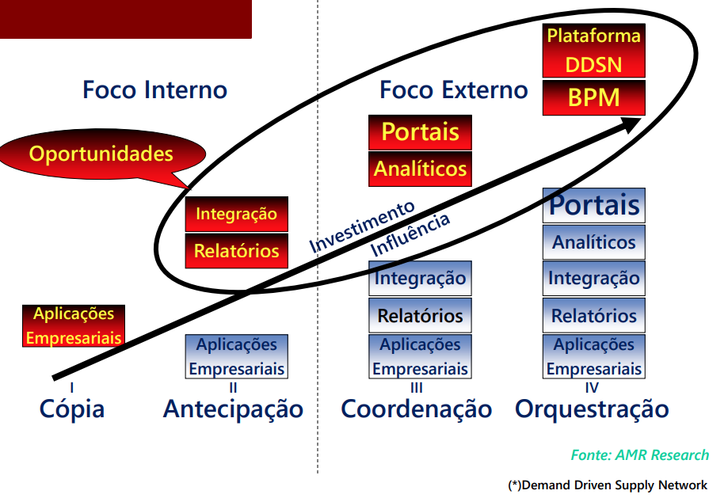
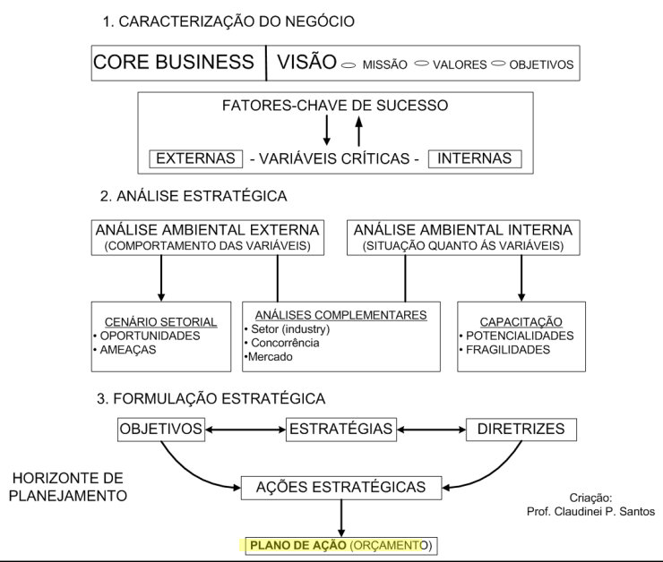
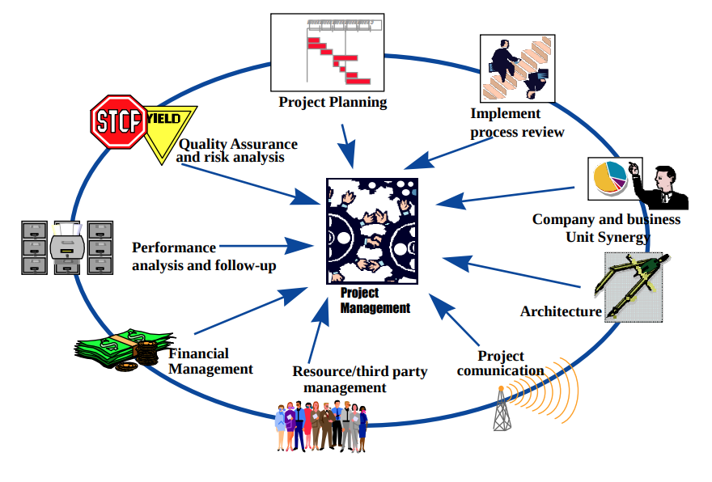

# Aula 4 - 20211025

## Fluxo de Pedido e Fluxo de Produto para a Empresa

## Demand-Driven Supply Networks (DDSN) - Estágios Maturidade 

## O Processo de Transformação Empresarial: Fatores Críticos de Sucesso

### Análise Estrutural e Ambiental do Negócio
1. Caracterização do Negócio
    - Core business
    - Visão - missão - valores - objetivos
    - fatores chave de sucesso

2. Análise Estratégica
    - Análise ambiental externa
        - Cenário setorial
        - Análise complementares
    - Análise ambiental interna
        - Capacitação
        - Análise complementares

3. Formulação Estratégica

### Fatores Criticis de Sucesso para Transformação do Negócio
- RH
- Compromentimento e patrocínio
- educação e treinamento
- Clareza de objetivos e escopo
- Aderência das soluções (ERP)
- Disponibilidade de Recursos
- Alinhamento dos processos
- Gerenciamento dos projetos
- Gerenciamento das mudanças
- Clareza no entendimento da estratégia

## Gerencia de Projetos
