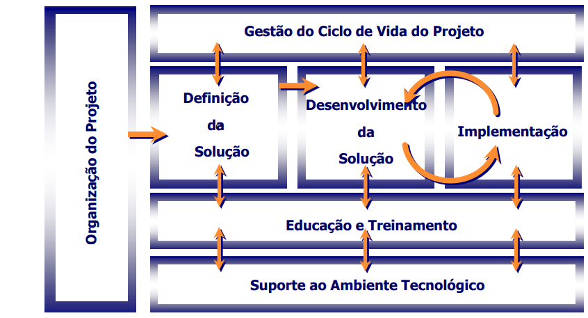

# Aula 5

## Gerenciamento da Mudança
### estratégia
- Alinhamento dos objetivos do projeto ERP ao portfolio de iniciativas e estratégias da organização;
- Análise da cultura e ambiente de negócios;
- Envolvimento da alta gerência e nivelamento de expectativas.

### alinhamento organizacional
- Diagnóstico dos impactos organizacionais,
- Alinhamento da estrutura atual da organização ao desenho dos novos papéis (roles) e Trabalhos (Jobs).

### modelagem de competências
- Identificação de novos papéis relacionados as novas atividades (activities x roles);
- Agrupamento dos novos papéis em novos trabalhos (roles x Jobs);
- Mapeamento de competências essenciais e complementares para cada novo trabalho (Job);
- Organização de workshops de validação com a organização;
- Alinhamento da nova visão de papeis com Recursos Humanos;
- Apoio ao processo de composição das autorizações do ERP.

### gerenciamento de riscos 
Avaliação dos fatores críticos associados ao processo de mudança : 
1) Desafio da mudança 
2) clareza de visão 
3) comprometimento do patrocínio
4) Capacidade dos agentes de mudança 
5) capacidade da equipe do projeto 
6) respostas da organização 
7) alinhamento cultural 
8) Eventos internos e externos 
9) eficiência do plano de mudança.

### educação e treinamento
- Seleção e capacitação de multiplicadores/facilitadores para suportar o treinamento dos usuários finais ( Train the Trainers approach);
- Elaboração de todo o plano de treinamento dos usuários finais (materiais, logística, infra-estrutura, instrutores, fornecedores, comunicação, avaliação, Help Desk, etc.)

### comunicação
- Definição das estratégias e canais de comunicação do projeto;
- Coordenação do processo de comunicação e plano de mídia;
- Acompanhamento e monitoramento da eficácia da comunicação através de outros meios como : boletins de intranet e internet, quadros de aviso, reuniões, workshops, mails, etc..

### sensibilização para Mudança
- Execução de apresentações institucionais sobre o escopo e benefícios
do projeto;
- Execução de apresentações sobre temas relacionados a orientação a processos, liderança, facilitadores, etc;
- Reuniões de resultado. 

### team building
- Desenvolvimento de atividades de integração de times;
- Definição de missão, papéis e responsabilidades de cada time;
- Capacitação da equipe do projeto em metodologias, ferramentas e treinamentos ERP

### envolvimento de influenciadores
- Identificação de influenciadores, donos de processo e Multiplicadores;
- Entrevistas com pessoas chave da organização;
- Identificação de habilitadores da mudança ou possíveis barreiras;
- Entendimento da motivação para a mudança.

## Ciclo de Vida do Projeto de Aplicação Corporativa
