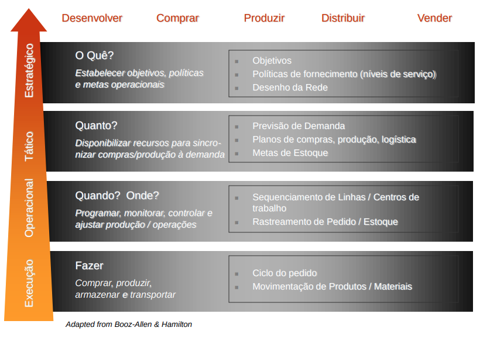

# Aula 6 - 20211122

## Processos Supply Chain Management
1. Produzir
2. Vender
3. Entregar
4. Assist. Técnica
5. Desenhar (design)
6. Planejar
7. Suprir

## Advanced Planning & Scheduling
`--------> fluxo material --------> `
`<-------- fluxo caixa <--------`
`<-------- fluxo informação -------->`

Fornecedor -> Gerencia de demanda e Suprimento -> Gerencia de fontes de Suprimento -> Manufatura e operação -> distribuição -> transporte e logística -> serviço ao cliente e gerenciamento de ordens -> clientes

### Elementos de um sistema APS
- Gerenciamento da demanda (previsão e reposição)
- Planejamento de Estoques
- Planejamento de Capacidade
- Planejamento e Sequênciamento de Ordens de Produção

### Previsão da Demanda

## Planejamento + Execução Funções de Negócio

