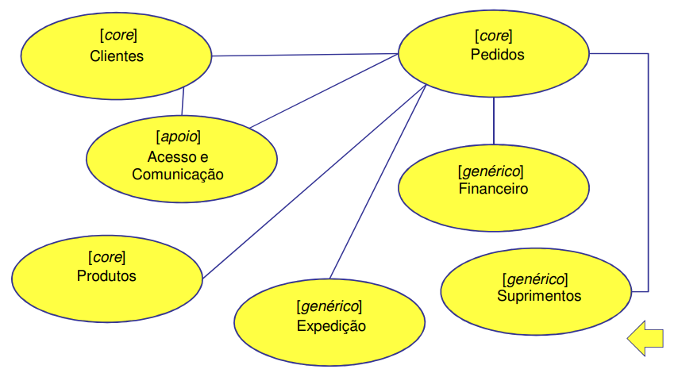
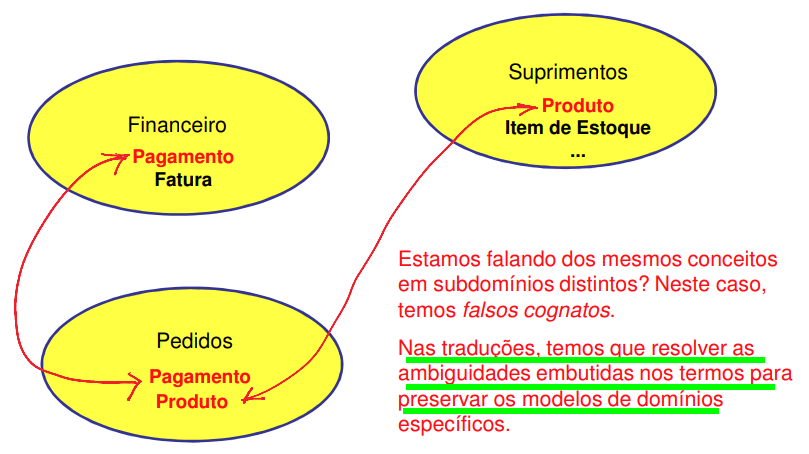
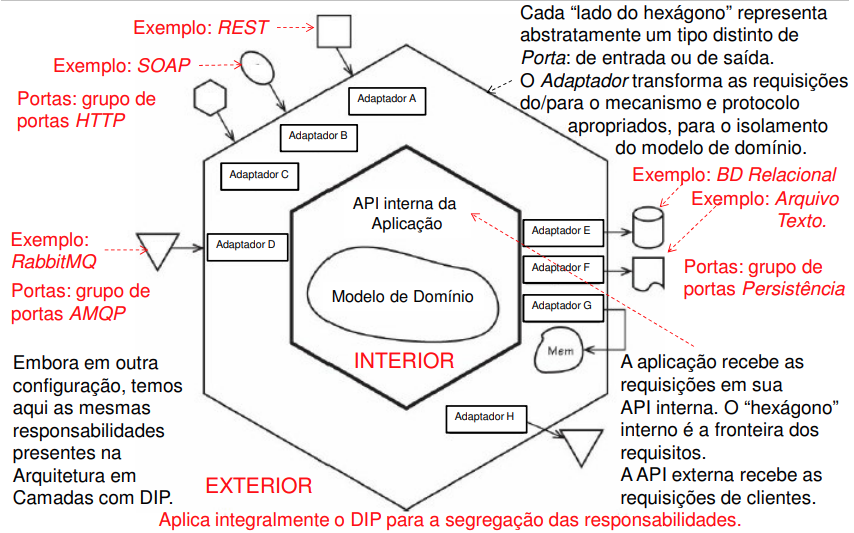

# Aula 2 - 20211013
## Objetivos
- noções preliminares do projeto dirigido pelo domínio (DDD)

## DDD - Noções Fundamentais
### DDD - Motivação
- muitas vezes as **discussões** com os especialistas do domínio estão totalmente **desconectadas** da **interpretação embutida na base de código**.
- o DDD utiliza uma **linguagem comum** que deve **permitir a expressão do modelo conceitual do domínio** em todas as comunicações entre as duas partes: a Linguagem Ubíqua ou Onipresente.
- Os especialistas do domínio e os desenvolvedores devem entender o modelo conceitual do domínio que evolui ao longo do projeto (project) em termos da linguagem onipresente.

### DDD - O que é Domínio?
- em termos pragmáticos, é o que uma organização faz numa parte do mundo dos negócios.
- nesse domínio há várias áreas e funções específicas, stakeholders com interesses distintos e idiomas específicos.

 

- consequência 1: um **Domínio** de negócio é **composto** por **vários Subdomínios**.
- consequência 2: em vez de se ter um único modelo de design inclusivo, tem-se vários modelos de design específicos.
- no DDD, os **_modelos de design_ são desenvolvidos em Contextos Delimitados** (Bounded Contexts).

### DDD - Projeto Estratégico - Contexto Delimitado (Bounded Contexts)
- idealmente, cada Subdomínio é mapeado em um **Contexto Delimitado**.
- cada Contexto Delimitado:
    - é um **modelo de solução** definido numa linguagem em torno de uma **finalidade específica**
    - **define** uma **fronteira conceitual** em um Domínio, definindo/criando um **Espaço de Solução** do sistema que **apoia o domínio do negócio** em questão.
    - tem sua **própria Linguagem Onipresente** que fundamenta e orienta um modelo de design.
    - fornece uma **implementação técnica** que reforça as fronteiras do espaço de solução, **definindo os modelos de design deste espaço**.

### DDD - Projeto Estratégico - Tipos de subdomínios
- Domínio Nuclear (core): desenvolvido internamente, pois constitui um diferencial estratégico. Prioridade.
- Subdomínio de Apoio: **sem ele o Domínio Nuclear não é bem sucedido**. Pode não haver solução de prateleira apropriada,requerendo desenvolvimento personalizado.
    - pode ser considerada uma solução outsourcing
- Subdomínio Genérico: solução de prateleira ou externa, com investimento inferior ao do Subdomínio Nuclear.

### Mapa de Contextos
- Visualização das Relações entre os Contextos Delimitados.
- Um diagrama simples mostrando os relacionamentos de integração entre os Contextos Delimitados.
- Considerando que em dois Contextos Delimitados há duas Linguagens Onipresentes com suas especificidades, o mapa deve indicar a necessidade da **tradução entre as linguagens**.
- O mapa deve então representar: 
    - onde estão as fronteiras, 
    - quais são os relacionamentos entre elas e também entre suas equipes, 
    - quais integrações estarão envolvidas
    - quais traduções serão necessárias entre as linguagens.

### Alguns Problemas nas Relações Entre Linguagens Onipresente
- Conceitos duplicados: elementos de dois modelos distintos representam o mesmo conceito. 
    - Problemas de uso e de sincronização em atualizações. 
    - Exemplo: “Conta do beneficiário direto” e “Conta do segurado” em um contexto de seguridade social.

 

- Falsos cognatos: mesmo termo aplicado a conceitos distintos. 
    - Conflitos de interpretação e, portanto, de implementação. 
    - Exemplo trivial: “Conta” no contexto bancário e no contexto de aplicação Web para um jornal digital.
  

## DDD e Arquitetura
- O DDD não requer o uso de uma arquitetura específica, mas estabelece algumas premissas.
    - Deve dar suporte ao isolamento do modelo do domínio.
    - A separação das perspectivas (IU, persistência, ...) deve acomodar mudanças sem efeitos colaterais indesejados de uma perspectiva sobre outra.
        - As mudanças nestas perspectivas ocorrem por motivos distintos e com frequências distintas
    - Deve abstrair os detalhes de um modelo de domínio que evolui em complexidade, encapsulando-os em comportamentos que expressam o uso da aplicação.

### Motivação
- Clientes que interagem de modo heterogêneo com a aplicação
    - Um utiliza REST => protocolo HTTP(S).
    - Outro utiliza mensageria com RabbitMQ => protocolo AMQP
-  **Desacoplar as dependências dos mecanismos de interação** e manter a facilidade para a integração/teste.

### Arquitetura Hexagonal

