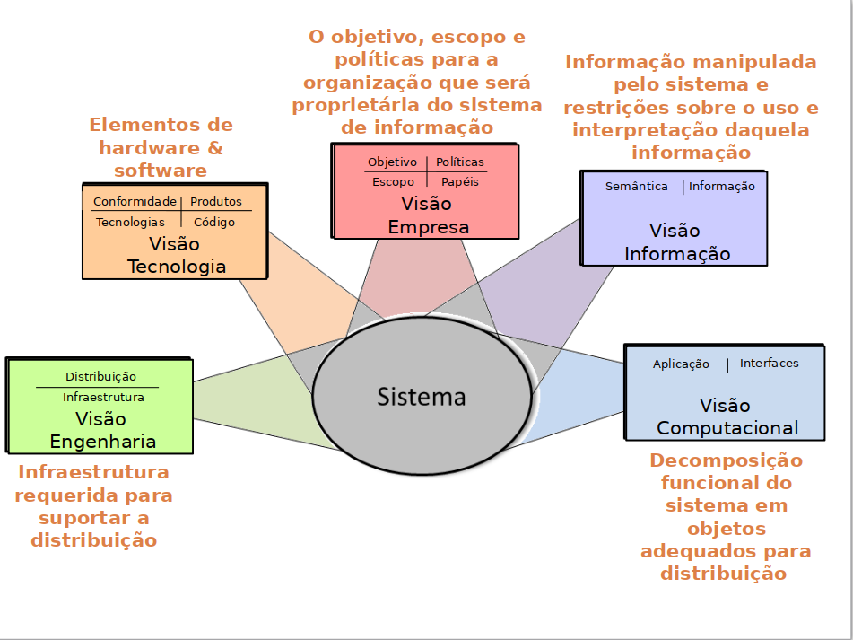

# Aula 3 - 20211026

- Elemento arquitetural
- Instanciação da arquitetura
- Abstração de uma Arquitetura

- Procuramos criar um modelo que represente todas essas preocupações
    - Representa-se no modelo um conjunto de equipamentos
      - Desktop, terminais, celular, entre outros
    - Representa-se vários sistemas físicos para armazenar  dados
    - Representa-se Assinatura Digital
    - Inclui-se textos para não esquecer as várias línguas
    - Onde as informações serão auditadas, analisadas ou arquivadas segundo as regulamentações de órgãos de saúde

## Visões Arquiteturais
- Problematização de representar um sistema sob diferente aspectos.

- Uma **visão** é uma representação de **um ou vários aspectos de uma arquitetura**, ilustra como arquitetura **trata um ou várias preocupações de um ou vários stakeholder**.

- A partir da visão do negócio é possível identificar informações e seus ciclos de vida que serão usados para representar o sistema.

### Cinco Visões de Arquitetura

- Visão Tecnologia: Elementos de hardware & software

- Visão Engenharia: Infraestrutura requerida para suportar a distribuição
    - midleware que permite a interoperabilidade entre as aplicações do sistema

- Visão Empresa: O objetivo, escopo e políticas para a organização que será proprietária do sistema de informação (enxergar os processos de negócio)
    - Objetivo | Políticas | Escopo | Papeis

- Visão Informação: Informação manipulada pelo sistema e restrições sobre o uso e interpretação daquela informação
    - Semântica: significado, ciclo de vida, regras da informação ()

- Visão Computacional: Decomposição funcional do sistema em objetos adequados para distribuição
    - Aplicação | Interfaces
    - Onde estão as funcionalidades

## Propriedades de Qualidade
- Muitas decisões arquiteturais visam requisitos que são comuns a alguns ou todas as visões.
- Em muitos casos os requisitos estão mais ligadas a propriedades de qualidade que numa função particular.

### Segurança
- Ponto de vista funcional
    - O sistema precisa identificar e autenticar seus usuários. Os processos de segurança devem evitar qualquer ataque externo
- Ponto de vista da informação
    - O sistema deve  controlar diferentes classes de acesso à informação. 
        - O sistema deve aplicar esses controles em diferentes níveis de granularidade
            - Segurança no nível de objetos dentro de uma base de dados
- Ponto de vista operacional
    - O sistema deve manter e distribuir informações  confidenciais(senhas) 
    - O sistema deve-se atualizar com os mesmos níveis de segurança
- A segurança deve ser analisada nos outros pontos de vistas 
- “ O sistema deve ser seguro” deve ser analisado através de todos os pontos de vista

### Perspectiva Arquitetural
- Coleção de atividades, táticas e diretrizes de arquitetura que são usadas para **garantir** que um **sistema** **exiba um conjunto específico de propriedades de qualidade relacionadas** e que por sua vez **precisam de consideração em várias visões** da arquitetura do sistema.

### Estrutura da Perspectiva
- Requisito
    - Define a propriedade de qualidade 
- Aplicabilidade
    Explica a dimensão da relação com as visões
- Atividades
    - Passos para aplicar a perspectiva nas visões. 
    - Decisões arquiteturais de projeto para modificar ou melhorar as visões
- Táticas arquiteturais
    - Soluções gerais e típicas que podem ser utilizadas para tratar o atributo de qualidade

## Representação de Uma Arquitetura
- Como se identifica o Ambiente que sistema está inserido?
- Quem são os stakeholders? Como atuam no Ambiente? O que fazem? Como são representados?
- Qual é negócio? Quais são ações e os agentes que realizam?
- Como se identificam os elementos do sistema?
- Como se identificam as iterações entre as partes do software?
- Quais são as funcionalidades do sistema? Como estão distribuídas nos elementos?
- Como se representa os aspectos dinâmicos?
- Como se representa as propriedades de qualidade?  
- Quais são as tecnologias utilizadas e como se identificam na arquitetura

## 20211117
- Ambiente de Produção de Software Centrada em Arquitetura
- A partir de uma arquitetura de referencia, orienta-se a criação da arquitetura "base"

## Processo Centrado em Arquitetura de Software
- Question (A) Como começamos o desenvolvimento de software?
    - Como chegamos na história de usuário?
        - como levantamos requisitos? 
            - tiramos os requisitos de onde?
- Answer (A) USER EXPERIENCE
    - Jornada do usuário -> processo que tem uma sequência de diversas atividades (um fim pode ser objetivado)
    - Empatia

- Muitas vezes existe uma distância entre o negocio e o sistema
    - Negócio
        - Processo de Negócio
        - Requisitos de Negócio
        - Gerenciamento do Negócio
        [[[[[gap]]]]]
    - Sistema TI
        - Requisitos sistema
        - arquitetura
        - projeto e implementação
        - equipes TI

- Como resolver esse GAP?
    - Planejamento do desenvolvimento e evolução. [objetivos, metas e negócios] --> [sistema]
        - Design --> arquitetura --> implementação    
    - avaliação.  [sistema] ---> [objetivos, metas e negócios]
        - conformidade --> arquitetura --> avaliação
