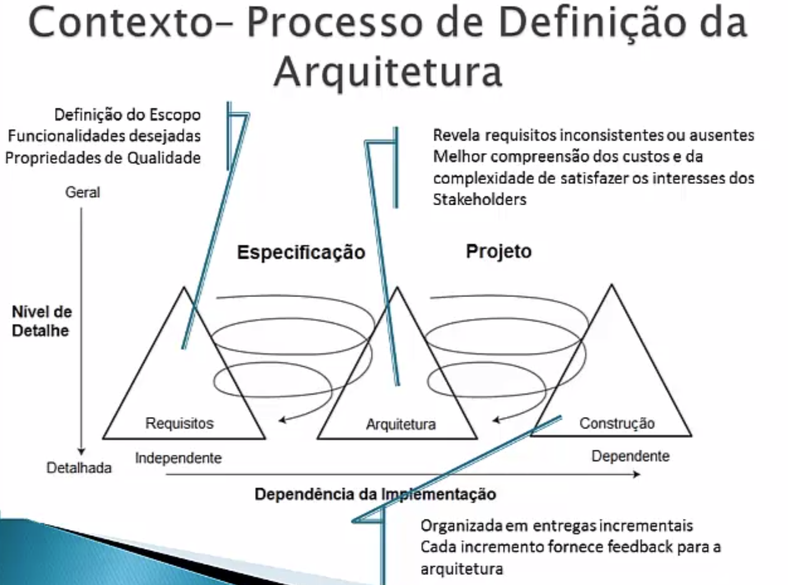

# Aula 9 - 20211203

## Conceitos Envolvidos

### Arquitetura de Software
- Arquitetura é o conjunto de decisões do projeto
- Perry e Wolf (1992)
    - Arquitetura `=` {Elementos, Forma, Fundamentação}.
        - elementos = principais constituintes em qualquer arquitetura em termos de componentes e conectores.
        - propriedades não funcionais gerariam a forma final da arquitetura.
- IEEE std. 1471 (2000) e ISO/IEC IEEE 42010 (2011)
    - A arquitetura é definida como a organização fundamental de um sistema incorporada em seus componentes, seus relacimomamentos uns com os outros e com seu ambiente, e bem como os princípios que guiam a sua conceptção e evolução.
- Taylor, medvidovic e dashofy (2009)
    - A arquitetura de softawe é o conjunto das principais decisões de projeto tomadas a respeito de um sistema, e que fornecem um plano detalhado para construção e evolução de um sistema de software
        - decisões de projeto relacionadas à estrutura do sistema.
        - decisões de projeto relacionadas ao comportamento funcional.
        - decisões de projeto relacionadas à interação.
        - decisões de projeto relacionadas às propriedades não funcionais do sistemal
        - decisões de projeto relacionadas à implementação do sistema
    - A arquitetura de software é o conjunto das principais decisões de projeto tomadas a respeito de um sistema, e que fornecem um plano detalhado para construção e evolução de um sistema de software. 
        - decisões de projeto relacionadas à estrutura do sistema.
            - The architectural elements should be organized and composed exactly like this...

        - decisões de projeto relacionadas ao comportamento funcional 
            - Data processing, storage, and visualization will be performed in strict sequence.

        - decisões de projeto relacionadas à interação
            - Communication among all system elements will occur only using event notifications.

        - decisões de projeto relacionadas às propriedades não funcionais do sistema 
            - The system's dependability will be ensured by replicated processing modules.

        - decisões de projeto relacionadas à implementação do sistema 
            - The user interface components will be built using the Java Swing toolkit.

### Desafios do Desenvolvimento de Software
- Mais qualidade, produtividade e menor custo
- Complexidade
- Modificabilidade
- Heterogeneida
- Mobilidade
- Extensibilidade

### Processo de Definição da Arquitetura
- deve ser orientado aos interesses dos stakeholders
- deve encorajar a comunicação efetiva das decisões e princípios arquiteturais e a solução dpara os stakeholders
- deve garantir, de forma permanente, que as decises e principios arquiteturais sejam respeitados durante o ciclo de vida - desde a concepção e implantação (e posteriores evoluções)
- deve ser estruturada - incluir a série de uma ou mais etapas, objetivos de cada etapa, inputs e outputs das entradas
- deve ser pragmática - considerar questões relativas do mundo real (cronograma apertado, orçamento, competências tecnicas, etc)
- deve ser flexivel - adaptado a circunstancias particulares (utilizar um toolkit e frameworks)
- deve ser tecnologia-neutra - não deve impor que a solução seja baseada em torno de qualquer tecnologia especifica
- deve ser alinhado com boas práticas de engenharia de software e gerenciamento de qualidade

- modelo tri-pics
- arquitetura conecta a especificação com o projeto, permitindo o intercambio necessário para satisfazer a demanda tanto de requisitos quanto de arquitetura. Dessa forma, a definição da arquiteutra fica entre a fase de definição de requisitos e projeto codificação e teste de software

- 
