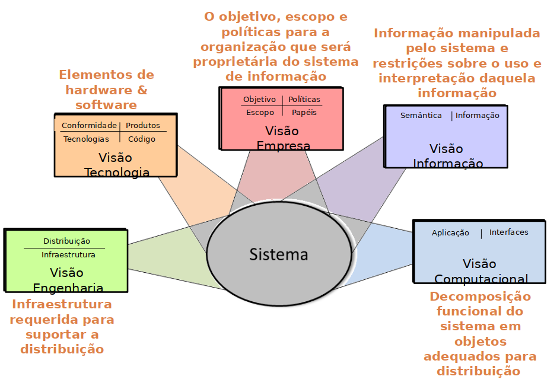
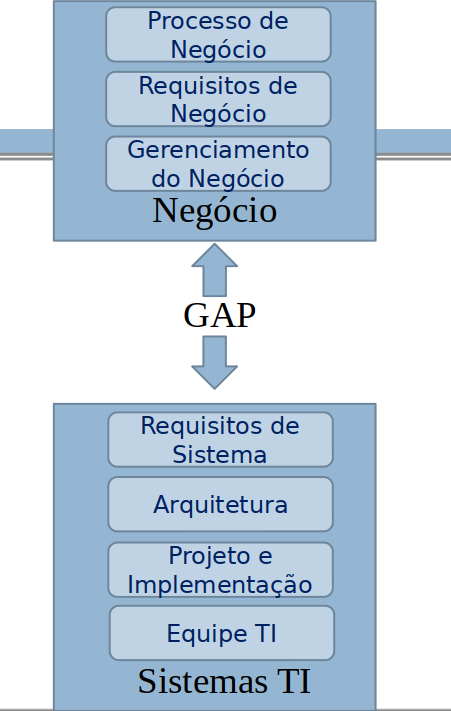
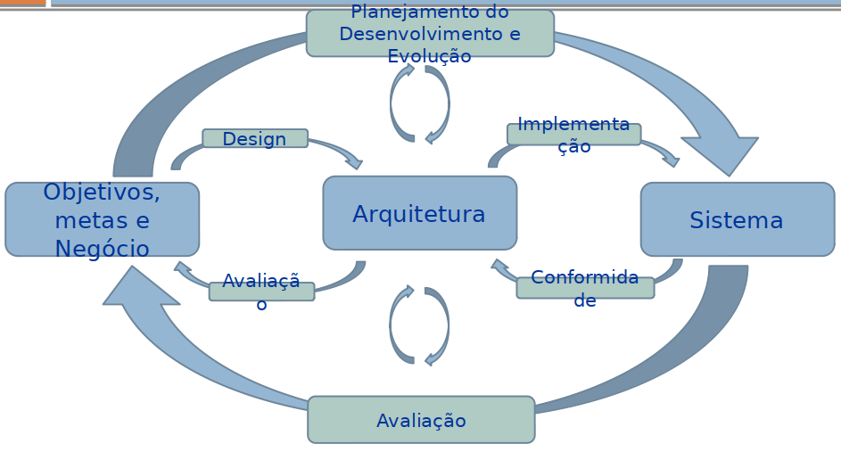
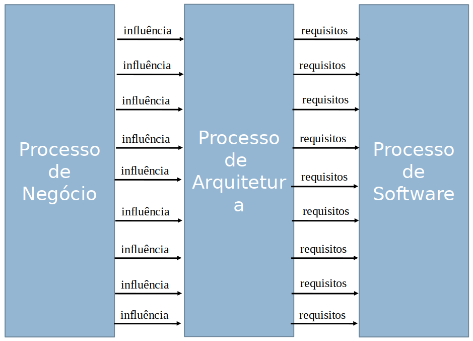

# Review Test
## Summary
- [Review Test](#review-test)
  - [Summary](#summary)
  - [Analogia com Casa](#analogia-com-casa)
  - [Arquitetura de Software](#arquitetura-de-software)
  - [Elementos do sistema e seus relacionamentos](#elementos-do-sistema-e-seus-relacionamentos)
  - [Propriedades Externas](#propriedades-externas)
  - [Princípio de Design e Evolução](#princípio-de-design-e-evolução)
  - [Elementos Arquiteturais](#elementos-arquiteturais)
  - [Visões Arquiteturais](#visões-arquiteturais)
  - [Propriedades de Qualidade](#propriedades-de-qualidade)
    - [Exemplo - Segurança](#exemplo---segurança)
  - [Perspectiva Arquitetural](#perspectiva-arquitetural)
    - [Estrutura da Perspectiva](#estrutura-da-perspectiva)
  - [Representação de uma Arquitetura](#representação-de-uma-arquitetura)
  - [Análise de uma Arquitetura](#análise-de-uma-arquitetura)
  - [Processos centrados em Arquitetura de Software](#processos-centrados-em-arquitetura-de-software)
    - [Práticas de Engenharia Centradas em Arquitetura](#práticas-de-engenharia-centradas-em-arquitetura)
  - [Viewpoints modeling and the RM-ODP](#viewpoints-modeling-and-the-rm-odp)

- Existem três elementos importantes nos sistemas computacionais
Hardware, software, dados
- A arquitetura de um sistema intensive-software é a estrutura ou as estruturas do sistema composta pelos elementos de software, as propriedades externas e visíveis destes elementos e os relacionamentos entre estes elementos
## Analogia com Casa
- Por que desenhar a casa no software e não construir ela de uma vez?
    - Propósito de uso
    - Possui finalidade
    - Agregar valor
    - Verificar se concretizou de uma forma menos custosa os requisitos de quem está envolvida no projeto

- Ambiente onde a casa está inserido afeta a experiencia de seu uso

- Requisito funcional: Aquilo que o software deve fazer
- Requisito não funcional: são os requisitos relacionados ao uso da aplicação em termos de desempenho, usabilidade, confiabilidade, segurança, disponibilidade, manutenção e tecnologias envolvidas

## Arquitetura de Software
- Definição I: Forma, elementos, fundamentação (o "por quê" da forma o motivo)
- Definição II: Conceitos ou propriedades fundamentais de um sistema em seu ambiente incorporados em seus elementos,relacionamentos e os **princípios de seu design** e evolução” (ISO/IEC/IEEE, 2011).

 

- Três elementos importantes
    - Hardware, software e dados

 

- A arquitetura de um sistema **intensive-software** (sistema de software intensivo) é a estrutura ou as estruturas do sistema composta pelos elementos de software, as propriedades externas e visíveis destes elementos e os relacionamentos entre estes elementos.

- microserviço:
    - unidade autonoma de execução independente.
    - elemento de processamento
    - definição também depende da escola de pensamento

## Elementos do sistema e seus relacionamentos
- Qualquer sistema é composto por partes
    - Módulos, componentes, partições ou subsistemas
    - Terminologia neutra elementos
        - partes que constituem um sistema

- **Estrutura de um sistema**
    - Elementos que constituem o sistema e o relacionamento entre eles

- **Estrutura estática de um sistema**
    - Define seus elementos internos e sua disposição em "design-time"

- **Estrutura dinâmica**
    - Elementos ("runtime") e suas iterações
        - Como o sistema trabalho, que acontece "runtime" e como responde aos estímulos externos ou internos
      - **exemplo**: fluxo de informações entre elementos
## Propriedades Externas
- Comportamento externamente visível
    - iterações funcionais entre o sistema e o seu ambiente.
    - fluxo de informação de entrada e saída, como o sistema responde aos estímulos externos, o contrato publicado ou API que a arquitetura tem com o mundo exterior.
    - O comportamento externo deve ser modelado observando o sistema como caixa preta.
- Propriedade de qualidade
    - Propriedades não funcionais, externas e visíveis
        - Desempenho, segurança, outros.
        - Como o sistema se comporta do ponto de vista de um observador externo.

## Princípio de Design e Evolução
- Declaração fundamental de convicção, abordagem ou intenção que orienta a definição de sua arquitetura.

- Uma forma de estabelecer uma estrutura de tomada de decisão para um arquitetura consistente e bem estruturada.

## Elementos Arquiteturais
- é o elemento ou elementos básicos que se **utilizam para construir o sistema**.

- a natureza do elemento arquitetural depende do tipo de sistema e de seu contexto.
    - Bibliotecas de programas, subsistemas, unidades distribuídas aplicações.

- Deve possuir um conjunto de atributos principais
    - Conjunto de responsabilidades
    - Restrições
    - Interfaces
    - Define os serviços que oferece aos outros elementos arquiteturais

## Visões Arquiteturais
Uma visão é uma representação de um ou vários aspectos de uma arquitetura, ilustra como arquitetura trata um ou várias preocupações de um ou vários stakeholder

## Propriedades de Qualidade
- Muitas decisões arquiteturais visam requisitos que são comuns a algumas ou todas as visões
    - Em muitos casos os r**equisitos estão mais ligadas a propriedades de qualidade que numa função particular**

### Exemplo - Segurança
- Ponto de vista funcional
    - O sistema precisa identificar e autenticar seus usuários. Os processos de segurança devem evitar qualquer ataque externo
- Ponto de vista da informação
    - O sistema deve  controlar diferentes classes de acesso à informação. 
    - O sistema deve aplicar esses controles em diferentes níveis de granularidade
        - Segurança no nível de objetos dentro de uma base de dados
- Ponto de vista operacional
    - O sistema deve manter e distribuir informações  confidenciais(senhas) 
    - O sistema deve-se atualizar com os mesmos níveis de segurança
- A segurança deve ser analisada nos outros pontos de vistas 
- “O sistema deve ser seguro” deve ser analisado através de todos os pontos de vista

## Perspectiva Arquitetural
Coleção de atividades, táticas e diretrizes de arquitetura que são u**sadas para garantir que um sistema exiba um conjunto específico de propriedades de qualidade relacionadas** e que por sua vez precisam de consideração em várias visões da arquitetura do sistema.

### Estrutura da Perspectiva
- Requisito
    - Define a propriedade de qualidade 
- Aplicabilidade
    - Explica a dimensão da relação com as visões
- Atividades
    - Passos para aplicar a perspectiva nas visões. Decisões arquiteturais de projeto para modificar ou melhorar as visões
- Táticas arquiteturais
    - Soluções gerais e típicas que podem ser utilizadas para tratar o atributo de qualidade

## Representação de uma Arquitetura
- Como se identifica o Ambiente que sistema está inserido?
- Quem são os stakeholders? Como atuam no Ambiente? O que fazem? Como são representados?
- Qual é negócio? Quais são ações e os agentes que realizam?
- Como se identificam os elementos do sistema?
- Como se identificam as iterações entre as partes do software?
- Quais são as funcionalidades do sistema? Como estão distribuídas nos elementos?
- Como se representa os aspectos dinâmicos?
- Como se representa as propriedades de qualidade?
- Quais são as tecnologias utilizadas e como se identificam na arquitetura

## Análise de uma Arquitetura
- Pré-Condição: Saber conceito de Arquitetura e de visões, Contexto/Ambiente
- At- ividades
    - Entender o ambiente, os agentes, os elementos e atividades que fazem parte, como atuam, como interagem
    - Identificar as camadas e a finalidade de cada uma
    - Analise a camada que tem interação com o ambiente e identifique quais são os agentes /elementos de interação e as atividades de negócio que podem realizar por meio de tecnológica
    - Identificar e analisar o tipo de informação que geram e consomem
    - Analise as camadas subsequentes da arquitetura, identifiquem os elementos de processamento da informação, o tipo de processamento que realizam e o valor que agregam ao negócio
    - Identifique a colaboração entre os elemento de processamento em cada camada e reflita sobre a infraestrutura de comunicação
    - Analise e pesquisa sobre as tecnologias existem para viabilizar a implementação da arquitetura

## Processos centrados em Arquitetura de Software

### Práticas de Engenharia Centradas em Arquitetura

## Viewpoints modeling and the RM-ODP

- Due to the extensive system specifications, it is extremelly difficult for a single individual comprehend all aspects of the system specs. Furthermore, there are different interest for each stackeholder of a given system and different reasons for examining the system's spec.
- RM-ODP plays a big role in provide separate viewpoits into the spec of a given complex system
	- These views each satisfy an audience with a particular interest in a set of aspects of the system.

- Viewpoint is a subdivision of the spec of a system. They are separately specified, but not completely independent. They are just sufficiently independent to simplify reasoning about the complete specification.

- Enterprise viewpoint: 
	- Purpose, scope and policies of the system
	- It describes business requirements and how to meet them
	- Aspectos de consideração:
		- Identificação e descrição do negócio, incluindo responsáveis, regras, ações, propósitos, uso e políticas da empresa
		- Identificação da visão estrutural do negócio
	- Atividade
		- Descrever as comunidades e os objetivos de cada uma
		- Descrever o comportamento necessário para cumprir os objetivos das comunidades

- Information viewpoint
	- semantics of the information 
	- information processing performed
	- It describes information managed by the system
	- Also, it describes the structure and content type of the supporting data
	- Aspectos de consideração:
		- Identificação e descrição das informações que fluem através do processo de negócio
			- informações que fluem pelo processo
		- Identificação e descrição das informações que são utilizadas na visão estrutural de negócio
			- informações da visão estrutural do negócio

- Computational viewpoint
	- it describes functionality provides by the system and its functional decomposition
	- the functional decomposition shows the "objects" present within the system and how they iteract thorough interfaces
	- Baseado nos seguintes objetos:
		- objetos que encapsulam dados e processamento
		- objetos que oferecem interfaces para interação com outros objetos
		- objetos que podem oferecer interfaces multiplas
	- Visão define os objetos dentro do sistema, as atividades dentro desses objetos e as interações que ocorrem entre os objetos.
	- Maioria dos objetos nessa spec descrevem funcionalidades da aplicação e estes objetos são unidos por ligações pelas quais as interações acontecem.
	- Aspectos de consideração:
		- Infra que fornece suporte ao negócio
			- ex: para identificar as infos sobre crédito do cliente, a instituição já possui infra pronta para tal realização
		- Sistemas existentes que já apóiam o negócio
			- ex: já existia o sistema de conta-corrente e pagamento. Para o IB é necessário implementar a interação entre o cliete na internet e esses sistemas através de um ambiente seguro e controlado

- Engineering viewpoint
	- It describes the distribution of processing performed by the system to manage info and provide funcionality
	- focuses on the mechanisms and functions required to support distributed interactions between objects in the system
	-  focado no modo como é alcançada a interação dos objetos no ambiente distribuíd
	- Aspectos de consideração:
		- especificar a distribuição de sistemas e repositórios corporativos já existentes na empresa
		- comparar com os serviços de negócio identificados e com a localização fisica das unidades de negócio

- Technology viewpoint
	- focuses on the choice of technology of the system
	- It describes the technologies chosen to provide the processing, functionality and presentation of information.
	- Aspectos de consideração:
		- validar e verificar a aderência dos serviços de neǵocio com frameworks tecnológicos candidatos
		- verificar a necessidade de aquisição de outras tecnologias
