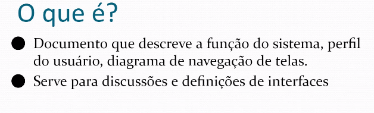

# 20220412

## Manual do Usuário

- Diagrama de navegação (ligados aos casos de uso)
- Manual preliminar

### Quando é Elaborado

- Na fase de análise, definir navegação, versão inicial
- Na fase de projeto (design), detalhamento das interfaces, versão final

### Projeto de Interface

- Familiaridade de usuário
- Consistência de interface
    - Não fazer com que diversos de símbolos representem a mesma coisa
    - Deseja-se consistência
- Surpresa mínima
    - “Usuário não pode ser surpreendido onde ele fica encurralado sem saber por onde vai.”
    - Ex: “Exigir dados que o usuário não estava preparado para fornecer”
- Facilidade de recuperação
- Guia de usuário
- Diversidade de usuário

### Modelo Baseado em Cenários

### Modelo de Navegação

- Click == evento
- Ao clicar ele pode gerar uma mensagem —→ ação ‘n’
- Diagrama de navegação parece **diagrama de estados**
    
    
    

### Estrutura do Manual do Usuário

1. Introdução
    1. Objetivo, Publico-alvo
2. Perfil do Usuário
    1. Tipos de usuário e responsabilidades
3. Diagrama de Navegação
4. Detalhamento das interfaces
5. Referências