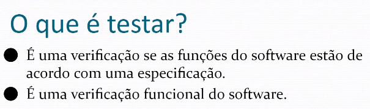

# 20220419

## Plano de Testes de Validação

### Visão Geral do Teste

### Estrutura do Plano de Testes de Validação

1. Publico-alvo: stakeholders que estão envolvidos no projeto também são considerados público-alvo
2. Teste de validação: Baseado no publico-alvo é uma definição do teste de validação (pegar definição e colocar a fonte da definição nas referências)
3. Material: ferramentas, etc
4. Plano de Teste
    1. Descrição do teste
    2. Colocar um identificador para cada teste
    3. 
5. Documentos nos quais nós nos apoiamos para fazer os cenários de teste
    1. Autores, Nome do documento, Versão e Ano