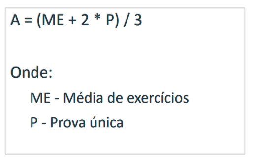

# 20220221

## Critérios de Avaliação

## Introdução

- O que é um projeto?
    - É um empreendimento;
    - Existe projeto “tranquilo”?

- Os projetos **Cancelados** custam dinheiro então o ideal é tentar minimizar situações que levam o projeto a ser descontinuado.

### Por que os projetos de TI falham?

- Visão do **Usuário**
    - Falta de participação do usuário (12,8%)
    - Requisitos e especificações incompletos (12,3%)
    - Mudanças nos requisitos e especificações (11,8%)
    - Expectativas irreais (5,9%)
    - Falta de clareza nos objetivos (5,3%)
    - Prazo fora da realizade (4,3%)
- Visão de **Gestores de TI**
    - Falta de suporte executivo
    - Falta de recursos
    - Expectativsas irreais
    - Prazo fora da realizade
- Visão de **Equipe de TI**
    - Requisitos e especificações incompletos
    - Mudanças nos requisitos e especificações
    - Incompetência tecnológica
    - Novas Tecnologias

### Fatores Críticos de Sucesso

- Envolvimento do usuário
- Apoio executivo
- Requisitos claramente estabelecidos
- Planejamento adequado
- Expectativas realistas
- Marcos de projetos menores
- Equipe competente
- Visão e objetivos claros
- Equipe focada e trabalhando sério

### Operação x Projeto x Programa x Portfólio

**Operação**

> Uma operação é uma função organizacional que realiza a execução contínua de atividades que produzem o **mesmo produto** ou fornecem o mesmo serviço repetidamente. (PMI, 2021)
> 
- Exemplo:
    - Linha de montagem automóveis
    - Supermercado oferece **continuamente** produtos

**Projeto**

> Um projeto é um empreendimento temporário conduzido para gerar um produto, serviço ou resultado específico.  (PMI, 2021)

O caráter temporário dos projetos indica um início e um fim do do projeto ou uma fase. Os projetos podem ser autônomos ou fazer parte de um programa ou portfólio (PMI, 2021)
> 

**Programa**

> Um programa é um **grupo de projetos**, subprogramas e atividades relacionados que são gerenciados de forma coordenada para obter benefícios que não estariam disponíveis se eles fossem gerenciados individualmente. (PMI, 2021)
> 
- Exemplo:
    - Programa de vacinação
    - Programa de erradicação da fome

**Portfólio**

> Um Portfólio é um **conjunto de projetos**, programas e outros trabalhos que **são agrupados para facilitar o gerenciamento efetivo daquele trabalho** para atender a objetivos estratégicos específicos. Os componentes do Portfólio não necessariamente precisam ter alguma relação de dependência ou estar diretamente relacionados. (PMI, 2021)
> 

### Qual a diferença entre gerência de projetos e gerência de portfólio de projetos?

> **Gerência de Projetos** é a aplicação de conhecimentos, perfis, ferramentas e técnicas, às atividades de projeto **para atingir os requisitos do projeto**.

A **gerência do projeto** refere-se à orientação das atividades para obter os resultados pretendidos. As equipes de projeto podem alcançar os resultados utilizando diversas abordagens (por exemplo preditivas, híbridas e adaptativas). (PMI, 2021)
> 

- **Gerência de portfólio da uma *visão global***
    - Consegue visualizar (”de cima”) projetos que estão dando sucesso e projetos que estão com problemas. Devido a isso é possível “realocar” recursos para assistir projetos que demandam de mais recursos (ou projetos problemáticos).
    
- **Gerente de Projetos**

> Gerente de projeto é uma pessoa que provê diretiva e controle técnico e administrativo para as tarefas executadas ou atividades dentro de sua área de responsabilidade de gestão. Funções tradicionais de um gerente incluem planejamento, organização, direcionamento e controle. (Chrissis, 2006)
> 

### Resultado x Produto

- Resultado == trazer benefício para o negócio (através de projetos)

> Resultado é uma saída ou consequência de um processo ou projeto. Os resultados podem incluir produtos e artefatos, mas têm uma finalidade mais ampla ao focarem nos benefícios e no valor que o projeto foi realizado para produzir. (PMI, 2021)

Um artefato que é produzido, é quantificável, e pode ser o produto final ou componente de um produto. (PMI, 2021)
> 

### Valor

> O significado, importância, ou utilidade de algo. Os diferentes stakeholders percebem valor de formas diferentes. 

Os clientes podem definir valor como a capacidade de utilizar características ou funções de um produto. As organizações podem concertar esforços no valor comercial determinado produto medindo esses ganhos com métricas financeiras.“ (PMI, 2021)
> 

**Sistema para Entrega de Valor** 

> Uma série de atividades estratégicas destinadas a construir, manter e/ou fazer crescer uma organização. Portfólios, programas, projetos, produtos e operações podem todos fazer parte do sistema de uma organização para a geração de valor.  (PMI, 2021)
> 

### Planejamento

> Inclui as atividades de realizar estimativas de atributos de produtos de trabalho e tarefas, determinar recursos necessários, negociar compromissos, produzir um cronograma e identificar e analisar os riscos de projeto. (Chrissis, 2006)
> 

- **Plano de Projeto**
    - Conteúdo do plano:
    
    > Um plano de projeto fornece a base para execução e controle das atividade do projeto, que também trata do comprometimento com o projeto do cliente. Planejamento do projeto inclui estimativas dos atributos de tarefas e produtos de trabalho, determinação dos recursos necessários, negociações dos comprometimento, produção de um cronograma, identificação e análise dos riscos do projeto. Interação entre estas atividades é necessária para estabelecer o plano do projeto. (CMMI Institute, 2018)
    
    Define os recursos disponíveis para o projeto, a estrutura analítica do trabalho e uma programação para realizar o trabalho. (Sommerville, 2011)
    > 
    
- **Plano de Projeto de Software**
    - Coleção de planos, formais ou informais que descrevem as atividades a serem executadas pelo projeto de software. Governa a gerência das atividades executadas pelo grupo de engenharia de software para um dado projeto de software.
    - **Exemplos de planos:**
        - Plano de desenvolvimento de software
        - Plano de garantia de qualidade de software
        - Plano de gerência de configuração de software
        - Plano de teste de software
        - Plano de gerência de riscos
        - Plano de melhoria de processo.
        

### Exercício

1. **Defina o que é um projeto?**
- Um projeto é um esforço temporário que tem como finalidade um resultado único e possui recursos delimitados
- Um projeto é um esforço temporário e progressivo empreendido para criar um produto, serviço ou resultado exclusivo
- ação (ou conjunto de ações) que tem início e fim determinados
- recursos que são destinados ao projeto (humanos, financeiros e materiais) para que ele seja realizado
2. **Cite uma diferença entre projeto, programa e portfólio**
- Diferença entre projeto e programa é que o projeto trata-se de um esforço temporário enquanto que o programa é um conjunto de projetos relacionados (agrupamento de projetos com objetivos em comum), que quando combinadam visam um resultado que só é possível de se obter apartir da combinação dos projetos
****- O portfólio, por sua vez, consiste no agrupamento de programas e projetos com o objetivo de obter sucesso no desenvolvimento de produtos ou serviços, além de maximização da eficiência na corporação
3. **Quais são os Stakeholders típicos de um projeto de software?**
- Usa o sistema diretamente
- Trabalha com os resultados de quem usa o sistema
- Será impactado com a implantação e operação do sistema
- Tem investimento no orçamento ou no cronograma
- Tem interesse em entender como a solução será desenvolvida
- Estará envolvido em propagandear, vender, instalar ou mante
- Desenvolvedores
- Usuários
- Contratantes/Donos
- Agências regulatórias
4. **Qual é a função de um gerente de projetos?
-** Gerente de projeto é uma pessoa que direciona e controla (técnico e administrativo) as atividades dentro de sua  responsabilidade de gestão. Funções tradicionais de um gerente incluem planejamento, organização, direcionamento e controle. 
5. **De que forma um projeto é definido na sua empresa?**
- Gerente de projeto, Coordenadores e P.Os realizam levantamento do escopo do projeto, recursos alocados (times envolvidos)
- P.O realiza quickoff para apresentar/formalizar a iniciativa tanto aos envolvidos quando aos demais membros da empresa
- Estabelece-se roadmaps
6. **O que define o início de um projeto na sua empresa?**
- Quickoff
- Concorrência
- Orgões reguladores (BACEN)
- Pesquisa de mercado (bandeiras
7. **Qual é o modelo de ciclo de vida usado na sua empresa?**
- Scrum
- Incremental