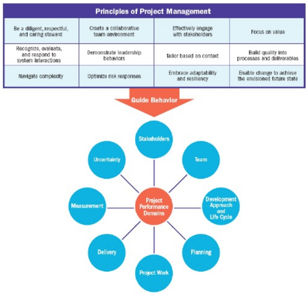

# 20220307

## PMBOK

- Guia do corpo de conhecimento de gerenciamento de projeto
    - PMBOK – A guide to the project Management body of Knowledge
- Padrão para gerenciamento de projetos
    - The Standard for Project Management – ANSI
- Ambos evoluíram e reconhecem que os elementos fundamentais da gestão de projeto permanacem
- Guia PMBOK 7 edição
    - 12 princípios de gerenciamento de projeto
    - 8 domínios de desempenho do projeto em vez de áreas de conhecimento
    - o foco do trabalho do projeto não se concentra apenas nas entregas, mas também nos seus resultados, ou, ao valor
    - Gestão de mudanças como parte da gestão de projetos
- O PMBOK fornece uma base para compreender a gestão do projeto e a forma como o mesmo ajuda em resultados
- Aplica-se a qualquer organização independente da industria, localização, tamanho ou abordagem de entrega
- Descreve o sistema em que os projetos operam, incluindo governança, possíveis funções, o ambiente do projeto, e considerações sobre a relação entre a gestão de projetos e gestão de produtos

### Entrega de Valor

- Como criar valor?
    - Criando um novo produto, serviço ou resultado que satisfaça as necessidades das partes interessadas
    - Criando contribuições sociais ou ambientais
    - Melhorando a eficiência, produtividade, eficácia, ou capacidade de resposta
    - Possibilitando as mudanças necessárias para a organização passar para um estado desejado
    - Mantendo os benefícios permitidos por programas, projetos, ou operações comerciais
    

### Princípios de Gerenciamento de Projetos

1. Seja um **gestor** atento, respeitoso e atencioso
    - Além de competências técnicas ter uma abordagem humilde com os membros de uma equipe
    - A responsabilidade da gestão engloba tanto as responsabilidades dentro da organização como os externos
2. Criar um ambiente colaborativo na **equipe** de projeto
    - Trabalhar em ambiente colaborativo é fundamental para entregar valor
    - Projetos são entregues por equipes de projeto
    - Equipes de projeto trabalham dentro de culturas e diretrizes organizacionais e profissionais e em geral estabelecem a sua própria cultura local
    - Um ambiente colaborativo da equipe de projeto facilita:
        - Alinhamento com outras culturas e diretrizes organizacionais
        - Equipe e colaboradores aprendem e se desenvolvem
        - São ótimos colaboradores para produzir os resultados desejados
3. Envolver eficazmente as **partes interessadas**
    - É importante que gestores e líderes tenham interação com as partes interessadas para entender muito bem suas expectativas e necessidade
4. Foco no **valor**
    - Mais importante do que entregar no prazo, respeitando o orçamento, é agregar valor em cada projeto finalizado
    - Valor é o indicador final do sucesso do projeto
    - Valor e os benefícios que contribuem para obtenção do valor podem ser definidos em termos quantitativos ou qualitativos
5. Reconhecer, avaliar, e responder às interações do sistema
    - Projetos não são “ilhas”, portanto, é necessário entender como diferentes projetos se articulam em um **sistema** dentro de uma organização
    - Pensamento Sistêmico
        - Um projeto é um sistema de atividades de domínios independentes e interativos
6. Demonstrar comportamentos de **liderança**
    - O sucesso não vem sem um esforço contínuo em liderar, motivar, aprender e treinar
    - Lideranças eficazes promovem o sucesso do projeto e
    contribuem para resultados positivos
    - Qualquer membro da equipe de projeto pode apresentar
    comportamento positivo de liderança
    - Liderança é diferente de autoridade
    - Líderes eficazes adaptam seus estilos a diferentes situações
    - Líderes eficazes reconhecem diferenças em motivação entre os membros da equipe
    - Líderes demonstram comportamentos desejados com relação à honestidade, integridade e conduta ética.
7. **Customizar** com base no contexto
    - Customização (Tailoring): o conceito de “um tamanho serve para todos” ficou no passado, e hoje os projetos precisam ser adaptados a contextos mais específicos
    - A customização da abordagem é interativa e portanto é um processo que desenvolve ao longo do projeto
8. Construir a **qualidade** em processos e produtos a entregar
    - Sendo a qualidade quase sinônimo de valor, é preciso garantir que as entregas atenderão aos padrões esperados pelo cliente
    - Um projeto de qualidade implica em satisfazer as expectativas das partes interessadas e atender os requisitos do projeto e do produto
    - A qualidade foca nos critérios de aceitação da entrega
    - Qualidade de projeto “implica em assegurar que os processos de projeto são tão apropriados e eficazes quanto possível
9. Navegar na **complexidade**
    - Gerir projetos em um ambiente de VUCA (Volatilidade, incerteza, complexidade e ambiguidade) é complexo
10. Otimizar as respostas ao **risco**
    - As ameaças que vêm de fora (ou de dentro) continuam a existir, e devem ser contempladas em diferentes projetos
    - Riscos gerais ou únicos podem impactar projetos
    - Riscos podem ser positivos (oportunidades) ou negativos (ameaças)
    - A possibilidade de identificação de riscos deve ser continuamente considerada durante o projeto
    - A resposta ao risco deve ser:
        - Apropriada para a relevância do risco
        - Realista dentro do contexto do projeto
        - Acordada com as partes interessadas relevantes
        - Atribuída a uma pessoa como responsável
11. Adotar adaptabilidade e resiliência
    - As equipes e líderes em projetos estão expostos a diferentes ameaças e oportunidades. É preciso desenvolver a capacidade de se adaptar
    - **Adaptabilidade é a habilidade de responder às mudanças de condições**
    - **Resiliência é a habilidade de absorver rapidamente impactos de uma falha ou contratempo**
12. Permitir a **mudança** para atingir o estado esperado amanhã

## PMBOK – Corpo de Conhecimento de Gerenciamento de Projetos

- Domínios de desempenho de projeto
- Customização (tailoring)
- Modelos, Métodos e Artefatos

### Domínios de Desempenho de projeto

- Áreas de conhecimento – disciplinas (custo, cronograma, pessoas, aquisição) – até 6ª Edição
- Domínios de Desempenho do Projeto – aspectos a prestar atenção
1. Partes interessadas
    - Ter um compromisso sólido com as partes interessadas
2. Equipe
    - Promover o desenvolvimento da equipe e comportamentos de liderança de todos os membros da equipe do projeto para atingir os resultados
    - Propriedade (ownership) partilhada
    - Equipe de alto desempenho (performance)
    - Liderança adequada e outras habilidades interpessoais evidente por todos membros da equipe
3. Abordagem de desenvolvimento e Ciclo de vida
    - O desenvolvimento e a cadência de entrega influenciam o ciclo de vida do projeto e suas fases
    - Ciclo de vida do projeto constituído de fases que ligam os valores do negócio e partes interessadas desde o início ao final do projeto
    - Ciclo de vida do projeto constituído de fases que facilitam o ritmo de entrega e a abordagem de desenvolvimento exigida na produção das entregas do projeto
4. Planejamento
    - Atividades necessárias para produzir as entregas e os resultados
    - O projeto se desenvolve de maneira coordenada, organizada e planejada
    - Existe uma abordagem holística para as entregas dos resultados do projeto
    - Informações relativas ao desenvolvimento são elaboradas para produzir entregas e resultados para os quais o projeto foi lançado
    - Tempo gasto no planejamento é adequado para a situaçã
5. Trabalho do projeto
    - Necessário para manter as operações do projeto funcionando perfeitamente e inclui, além de outros, comunicação, engajamento e outros trabalhos
6. Entrega
    - Associado à entrega de valor
    - Projetos contribuem para os objetivos do negócio e para o avanço da estratégia
    - Projetos concretizam resultados que foram considerados no inicio para entregas
    - Benefícios do projeto são concretizados no espaço de tempo para o qual foram planejados
    - A equipe do projeto tem claro entendimento dos requisitos
    - As partes interessadas aceitam e ficam satisfeitas com as entregas do projeto
7. Medição
    - Garantir que o resultado planejado seja alcançado
    - Um entendimento confiável dos estados do projeto
    - Dados de gatilho para facilitar a tomada de decisão
    - Ações adequadas e em tempo para manter o desempenho do projeto dentro do plano
    - Geração de valor do negócio e objetivos atingidos através de decisões tomadas bem fundamentadas, em tempo hábil e baseadas em planejamento e estimativas confiáveis
8. Incerteza

### Customização (Tailoring)

- A customização é a adaptação ponderada da abordagem da gestão do projeto, governança, e processos para os tornar mais adequados.
- A customização envolve a compreensão do contexto do projeto, objetivos e ambiente operacional.

Os projetos são executados em ambientes complexos que precisam equilibrar demandas potencialmente concorrentes:

- Entregar o mais rapidamente possível
- Minimizar os custos do projeto
- Otimizar o valor entregue
- Criar produtos e resultados de alta qualidade
- Proporcionando o cumprimento das normas regulamentares
- Satisfazer as diversas expectativas das partes interessadas
- Adaptação à mudança.

**O que Adaptar?**

### Modelos - Métodos - Artefatos

- **Objetivo:** ajudar as equipes do projeto a pensar sobre as opções disponíveis para eles
- **Modelo:** uma estratégia de pensamento para explicar um processo, estrutura (framework) ou fenômeno.
- **Método:** o meio para se alcançar um resultado, saída, produto
ou entregável de projeto
- **Artefato:** Um artefato pode ser um modelo (template), documento, saída, ou entregável de projeto

- Modelos
    - Refletem visões simplificadas e em pequena escala da realidade e de cenários atuais, estratégias, ou abordagens para otimizar esforços e os processos de trabalho.
    - Ajuda a explicar como algo funciona na realidade
    - Podem moldar o comportamento e apontar para abordagens para resolver problemas ou satisfazer necessidades.
    - Alguns modelos foram desenvolvidos com projetos e equipes de projeto em mente, outros são mais gerais.
    - Modelos Comumente Utilizados:
        - Modelos de Liderança Situacional
            - Liderança Situacional II (Situational Leadership II)
        - Modelos de comunicação
            - Comunicação Intercultural
        - Modelos de Motivação
            - Teoria das necessidades
        - Modelos de Mudança
            - O processo de 8 etapas para liderar a mudança
            - Gerenciar mudança nas organizações
        - Modelos de Complexidade
            - Matrix Stacey
        - Modelos de Desenvolvimento de Equipes de Projeto
            - Tuckman Ladder
            
            
            
        - Coleta e Análise de Dados
            - Benchmarking
            - Arvore de Análise de Decisão
        - Estimativa
            - Pontos de função
            - Wideband Delphi
        - Reuniões e Eventos
            - Daily Standup
            - Kick-off
            
            
            
- Artefatos
    - Artefatos de Estratégia
        - Modelo de Negócio (business case)
    - Logs e Registros
        - Backlog
        - Registro de Lições aprendidas
    - Planos
        - Plano de controle de mudanças
        - Plano de Gerenciamento de projeto
    - Gráficos Hierárquicos
        - Estrutura analítica de projeto (WBS)
        - Estrutura analítica da organização (organograma)
    - Linhas de base
        - Orçamento
        - Cronograma do projeto
    - Dados Visuais e Informação
        - Gráfico burndown
        - Diagrama de causa e efeito
        - Matriz de rastreabilidade de requisitos
    - Relatórios
        - Relatório de riscos
        - Status report
    - Acordos e Contratos
        - Contrato de Preço fixo
        - Acordo de nível de serviço (SLA)
    
    
    

## Exercícios

1.  A Gerência de Projetos na sua organização segue algum modelo ou padrão de projetos? De que forma isto pode ser verificado?
    - Método ágil Scrum
    - Coleta e Análise de Dados
        - Feedback 360
    - Reuniões e Eventos
        - Daily Standup
        - Kick-off
        - Kaizen
        - Planning e Refinamento
2. Escolha um projeto de software na qual você esteja envolvido e indique quais padrões e princípios estão presentes no planejamento
    
    Princípio de Ambiente colaborativo
    - Fórum Técnico
    - Clube do livro
    - Utilização de um canal no slack para conectar os desenvolvedores dentro da vertical (Canal de Engenharia)
    
    Reconhecer, avaliar, e responder às interações do sistemas
    - Times organizados por fluxos e não por aplicações
    
    Foco no valor
    - Entrega fatiada de bandeiras regionais ao invés de uma grande "pacote" de bandeiras
    
    Customizar com base no contexto
    - Troca de Scrum para Kanbam
    
    Navegar na complexidade
    - Open-banking não tem a especificação final de um produto
    - O prazo final foi definido
    - Para evitar realizar um bigbang proximo à entrega, estamos utilizando parte da especificação de um arranjo de pagamento que já foi incluido como base
    
    Outros Princípios
    - Arquitetura Hexagonal
    - DevOps
    
3. De que forma esses padrões e princípios foram definidos na sua organização

- Fórum Técnico: Surgiu a partir de uma iniciativa que começou em um time isolado e depois ganhou força e passou a ser um evento que conta coma participação de todos os times da vertical de digital-payments
- Clube do livro: Surgiu a partir da discussão de boas práticas e referências técnicas em um Pull Request

- Customizar com base no contexto (Scrum e Kanbam): Surgiu a partir da análise das entregas da sprint (kaizen)