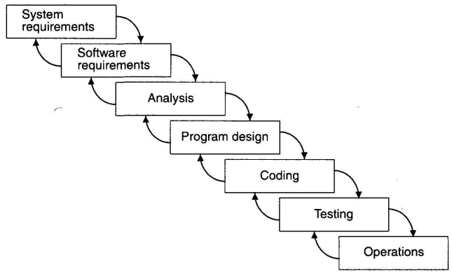

# 20220314

## Por que os projetos de software falham?

- **Negócio**
    - expectativas não-realistas
    - não necessidade do produto depois de algum tempo
- **Gerencial**
    - **Falta**:
        - planejamento
        - envolvimento do usuário
        - recursos
        - suporte executivo
        - gerenciamento de TI
- **Técnico**
    - requisitos incompletos
    - mudanças de requisitos e especificações
    - incapacidade tecnológica

## Gerência de Projetos vs Desenvolvimento de Software

- disciplinas distintas
- tipo de atividades
- driver técnico e estratégico
- responsabilidade de interação entre as disciplinas
- alguns processos de desenvolvimento já contemplam esta interação
    - quais são?
    - Todo modelo de ciclo de vida de software admite a interação?
    

## Processos de Desenvolvimento

- especificação
- implementação
- testes

### Modelo Cascata

> melhor modelo do ponto de vista da disciplina do desenvolvimento de software (atividades).
> 
- Pontos de controle a cada “fase”
    - Gerente pode verificar, acompanhar a evolução do projeto em cada ponto de controle

### Modelo Incremental

> Assim como o cascada, o modelo incremental possui “pontos de controle”
> 
- Todo incremento é funcional
- Vantagens do ponto de vista do gerenciamento de projetos
    - Pontos de controle
        - Entre Sequência `plan —> control point —> design —> build`
        - Entre Incrementos

### Modelo Ágil - SCRUM

- Daily Meeting → forma de “gerenciar” o projeto (obtém feedback's nesse ponto de controle)

### RUP - Rational Unified Process

- “baleias” - corcovavas nos gráficos de cada linha no gráfico acima

## Interação Gerência de Projetos e Desenvolvimento de Software

## Escolha de um Processo de Desenvolvimento

- Do ponto de vista gerencial
    - conhecimento e experiência do processo
    - grau de definição dos requisitos
    - estabilidade do escopo
    - facilidade de mudanças
    - forma de entrega de produtos
    - grau de risco do produto
    - tipos de requisitos não-funcionais
    - regulações
    - restrições
    
    ## Exercícios
    
    1. **Por que os projetos falham?**
    
    Existem diversos fatores que podem contribuir para a falha de projetos de software, sejam eles de negocio, gerencial ou técnico. De expectativas não-realistas (negócio) a mudanças frequentes de requisitos e especificação (técnico), os projetos de software podem sofrem interferência ou efeitos colaterais que corroboram para seu fracasso.
    
    Dentro do âmbito de negócio vale destacar que, além das expectativas não realistas, também temos a questão da utilidade do software para o seu usuário, ou seja, o software era necessário, mas depois de algum tempo deixou de ser. Isso pode acontecer por diversos motivos como:
    
    - A situação que demandava do software não ocorre mais;
    - Surgimento de alternativas mais práticas;
    - dificuldades de implantação, seja no treinamento ou no convencimento dos usuários para seu uso;
    - etc.
    
    Do ponto de vista gerencial diversos fatores podem contribuir para a falha, alguns deles são:
    
    - Falta de planejamento, seja de cronograma, responsabilidades, recursos (humanos, financeiros e infraestrutura);
    - Falta de envolvimento do usuário no projeto. É essencial ter um bom entendimento dos usuários e stakeholders do projeto. O mal-entendido ou a compreensão parcial do problema pode levar a construção de algo com pouco uso/utilizade.
    
    Sobre o ponto de vista técnico alguns fatores que podem contribuir para o fracasso do projeto são:
    
    - Requisitos incompletos que podem levar a construção de um software que não atende as necessidades dos stakeholders;
    - Mudanças de escopo muito drásticas e constantes ao longo do projeto. Tal situação normalmente  gera muito retrabalho, e também possui impactos no orçamento e no cronograma do projeto.
    
    1. **Escolha um processo de desenvolvimento de software para uma aplicação e-Commerce e outra financeira. Justifique do ponto de vista gerencial e técnico.**
        - Para o desenvolvimento de software **e-commerce** eu optaria para a utilização da metodologia ágil com scrum devido as seguintes vantagens técnicas e gerêncial
            - Pequenas entregas em curto espaço de tempo
            - Pontos de controle constantes ao final de cada sprint
            - Software funcional ao final de cada sprint fazendo com que seja possível avaliar as funcionalidades desenvolvidas com o cliente
        
        Para o desenvolvimento de software **financeiro** eu optaria para a aplicação do modelo incremental, pois esse modelo tem algumas vantagens para o gerenciamento de projetos
        
        - Vantagens do ponto de vista do gerenciamento de projetos
            - Diversos Pontos de Controle
                - Entre Sequência `plan —> control point —> design —> build`;
                - Entre Incrementos.
            - Mitigar riscos devido a mudança constante de requisitos (principalmente levanto em conta fatores externos como o  Bacen)
                - O modelo em cascata pode ser aumentar muito o risco de se construir um software incompleto devido a sua estrutura de possuir uma única entrega.
        - Vantagens do ponto de vista técnico
            - Todo incremento é funcional, portanto é possível validar se o software está cumprindo com o que os requisitos solicitam
    2. **Quais são os elementos que definem o Escopo de um projeto? Quem define (quem contribui para a definição do escopo)?**
        - Requisitos funcionais e não funcionais que levam em conta as necessidades do cliente;
        - Quem define é o gerente de projetos apoiado pelo arquiteto/especialista de software.
        
    3. **Quais são os critérios de priorização de Requisitos de um projeto? Quem define os requisitos priorizados?**
        - Patrocinador define a priorização no seguinte cenário:
            - area técnica já listou os requisitos
                - Então é necessário fechar os requisitos com o contratante. O contratante que realiza a priorização nesse momento.
                ****
    4. **Quais são as evidências de qualidade dos projetos? Quem as colhe?**
    - Através de inspeções e testes são obtidas informações de qualidade
    - Gerente de projeto que colhe essas informações através dos checkpoints (pontos de validação) [responsável]
    - A coleta das evidências são realizadas por outras pessoas, além do gerente, como QAs, pessoas que estão agindo nas inspeções.
        - Analista de requisitos que está inspecionando os requisitos definidos para o projeto pode colher essas evidências
        - Quem colhe no fim são as pessoas que realizam as etapas de quality assurance do projeto.