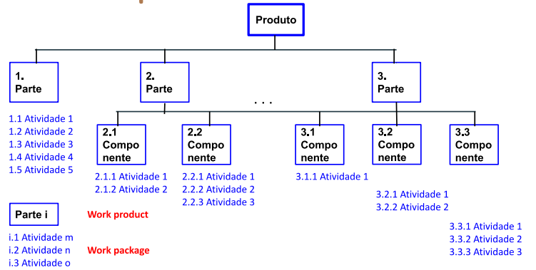

# 20220321

## Escopo do Projeto

1. Descrição textual do que precisa ser feito
2. Uma decomposição hierárquica do escopo
    1. WBS ou EAP

**Qual a principal responsabilidade de um gerente?**

- Planejamento baseado em dados
- Existem técnicas que podem ser empregadas para realizar o planejamento

- `WBS == Work breakdown structure`

## WBS Típico

- Basicamente uma estrutura em árvore
- Produto == Resultado
- WBS pode ser feito para “serviço” também
- **WBS decomposição do produto em partes reconhecíveis**
    - Dependendo da complexidade das partes, elas podem ter sub-níveis de atividades.
- Alimenta o cronograma em termos de atividades (não de tempo!!)
    - Work Product
    - Work Package

## WBS Projeto Casa

## WBS para Software

## Estimativas

1. Estimativa como um “chute” calculado
    1. `C.H.U.T.E = Cálculo Hipotético Universal Técnico Estimativo` 😅
2. Baseado na experiência pessoal
3. Desafio de “estimar” quando não há dados de projetos

### Parâmetros do Projeto

1. Escopo = f (custo, prazo)
    1. Bem possível aplicar ao **cascata**
2. Prazo = f (escopo, custo)
    1. **Incremental e/ou Iterativo**
    2. SCRUM
3. Custo = f (escopo, prazo)
    1. **Ágil ou Incremental e/ou Iterativo**
    2. Recursos materiais
    3. Recursos humanos
    

### Estimativas de Software

1. Tamanho
    1. Linha de código
    2. A própria funcionalidade
2. Funcionalidade
3. Esforço
4. Prazo
5. Custo

### Técnicas de Estimativas

1. Pontos de Função
2. Pontos de caso de uso
3. Delphi
4. Planning Poker

### Tamanho de Software

1. Linhas de código (fonte, executável)
2. No. de Páginas de Documentação

### Funcionalidade de Software

1. Análise de Pontos de Função
2. Análise de Pontos de casos de uso

**Análise Pontos de Função**

- **PF =  PFB x [0,65 + 0,01 x FA]**
    - PFB = Pontos de Função Brutos
    - FA = Fator de Ajuste
    - PF = Pontos de função ajustados
    

Qual o conhecimento prévio que o gerente precisa ter para utilizar o ponto de função? 

- Muito conhecimento de sistemas

**Análise de Pontos de casos de uso**

1. Cálculo do fator de complexidade técnica (TCF), com base em 13 fatores do sistema (TFactor)
**TCF = 0,6 + (0,01 x TFactor)**
2. Cálculo da complexidade ambiental (EF), com base em 8 fatores ambientais (EFactor) da equipe
**EF = 1.4 + (0,03 x EFactor)**
3. Cálculo do pontos de caso de uso (UCP) ajustados
**UCP = UUCP x TCF x EF**

## Exercícios

1. **Compare uma viagem de férias com sua família com um projeto de software que você deve planejar. Em termos de planejamento, são semelhantes?**
Em minha opinião é possível encontrar algumas semelhanças com relação ao planejamento de ambos os empreendimentos. 

Na viagem temos que realizar algumas atividades que exigem planejamento como:
- Orçamento da viagem
- Local da viagem
- Compra de passagens e reserva de hotel
- Quantos estarão envolvidos na viagem
- Atividades que serão feitas ao longo da viagem
- etc.

O software segue um agrupamento de atividades semelhante:
- Orçamento do projeto
- Definição das funcionalidades/features
- Compra e alocação de recursos
- “Quebra” do projeto em componentes e em atividades que devam ser desenvolvidas
2. **Na sua empresa, quais são as informações usadas para planejar um projeto de software?**
- Especialistas de software são consultados para “quebrar” o projeto em componentes que por sua vez se tornam atividades.
- Estimativas inciais são requeridas pelos tech leads.
- Times são envolvidos em refinamentos técnicos. Nesses refinamentos tempos discussões do que precisa ser feito na atividade e uma estimativa levando em conta o que foi discutido no refinamento é realizada.
3. **Quantos projetos em média terminam de acordo com as estimativas?**
- Em minha empresa atual (PagSeguro), pude participar em seis projetos. Quatro deles foram entregues dentro do prazo estimado, os outros dois atrasaram.
- Alguns motivos para o atraso foram a saída de desenvolvedores e a não realocação de pessoal novo e a ocorrência de problemas técnicos não previstos, principalmente em decorrência das limitações do monólito que suporta algumas atividades principais da empresa. 

4. **Qual é o papel das estimativas no planejamento dos projetos de software?**
    
    A estimativa tem um papel fundamental no planejamento, pois a estimativa é um insumo para determinar as ações que serão executadas ao longo do projeto. Dependendo da estimativa, mais recursos podem ser alocados para atingi-la ou para reduzir o tempo estimado. Além disso, ela é vital para acompanhar o desenrolar do projeto (”vamos atingir os objetivos dentro do tempo esperado?”).