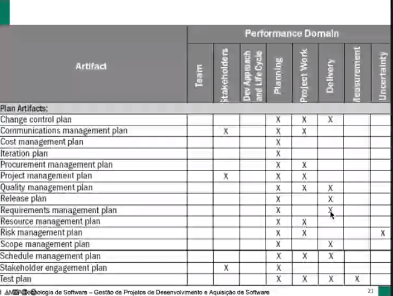

# 20220328

## Plano de Projeto

- **O que é um plano?**
    - Uma sequencia de atividades para atingir um objetivo.
    - “Um meio proposto para alcançar um objetivo” (PMI 2021)
- **Plano de Gerencia de Projeto** (~ plano de projeto)
    - “O documento que descreve como o projeto será executado, monitorado, controlado, e encerrado” (PMI 2021)
    ****
- **Planejamento**
    - “Inclui as atividades de realizar estimativas de atributos de produtos de trabalho e tarefas, determinar recursos necessários, negociar compromissos, produzir um cronograma e identificar e analisar os riscos de projeto” (Chrissis 2006)
    - “Desenvolver e manter um plano de projeto” (PMI 2021)
    - “ O planejamento se ocupa de identificar as atividades, marcos e os documentos a serem produzidos em um projeto” (Sommervile 2011)
- **Plano de Projeto**
    - “Provê a base para executar e controlar as atividades de projeto, que tratam dos compromissos com o cliente do projeto.” (Crissis 2006)
    - “Define os recursos disponíveis para o projeto, a estrutura analítica do trabalho e uma programação para realizar o trabalho” (Sommervile 2011)
    - ABNT, 2021
        - Processos de gerenciamento técnico
        - Processos de planejamento de projeto
        - O Propósito do **Processo de planejamento de projeto** é produzir e coordenar **planos** efetivos e viáveis.
            - Resultados esperados
                - Os objetivos e os planos são definidos
                - Os papéis, as responsabilidades... são definidas
- **Planejamento de Projeto de Software**
    - O primeiro passo no planejamento de projetos de software deve ser a seleção de um modelo apropriado de ciclo de vida de desenvolvimento de software e talvez a sua adaptação com base no âmbito do projeto, requisitos de software, e uma avaliação de risco.
    - Outros fatores a serem considerados incluem a natureza do domínio de aplicação, a complexidade funcional e técnica, e os requisitos ...
    - Entregáveis
        - Plano do processo
        - entregpaveis
        - estimativas esforço, cronograma e custo
        - ...
- **PMBOK**
    - Aquisições
        - Custos
        - “Vai Casar?”
        - “O que pedimos é o que realmente veio?”
    - Entrega
        - Pode ter bug
        - Planejamento da entrega
        - Treinamento
    - Requisitos
        - Acompanhar a evolução dos requisitos
        - Manter o que se desenvolve up to date com os requisitos
    - Recursos
        - Férias de funcionário
        - Saída de funcionário
        - Recursos materiais
            - Obter celular do tipo X, Y, Z, pois eles serão utilizados no desenvolvimento do app.
        
        
        
    
    ## Acompanhamento de Projeto
    
    - Monitorar
        - Coletar dados de desempenho do projeto, gerando medidas de desempenho, e informar e divulgar informações sobre o dese"mpenho
        - “O desempenho do projeto deve ser monitorado e medido regularmente para identificar variações em relação ao plano” (PMI 2021)
        - Pontos Importantes para monitorar
        
        
        
    - Definir períodos mínimos dos reportes
        
        
        
    - Monitorar escopo
        - Verificação do que foi feito
        - Verificar o atendimento às especificações (requisitos) de cada atividade
        - Ex: Atividade:
            - Pesquisa de mercado
                - Abrangência solicitada
                - Relatório formatado
                - Conclusão clara
        
    
    
    
    
    
    
    
    ## Exercícios
    
    1. Cite 3 itens de conteúdo de um plano de projeto
        - Recurso;
        - Prazo;
        - Custo;
        - Requisitos;
        - Entregáveis;
        - Aquisições;
        - Gerenciamento de Risco;
        - Controle de Qualidade;
        - Requisitos (caso seja muito grande “criar um ponteiro/flecha apontando para a sessão de requisitos mais detalhada”);
        - Papeis e responsabilidades.
    2. Planeje uma viagem de férias - daqui 1 mês
        - Roteiro da viagem para determinar a quantidade de dias que a viagem vai levar
        - Determinar a data de ida e retorno
        - Determinar a passagem
        - Determinar hotéis
        - Determinar transfer
        - Estimar gasto alimentação
        - Verificar clima
        - Como vou chegar no local de destino
            - Carro, ônibus, avião?
            - Comprar/alugar o meio de locomoção
            - Quanto estou disposto a pagar
        - Onde será a viagem?
            - Roupas específicas para o local, se muito frio, levar casacos e moletom. Caso seja quente, levar roupas leves
        - Onde vou ficar hospedado?
            - Será em um hotel? Quanto estou disposto a pagar?
            - Alugarei uma casa? O que preciso me preocupar para comprar/levar? Quanto estou disposto a pagar
        - Vou sozinho?
        
    3. O que deve ser acompanhado nesse mês?
        - Gerenciamento de Risco;
            - Mudanças frequentes da especificação do BACEN para o open-banking pode gerar riscos de atendimento ou não dos requisitos no projeto da empresa.
        
        - Prazo
            - Devido a mudança dos requisitos, podemos ter retrabalho ou novas atividades, o que pode impactar no prazo
        
        - **Formas de acompanhamento**
            - Status report
            - Reuniões semanais com mais detalhamento