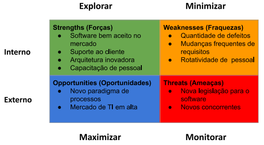

# 20220404

## Gerência de Risco

### Definição de Risco

- “Um risco é qualquer coisa, desconhecida ou incerta, que possa impedir o sucesso” de um empreendimento (Fonte: Dicionário)
- “Um risco é um evento incerto ou condição que, se ocorrer, pode ter um efeito positivo ou negativo sobre um ou mais objetivos” de um empreendimento

### Riscos Organizacionais

- Empresa
    - Missão, visão e valores
- Empreendimentos
    - Portfólios
    - Programas
    - Projetos
- Planejamento
    - Estratégico (alta gerência)
    - Tático (gerência)
    - Operacional (colaboradores)

### Analise SWOT (FOFA)

- Strengths (forças)
- Weaknesses (fraquezas)
- Opportunities (oportunidades)
- Threats (ameaças)
- “Utilizar esses itens para identificar riscos organizacionais  👆”

A análise SWOT (FOFA) visa identificar as forças, as fraquezas (internas), as oportunidades e as ameaças (externas) de um empreendimento ou organização.

- SWOT Usada na identificação de riscos.

**Passos Análise SWOT**

1. Identificar as **forças** e **fraquezas** da organização, com foco no **projeto** ou **área em geral**.
    1. 
2. identificar as **oportunidades** resultantes das forças do projeto ou da organização;
3. identificar as **ameaças** resultantes das fraquezas do projeto ou da organização

## Projeto de Software

### Definição Projeto de Software

- Possuem vários tipos de stakeholders
- São complexos
- São multidisciplinares
- São distribuídos (projeto e produto)
- Seguem um modelo de ciclo de vida
- Usam tecnologias para o projeto
- Podem ter fornecedores
- são susceptíveis a falhas

> A maioria dos desastres de projetos de software poderiam ser evitados ou grandemente reduzidos se houvesse uma consciência explícita em identificar os problemas com antecedência e resolver seus elementos de alto risco

\- BOEHM, 1991, p.32
> 

### Potenciais Riscos de Projeto

- **Premissas**
    - Assumidas no projeto como verdadeiros (p. ex. contratação de especialistas em Data Science em prazo definido)
- **Suposições** (Pressupostos)
    - Hipóteses assumidas no projeto (p. ex. disponibilidade de ferramenta de testes)
- **Restrições**
    - Limitam as possíveis soluções do produto (p. ex. uso de linguagem de programação Java)

### Gerência de Riscos de Projeto

- Identificação de ações alternativas
- Aumento de confiança para atingir os objetivos do projeto
- Aumento de chances de sucesso
- Surpresas reduzidas
- Estimativas mais precisas (incerteza reduzida)
- Redução de duplicação de esforço (ciência dos riscos pela equipe)

**Gerência de Riscos de Projeto - Fases**

**Gerência de Riscos de Projeto - Identificação**

**Gerência de Riscos de Projeto - Análise**

- Probabilidade e impacto (para cada risco)
    - **Probabilidade:** Baixa, média, alta
    - **Impacto:** Insignificante, moderado, catastrófico
- Exposição ao risco
    - **Probabilidade x Impacto**
    

**Gerência de Riscos de Projeto - Tabela de Riscos**

- Identificador: Número Sequencial
- Tipo: Ver: *Gerência de Riscos de Projeto - Identificação*
- Risco: Nome do risco (categoria)
- Descrição: Texto contando o que de fato é esse risco
- Probabilidade: Baixa, média ou alta
- Impacto:  Insignificante, moderado ou catastrófico
- Ação: Ver: *Estratégia de Resposta ao Risco*

## Estratégia de Resposta ao Risco

- Evitar: Evitar um efeito negativo no projeto;
- Transferir: Transferir a responsabilidade para um terceiro;
- Mitigar: Reduzir a ameaça reduzindo a probabilidade e/ou impacto antes que o risco se realize;
- Aceitar: Aceitar por meio de estratégia de respostas ativas e passivas.

| Identificador | Tipo | Risco | Descrição | Probabilidade | Impacto | Ação |
| --- | --- | --- | --- | --- | --- | --- |
| 1 | Pessoal | Saída de desenvolvedores | O projeto com propósito regulatório do BACEN conta com muitos desenvolvedores com menos de 2 anos de experiencia.  |  |  |  |
| 2 | Estimativa | Não cumprimento do prazo de entrega de um projeto que busca atender um pedido regulatório do BACEN. | O projeto com propósito regulatório do BACEN conta com muitos desenvolvedores com menos de 2 anos de experiencia.  | média | catastrófico | Mitigar ou Evitar (contratar mais Devs) |
| 3 | Tecnologia | Alteração em Sistema Legado |  | alta | catastrófico | Precisamos |
| 4 | Tecnologia | Falta de experiencia com AWS |  |  |  |  |
| 5 | Requisitos | Não há a documentação oficial para regulamentação, mas data já foi definida. |  |  |  |  |
|  | Requisitos | Não implementação do motor funcional de teste |  |  |  |  |
|  | Organizacional | Saída dos gerentes responsáveis pelo projeto |  |  |  |  |
|  | Organizacional | Entrando em um novo campo de negócio  | desalocação de times do regulatório para atender o BACEN |  |  |  |

TODO Fazer descrição do Projeto