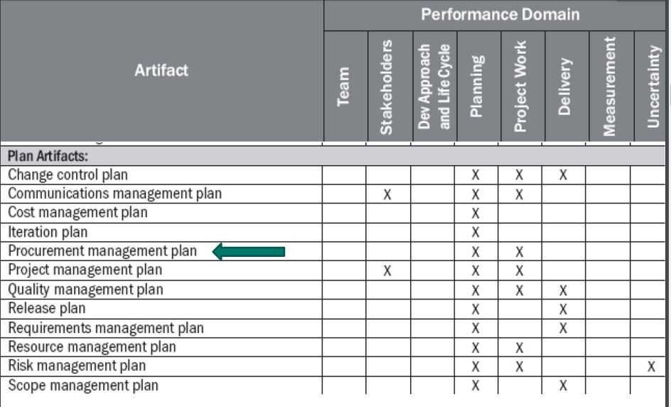

# 20220411

# Processos de aquisição de software

## Conceitos e Definições

- **Plano de Gerenciamento de Aquisições**
    - Um componente do projeto ou do plano de gerenciamento que **descreve como uma equipe vai adquirir bens e serviços**.
- Domínio de desempenho do projeto
    - A informação sobre aquisição tem impacto na equipe do projeto e no cronograma.
    - Os profissionais/empresas contratados precisam de informações sobre
        - tipo de produto/serviço necessários
        - quando serão necessários
        - Quaisquer outras especificações para os bens ou serviços
        adquiridos.
- Abordagem de desenvolvimento e Ciclo de vida
    - As aquisições podem acontecer em qualquer momento durante um projeto.
    - Planejar com antecedência ajuda a estabelecer expectativas
    - As equipes do projeto realizam uma análise comprar ou fazer (make-or-buy).
    Identificar os produtos e serviços que serão desenvolvidos internamente, e os que serão adquiridos.
    
- 👉 Antes de realizar uma aquisição, o gestor do projeto e a equipe
trabalham para desenvolver o *pedido de propostas (RFP),
declaração de trabalho (SOW), termos e condições, e outros
documentos necessários para a aquisição*.
- O processo de aquisição inclui o desenvolvimento e a divulgação
de documentos, reuniões com fornecedores, e seleção de um
fornecedor.

## Processos de Aquisição

### Planejamento de Suprimentos

- O Planejamento de Suprimentos visa **identificar** quais das **necessidades** da empresa podem ser melhor **atendidas** através da **aquisição de produtos e serviços** de fora da organização.
- O **resultado** do Planejamento de Suprimento é o **Plano de Suprimento**
- 
- Planejamento de Suprimentos envolve considerações sobre
    - **SE** comprar
    - **O QUÊ** comprar
    - **QUANTO** comprar
    - **QUANDO** comprar
    - **COMO** comprar
- Direcionadores do Plano de Suprimento:
    - características do projeto do produto e do processo
        - envolvidos (stakeholders)
        - volume de investimento
        - prazo de implantação
        - complexidade
        - localização
        - produto final
        - produtos intermediários
    - fatores econômicos e financeiros
        - conjuntura do país e da região
        - número de fornecedores
        - localização dos fornecedores
        - situação do mercado fornecedor
        - fontes de recursos (SEBRAE, BNDE, etc)
    - fatores sociais e políticos
        - Incentivo a fornecedores nacionais
        - criação de novos empregos
        - estímulo a fornecedores locais
        - reflexos do projeto na comunidade
        - efeitos do projeto no meio ambiente
    - fatores técnicos
        - tecnologia
        - índice de automação
        - agrupamento de itens de fornecimento
        - padronização de equipamentos
        - estrutura de gerenciamento
        - multiplicidade e simultaneidade de contratos
        - necessidades de inspeção e controle de qualidade
        - transporte, acondicionamento e seguro
        - infraestrutura e facilidades do “site”
        - itens sobressalentes
        - supervisão técnica de instalação
        prazo e cobertura de garantias
        - assistência técnica pós venda
    - condições de mercado
        - Quais produtos e serviços se encontra no mercado
            - prontamente disponíveis
            - necessitam ser desenvolvidos
        - De quais fornecedores
            - número (concorrentes)
            - tradicionais (segurança) ou novos (risco)
            - capacitação
            - localização
        - técnicas (tecnologia, prazos, qualidade, garantia, etc)
        - comerciais (forma de pagamento, financiamento, garantias, etc)

### Planejamento da Aquisição

- **Lista de Fornecedores (vendor list):**
    - Fornecedores usuais (com bom desempenho anterior)
    - Fornecedores recomendados (técnica, econômica e política)
    - Fornecedores cadastrados
    - Fornecedores especializados (itens específicos)
    - Fornecedores cadastrados junto a fontes de financiamento
    - Fornecedores com mesmo porte técnico-econômico
    - Fornecedores locais
    - Fornecedores com outros clientes na região
- **Pré Qualificação de Fornecedores:**
    - relação de fornecimentos executados
    - atestados de fornecimentos similares
    - instalações e recursos do fornecedor
    - corpo técnico e administrativo do fornecedor
    - carteira de fornecimentos em andamento
    - balanços e atestados jurídico-financeiros
- **Lista de Fornecedores Qualificados - desenvolvendo uma “short list”:**
    - Visita às instalações do Fornecedor
    - Verificação de fornecimentos similares
    - Contato com clientes já atendidos
    - Contato com clientes atuais
    - Contato com sub fornecedores
    - Referências financeiras
    - Classificação (baseada em critérios pré estabelecidos -“critérios de qualificação”)
- **Documentos de aquisição gerados no processo de Planejamento da Solicitação:**
    - Solicitação de Informação (Request for Iinformation - RFI);
    - Convite para Apresentação de Oferta (Invitation for Bid - IFB);
    - Solicitação de Cotação (Request for Quotation - RFQ);
    - Solicitação de Proposta (Request for Proposal - RFP).
- **Solicitação e recebimento de Propostas Comercial:**
    - Oportunidade do fornecedor (proponente) demonstrar que compreendeu claramente a necessidade da contratante e que é capaz de satisfazê-la de maneira melhor que seus concorrentes.
    - Preparada em conformidade com o requerido nos respectivos Documentos de Suprimentos (forma, conteúdo, abrangência).
    - Primeiro documento formal de um potencial relacionamento comercial que visa ganhos para ambos os lados (lucro x solução da necessidade).

### Contratações e Administração de Contratos

- O processo de Contratações envolve o recebimento de ofertas e
propostas e a aplicação de critérios de avaliação para selecionar o fornecedor que melhor atende às necessidades do cliente.
- É **executado** através da **Análise Técnica e Econômica** das propostas obtidas dos proponentes.
- **Propostas**
    - **Qualificação**
        - Capacidade técnica (amostras ou atestados de clientes)
        - capacidade financeira
        - regularidade jurídico-fiscal
    - **Proposta Técnica**
        - Processos de fabricação e qualidade do produto
        - recursos humanos
        - cronograma de entrega
    - **Proposta Comercial**
        - Planilhas de preços e quantidades
        - forma de pagamento
        - fórmula de reajuste
    - **Critérios de avaliação de propostas**
        - Estabelecimento de itens, notas e pesos a serem considerados na avaliação das propostas, para efeito de comparação (análise técnica e econômica das propostas). Utilizar histórico do fornecedor
    - **Exemplos de atributos de avaliação de propostas**
        - Preço (itens conhecidos e muitas opções de fornecedores)
        - Entendimento das Necessidades do Contratante (achar que entendeu x entender x demonstrar que entendeu);
        - Custo Total do Ciclo de Vida do Bem ou Serviço (preço+custo de aquisição+custo de operação);
        - Capacidade Técnica (deter ou desenvolver conhecimento necessário à execução do fornecimento);
        - Capacidade Administrativa (deter ou desenvolver os processos e procedimentos administrativos necessários à execução do fornecimento);
        - Capacidade Financeira (deter ou obter a tempo os recursos necessários à execução do fornecimento).
    - ATENÇÃO - Políticas das organizações envolvidas podem, de alguma forma, afetar a avaliação das propostas:
        - Prazos Internos
        - Tamanho de lote
        - Formas de Pagamento
        - Tolerância a Riscos
        - Facilidades de Transferências Internacionais ($)
        - Planos de Desenvolvimento
        - Padrão de Qualidade
- **O Contrato**
    - O contrato é um acordo através do qual o fornecedor se obriga a
    entregar o produto especificado e o contratante se obriga a pagar por ele.
    - Contrato é o documento de formalização do acordo entre duas ou
    mais partes, que transferem entre si direitos e obrigações.
    - O contrato é um instrumento de responsabilidade legal sujeito a ser tratado (remediado) na Justiça.
    - **Cláusulas Essenciais dos Contratos:**
        - Partes
        - Objeto
        - Especificação técnica do produto a ser entregue
        - Preço e Condições de Pagamento
        - Responsabilidades e Garantias
        - Reajustamento
        - Prazos e Penalidades
        - Direitos e Obrigações
        - Entrega dos Bens e Serviços
        - Rescisão ou Suspensão
        - Disposições Finais
        

### Encerramento de Contratos e Avaliação de Fornecedores

## Exercícios

1. Como os projetos adquirem os suprimentos necessários para as atividades definidas?
- Na empresa em que trabalho (PagSeguro), quando é necessário adquirir um item para um projeto, dependendo do item, o coordenador do time ou gerente de projetos consegue solicita-lo por meio de uma plataforma interna da companhia que disponibiliza uma gama de softwares, equipamentos pré-aprovados. A solicitação exige um motivo para a solicitação, nível de urgência (baixo, médio ou alto), quantidade dos itens a serem solicitados.

1. Como os gerentes de projeto interagem com o setor de compras
- Plataforma Interna

1. Como os fornecedores são definidos e homologados?

O time de segurança verifica se haverá o compartilhamento de informações confidenciais com os fornecedores.

Verifica o custo