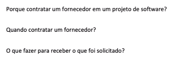

# 20220418

## Gerenciamento de Contrato de Fornecedor

**Porque contratar um fornecedor em um projeto de software?**

- Falta de mão de obra
- Falta de conhecimento para desenvolvimento
- Falta de tempo para desenvolver

**Quando contratar um fornecedor?**

- Contratação deve ser considerada no planejamento do projeto

**O que fazer para receber o que foi solicitado?**

- Estabelecer um acordo com fornecedores
- Garantir que o fornecedor e o adquirente estão trabalhando de acordo com o contrato
- avaliar as entregas

**Gerenciamento de Contrato com Fornecedores Envolve:**

- estabelecer o contrato
- implementar o contrato
- monitorar atividades técnicas
- monitorar processos do fornecedores
- aceitar a entrega de produtos adquiridos
- **gerenciar as faturas**
    - Importante, pois para pagar o fornecedor é preciso ter a certeza de que aquilo que solicitamos foi “entregue”

**O contrato deve definir os processos, papéis e responsabilidades que permitem ao adquirente:**

- Supervisionar as atividades do fornecedor
- Monitorar a evolução dos entregáveis
- Verificar a conformidade com os requisitos do contrato
- Resolver problemas conforme necessário

### **Etapas para o Gerenciamento de Contrato de Fornecedor**

### Etapa 1

**Monitorar o fornecedor conforme especificado no contrato e manter o contrato atualizado**

- Benefício
    - melhorar a probabilidade de fornecedor fazer a entrega correta
- Requisitos podem mudar depois de assinar o contrato, com base em fatores como:
    - Aplicação dos requisitos
    - disponibilidade de nova tecnologia
    - redução de relatórios excessivamente onerosos
    - mudanças na organização (por exemplo, fusão ou aquisição)
- Atividades envolvidas
    - Assinar o contrato com fornecedor e manter atualizado
    - registrar alterações formalmente (adquirente e fornecedor)
    - revisar periodicamente o contrato para refletir com precisão os planos e processos
    - verificar se o adquirente e fornecedor entendem e concordam todos requisitos, aprovando o contrato
    - Comunicar o contrato com o fornecedor dentro da organização adquirente, conforme necessário
        - Garantir que stakeholders saibam do acordo
- Produtos de trabalho que podem ser elaborados
    
    
    

### Etapa 2

**Executar atividades conforme especificado no contrato do fornecedor**

- **Benefícios**
    - Melhora a confiança do adquirente na capacidade do fornecedor de fornecer o produto certo com a qualidade certa
    
    
    
    
    
    
    
    
    
    
    
    
    

### Etapa 3

**Verificar se o contrato com o fornecedor está atendido antes de aceitar a entrega do produto adquirido**

- Benefício
    - 
    
    
    
    
    

### Etapa 4

**Gerenciar faturas enviadas pelo fornecedor de acordo com os contratos**

- Benefícios
    - manter um bom relacionamento comercial entre o adquirente e o fornecedor

### Etapa 5

**Selecionar produtos técnicos para analisar e conduzir análise técnicas**

- **O que se revisar?**
    - Plano de testes
        - Possivel de enxergar os requisitos
        - Nível de cobertura
    - Código fonte
        - Boas práticas
        - Linhas de código
    - Executável
        - Formato do executável
        - recursos demandados para rodar executável

### Etapa 6

**Selecionar e monitorar os processos e entregas do fornecedor com base nos critérios do contrato com o fornecedor**

- Benefício
    - Fornece melhor visibilidade da capacidade e desempenho do fornecedor e minimiza o risco
- Acompanhar processos de desenvolvimento
    - Desenvolvimento
    - Teste
    - Delivery
- Processos definidos por CMMI
    - Processo de verificação e validação
    - Processo de garantia da qualidade (PQA)

## Exercício

1.  Resposta:
    1. Período do projeto onde não haverá recursos humanos suficientes para fazer a entrega no prazo.
    2. Perda de funcionários e reposição não viável na janela de desenvolvimento do projeto
    3. Distribuir a carga de trabalho
    4. Projeto distribuído
        1. gestão das partes distribuídas cabe ao meu fornecedor fazer

1. Resposta
    1. Contrato bem feito
    2. Acompanhar o contrato
    3. Equipe qualificada para validar as entregas dos critérios de aceite
    4. Faturas 
        1. para pagar o fornecedor é preciso ter a certeza de que aquilo que solicitamos foi “entregue”
        2. Acompanhar para não passar do orçamento definido
    5. Acompanhar os processos de teste
    6. documentar bem requisitos (casos de uso)
    7. inspeção/auditoria no que se está desenvolvendo
    8. reuniões periódicas para acompanhar mais de perto o fornecedor para encontrar problemas de forma mais rápido e assim corrigi-los
    9. documentar comunicação
        1. o que foi decidido
        2. atas de reuniões
    10. Registrar mudanças e atualizar contrato se necessário