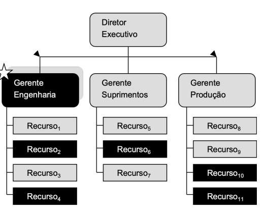

# Review

## Intro Gerência Projetos de Software (20220221)

### Por que os projetos de TI falham?

- Visão do **Usuário**
    - Falta de participação do usuário (12,8%)
    - Requisitos e especificações incompletos (12,3%)
    - Mudanças nos requisitos e especificações (11,8%)
    - Expectativas irreais (5,9%)
    - Falta de clareza nos objetivos (5,3%)
    - Prazo fora da realizade (4,3%)
- Visão de **Gestores de TI**
    - Falta de suporte executivo
    - Falta de recursos
    - Expectativsas irreais
    - Prazo fora da realizade
- Visão de **Equipe de TI**
    - Requisitos e especificações incompletos
    - Mudanças nos requisitos e especificações
    - Incompetência tecnológica
    - Novas Tecnologias
    

### Fatores Críticos de Sucesso

- **Envolvimento do usuário**
- Apoio executivo
- **Requisitos claramente estabelecidos**
- **Planejamento adequado**
- **Expectativas realistas**
- Marcos de projetos menores
- Equipe competente
- **Visão e objetivos claros**
- Equipe focada e trabalhando sério

### Estruturas Organizacionais de Projetos

- Estrutura hierárquica ou funcional



- Estrutura projetizada


- Estrutura matricial


### **Operação x Projeto x Programa x Portfólio**


- ***Operação****
    
    > Uma operação é uma função organizacional que realiza a execução contínua de atividades que produzem o ****mesmo produto**** ou fornecem o mesmo serviço repetidamente. (PMI, 2021)
    > 
    - Exemplo:
        - Linha de montagem automóveis
        
- **Projeto**
    
    > Um projeto é um **empreendimento temporário conduzido para gerar um produto**, serviço ou resultado específico.  (PMI, 2021)
    > 
    
    > O caráter temporário dos projetos indica um início e um fim do projeto ou uma fase. Os projetos podem ser autônomos ou fazer parte de um programa ou portfólio (PMI, 2021)
    > 
    
- **Programa**
    
    > Um programa é um **grupo de projetos**, subprogramas e atividades relacionados que são **gerenciados de forma coordenada para obter benefícios** que não estariam disponíveis se eles fossem gerenciados individualmente. (PMI, 2021)
    > 
    
- **Portfólio**
    
    > Um Portfólio é um ****conjunto de projetos****, programas e outros trabalhos que ****são agrupados para facilitar o gerenciamento efetivo daquele trabalho**** para atender a objetivos estratégicos específicos. Os componentes do Portfólio não necessariamente precisam ter alguma relação de dependência ou estar diretamente relacionados. (PMI, 2021)
    > 

- **Portfólio x Programas x Projetos**
    
    
    
    
    

- **Gerência de projetos**
    
    > **Gerência de Projetos** é a aplicação de conhecimentos, perfis, ferramentas e técnicas, às atividades de projeto **para atingir os requisitos do projeto**.
    > 

- **Gerência de Portfólio**
    
    > **Gerência de portfólio da uma** *visão global.* Consegue visualizar (”de cima”) projetos que estão dando sucesso e projetos que estão com problemas. Devido a isso é possível “realocar” recursos para assistir projetos que demandam de mais recursos (ou projetos problemáticos) (**gerencia recursos entre os projetos**).
    > 
    
- **Gerente de Projetos**
    
    > Gerente de projeto é uma pessoa que **provê diretiva e controle técnico e administrativo para as tarefas executadas** ou atividades dentro de sua área de responsabilidade de gestão. **Funções** tradicionais de um gerente incluem **planejamento**, **organização**, **direcionamento** e **controle**. (Chrissis, 2006)
    > 
    
- **Resultado**
    
    > Resultado é uma **saída** ou consequência de **um processo ou projeto**. Os **resultados podem incluir produtos e artefatos**, mas têm uma **finalidade** mais ampla ao **focarem nos benefícios** e no valor que o projeto foi realizado para produzir. (PMI, 2021)
    > 
    
- **Valor**
    
    > **O significado, importância, ou utilidade de algo**. Os diferentes stakeholders percebem valor de formas diferentes.
    > 
    
    > Os **clientes** podem definir **valor** como a c**apacidade de utilizar características ou funções de um produto**. As **organizações** podem concertar esforços no **valor** comercial determinado produto medindo esses **ganhos com métricas financeiras.**“ (PMI, 2021)
    > 
    
- **Sistema para Entrega de Valor**
    
    > Portfólios, programas, projetos, produtos e operações podem todos fazer parte do sistema de uma organização para a geração de valor. (PMI, 2021)
    > 

- **Planejamento**
    
    > Inclui as **atividades** de realizar **estimativas de atributos** de produtos de trabalho e **tarefas**, determinar **recursos** necessários, negociar compromissos, produzir um **cronograma** e identificar e **analisar os riscos** de projeto. (Chrissis, 2006)
    > 
    
- **Plano de Projeto**
    - Um plano de projeto **fornece a base** para **execução** e **controle** das atividade **do projeto**
    - Inclui:
        - estimativas de tarefas e produtos de trabalho
        - determinação dos recursos
        - cronograma
        - identificação e análise de riscos
    - **Plano de Projeto de Software**
        - Coleção de **planos**, formais ou informais que **descrevem as atividades** a serem executadas pelo projeto de software
        - **Exemplos de planos:**
        - Plano de desenvolvimento de software
        - Plano de garantia de qualidade de software
        - Plano de gerência de configuração de software
        - Plano de teste de software
        - Plano de gerência de riscos
        - Plano de melhoria de processo.

### Exercícios

- **Quais são os Stakeholders típicos de um projeto de software?**
    - Usa o sistema diretamente;
    - Trabalha com os resultados de quem usa o sistema;
    - Será impactado com a implantação e operação do sistema;
    - Tem investimento no orçamento ou no cronograma;
    - Tem interesse em entender como a solução será desenvolvida;
    - Estará envolvido em propagandear, vender, instalar ou mante;
    - Desenvolvedores;
    - Usuários;
    - Contratantes/Donos;
    - Agências regulatórias.
- **Cite uma diferença entre projeto, programa e portfólio**
    - Diferença entre projeto e programa é que o projeto trata-se de um esforço temporário enquanto que o programa é um conjunto de projetos relacionados (agrupamento de projetos com objetivos em comum), que quando combinados visam um resultado que só é possível de se obter a partir da combinação dos projetos
    - O portfólio, por sua vez, consiste no agrupamento de programas e projetos com o objetivo de obter sucesso no desenvolvimento de produtos ou serviços, além de maximização da eficiência na corporação
    

## **Princípios** e Aspectos de atuação em Gerência de Projetos (20220307)

- **PMBOK**
    - Domínios de Desempenho de Projeto
    - Customização (*tailoring)*
    - Modelos, métodos e artefatos

- **Padrão para Gerenciamento de Projetos**
    - Fornece uma **base** para **compreender a gestão do projeto** e a forma como o mesmo ajuda em resultados;
    - **Descreve o sistema em que os projetos operam**, incluindo **governança**, possíveis **funções**, o **ambiente** do projeto, e considerações sobre a relação entre a gestão de projetos e gestão de produtos.

- **Como criar valor?**
    - **Novo** produto, serviço ou resultado que satisfaça as necessidades das partes interessadas;
    - **Possibilitando** as **mudanças** necessárias para a organização passar para um estado desejado;
    - **Melhorando** a eficiência, produtividade, eficácia, ou
    capacidade de resposta.
    

### **Princípios de Gerenciamento de Projetos**

1. Gestão atenta (gestor atento);
2. Criar um ambiente **colaborativo** na equipe de projeto;
3. Envolver eficazmente as **partes interessadas:**
    1. É importante que gestores e líderes tenham interação com as partes interessadas para entender muito bem suas expectativas e necessidade.
4. Foco no **valor:**
    1. Valor é o indicador final do sucesso do projeto;
    2. Valor e os benefícios que contribuem para obtenção do valor podem ser definidos em termos quantitativos ou qualitativos.
5. Reconhecer, avaliar, e responder às interações do **sistema**:
    1. Projetos não são “ilhas”, portanto, é necessário entender como diferentes projetos se articulam em um **sistema** dentro de uma organização;
    2. Um projeto é um sistema de atividades de domínios independentes e interativos.
6. Comportamentos de **liderança;**
7. **Customizar** com base no contexto:
    1. Cada projeto é único;
    2.  O sucesso de um projeto é baseado na customização no
    contexto único do projeto para **determinar os métodos mais
    apropriados para produzir os resultados desejados.**
8. Construir **qualidade** nos processos e entregáveis:
    1. Um projeto de **qualidade** **implica em satisfazer as expectativas das partes interessadas** e atender os requisitos do projeto e do produto ;
    2. A **qualidade** foca nos **critérios de aceitação** da entrega
    3. Qualidade de projeto “implica em assegurar que os **processos de projeto** são tão **apropriados** e **eficazes** quanto possível.
9. Navegar na **complexidade:**
    1. O ambiente é V.U.C.A. (Volatilidade, incerteza, complexidade e ambiguidade).
10. Otimizar as **respostas** ao **risco:**
    1. Ameaças internas e externas, ****riscos gerais ou únicos podem impactar projetos;
    2. A resposta ao risco deve ser:
        1. Apropriada para a relevância do risco;
        2. Realista dentro do contexto do projeto;
        3. Acordada com as partes interessadas relevantes;
        4. Atribuída a uma pessoa como responsável.
11. Adotar **adaptabilidade** e **resiliência;**
12. Permitir a **mudança** para atingir o estado esperado amanhã.

```jsx
gerente;
colaboração
envolvimento;
valor;
interações do sistema;
liderança;
customização;
qualidade;
complexidade ambiental;
respostas ao risco;
adaptabilidade/resiliência
abraçar as mudanças.
```

### PMBOK

- **Domínios de Desempenho de projeto**
    - Áreas de conhecimentos (disciplinas): **custo, cronograma, pessoas, aquisição**;
    - Considerar os seguintes aspectos:
        - Partes interessadas (ter um compromisso sólido);
        - Equipe;
        - Abordagem de desenvolvimento e ciclo de vida:
            - **Ciclo de vida do projeto** constituído de fases que **facilitam** o **ritmo de entreg**a e a abordagem de desenvolvimento exigida na produção das entregas do projeto;
            - O **desenvolvimento** e a cadência de entrega **influenciam** o **ciclo de vida do projeto** e suas fases.
        - **Domínio de Desempenho do Planejamento** (Planejamento):
            - Atividades necessárias para produzir as entregas e os resultados;
            - O projeto se desenvolve de maneira coordenada, organizada e planejada;
            - Existe uma abordagem **holística** para as **entregas** dos r**esultados do projeto;**
            - Informações do plano são suficientes para atender as expectativas das partes interessadas;
            - **Existe um processo para adaptação dos planos ao longo do projeto baseadas na emergência e mudança de necessidade ou condições.**
        - **Trabalho do projeto:**
            - Necessário para **manter** as **operações** do **projeto** **funcionando** perfeitamente e inclui, além de outros, comunicação, engajamento e outros trabalhos.
        - **Entrega**:
            - Associado à **entrega** de **valor**;
            - Benefícios do projeto são concretizados no espaço de tempo
            para o qual foram planejados.
        - **Medição**:
            - **Garantir** que o **resultado** **planejado** seja **alcançado**;
            - Um entendimento confiável dos estados do projeto;
            - Geração de valor do negócio e objetivos atingidos através de decisões tomadas bem fundamentadas, em tempo hábil e baseadas em planejamento e estimativas confiáveis.
        - **Incerteza**:
            - Atividades e funções relacionadas associadas aos riscos
            - Conhecimento dos ambiente no qual os projetos ocorrem, incluindo mas não se limitando a ambientes técnicos, sociais, políticos, de mercado e econômicos
            - **Capacidade de antecipar ameaças** e oportunidades bem como entender as consequências do tema
        
        ``
        
        ```jsx
        **partes interessadas
        equipe
        ciclo de vida desenv
        planejamento
        manter op funfando
        entrega de valor
        garantir resultados planejados alcançados
        analisar riscos, antecipar ameaças**
        ```
        
        
        
- **Customização (*tailoring)***
    - A **customização** envolve a **compreensão do contexto do projeto**, **objetivos** e **ambiente** operacional;
    - A customização é a **adaptação** ponderada da abordagem da **gestão** do projeto, **governança**, e **processos** **para os tornar mais adequados;**
    - Os **projetos** são executados em ambientes complexos que **precisam equilibrar demandas potencialmente concorrentes**:
        - **Entregar** o mais **rapidamente** possível;
        - **Minimizar** os **custos** do projeto;
        - **Otimizar** o **valor** entregue;
        - Criar produtos e resultados de alta **qualidade;**
        - Proporcionando o **cumprimento** das **normas** regulamentares;
        - **Satisfazer** as diversas **expectativas** das partes interessadas;
        - **Adaptação** à **mudança**.
    - **O que adaptar/customizar?**
        - Processos;
        - Envolvimento;
        - Ferramentas;
        - Métodos;
        - Artefatos.
    
- **Modelos – Métodos – Artefatos**
    - **Modelo**: uma **estratégia de pensamento** para explicar um processo, estrutura (framework) ou fenômeno;
        - Refletem visões simplificadas e em pequena escala da realidade e de cenários atuais;
        - Podem moldar o comportamento e apontar para abordagens para resolver problemas ou satisfazer necessidades.
        - Exemplos de Modelos:
            - Liderança situacional II;
            - Comunicação intercultural;
            - Teoria das Necessidades;
            - Processo de 8 etapas para liderar mudanças.
    - **Método**: o **meio** para se **alcançar** um **resultado**, saída, produto ou entregável de projeto;
        - Exemplos de Métodos:
            - Benchmarking;
            - arvore de análise de decisão;
            - pontos de função;
            - daily standup.
    - **Artefato**: Um **artefato** pode ser um modelo (template), documento, **saída**, ou entregável de projeto.
        - Exemplos de artefatos:
            - backlogs
            - plano de controle de mudanças
            - WBS
            - organograma
            - status report

## Processos de Desenvolvimento de Software (20220314)

### Por que os projetos de Software Falham?

- Negócio
    - Expectativas não-realistas;
    - Não necessidade do produto depois de um tempo.
- Gerencial
    - Falta planejamento;
    - Falta de envolvimento do usuário;
    - Falta de recursos;
    - falta de suporte executivo;
- Técnico
    - **Requisitos incompletos**;
    - Mudanças de requisitos e especificações;
    - incapacidade tecnológica.

### Gerência de Projetos vs Desenvolvimento de Software

- **Processos de Desenvolvimento**
    - Especificação;
    - Implementação;
    - Testes;
    - **Modelos**:
        - **Modelo Cascata**
            - melhor modelo do ponto de vista da disciplina do desenvolvimento de software (atividades).
            - Pontos de controle a cada “fase”
                - Gerente pode verificar, acompanhar a evolução do projeto em cada ponto de controle
        - **Modelo Incremental**
            - Assim como o cascada, o modelo incremental possui “pontos de controle”;
            - Todo incremento é funcional;
            - Vantagens do ponto de vista do gerenciamento de projetos
                - Pontos de controle:
                    - Entre Sequência `plan —> control point —> design —> build`;
                    - Entre Incrementos.
        - **Modelo Ágil**
            - Daily Meeting → forma de “gerenciar” o projeto (obtém feedback's nesse ponto de controle).
        - **RUP**
            - “baleias” - corcovavas nos gráficos de cada linha no gráfico acima.

### Escolha de um Processo de Desenvolvimento

- Do ponto de vista **gerencial:**
    - conhecimento e experiência do processo;
    - **grau de definição dos requisitos;**
    - **estabilidade do escopo;**
    - **facilidade de mudanças;**
    - forma de entrega de produtos;
    - **grau de risco do produto**;
    - **tipos de requisitos não-funcionais**;
    - regulações;
    - restrições;
    - **Stakeholders**;
    - Estrutura organizacional;
    - cultura capacidade organizacional;
    - qualidade.
- Do ponto de vista técnico
    - Tradicional;
    - Ágil.
    

### Parâmetros de Projeto

```jsx
escopo
requisitos
qualidade
```

- Escopo (técnico-gerencial)
    - Escopo do projeto
        - atende ao cliente
        - atende ao produto
        - define o que precisa ser feito para atender ás necessidades do cliente
        - WBS
    - Escopo do sistema
        - Atende ao desenvolvimento
        - requisitos funcionais
            - casos de uso
        - requisitos não funcionais
            - desempenho
            - segurança
            - integridade
            - confiabilidade
            - qualidade
- Requisitos (técnico)
    - Restrições
        - leis
        - regulações
        - mercado
        - normas
    - Priorização de requisitos
        - Requisitos mandatórios
        - requisitos importantes
        - requisitos desejáveis
- Qualidade (técnico-gerencial)
    - Definição de qualidade
    - Abordagens técnicas
        - inspeções
        - testes

### Exercícios

1. **Por que os projetos falham?**
    
    Existem diversos fatores que podem contribuir para a falha de projetos de software, sejam eles de negocio, gerencial ou técnico. De expectativas não-realistas (negócio) a mudanças frequentes de requisitos e especificação (técnico), os projetos de software podem sofrem interferência ou efeitos colaterais que corroboram para seu fracasso.
    
    Dentro do âmbito de negócio vale destacar que, além das expectativas não realistas, também temos a questão da utilidade do software para o seu usuário, ou seja, o software era necessário, mas depois de algum tempo deixou de ser. Isso pode acontecer por diversos motivos como:
    
    - A situação que demandava do software não ocorre mais;
    - Surgimento de alternativas mais práticas;
    - dificuldades de implantação, seja no treinamento ou no convencimento dos usuários para seu uso;
    - etc.
    
    Do ponto de vista gerencial diversos fatores podem contribuir para a falha, alguns deles são:
    
    - Falta de planejamento, seja de cronograma, responsabilidades, recursos (humanos, financeiros e infraestrutura);
    - Falta de envolvimento do usuário no projeto. É essencial ter um bom entendimento dos usuários e stakeholders do projeto. O mal-entendido ou a compreensão parcial do problema pode levar a construção de algo com pouco uso/utilizade.
    
    Sobre o ponto de vista técnico alguns fatores que podem contribuir para o fracasso do projeto são:
    
    - Requisitos incompletos que podem levar a construção de um software que não atende as necessidades dos stakeholders;
    - Mudanças de escopo muito drásticas e constantes ao longo do projeto. Tal situação normalmente gera muito retrabalho, e também possui impactos no orçamento e no cronograma do projeto.
2. **Quais são os critérios de priorização de requisitos de um projeto? Quem define?**
    
    Os requisitos podem ser **priorizados** de acordo com sua **importância** em determinado **momento** da empresa ou do **ambiente**, ser um item **estratégico**, ser necessário para o cumprimento de **leis** e **regulamentações** ou ser importante para cumprir o **objetivos do cliente**.
    
    Essa priorização pode ser definida pela alta gerência, por exemplo quando se trata de um requisito urgente de grande impacto se não for feito, ou mesmo pelo cliente que acompanha todo o ciclo do produto, enquanto a gerência pode apoiar essas decisões com uma visão estratégica de curto e longo prazo.
    
3. **Quais são os elementos que definem o Escopo de um projeto? Quem define?**
    
    Os elementos que definem o escopo de um projeto dependem do fim a ser atingido com ele. Podem ser os **artefatos a serem gerados**, **resultados a serem atingidos**, descrição de etapas, limites de entrega, objetivos a serem listados, possíveis entregas, os responsáveis, os custos, prazos a serem levados em consideração e determinadas restrições. 
    
    Quem define é o gerente de projetos com suporte do time técnico para decisões e estimativas.
    

## Estrutura Analítica, Estimativas e Cronograma de Projetos (20220404)

### Parâmetros de Projetos

- Escopo = f(custo, prazo)
- Prazo = f(escopo, custo)
- Custo = f(escopo, prazo)
    - Recursos materiais
    - Recursos Humanos

### Estimativas de Software

- tamanho
    - linhas de código (fonte, executável)
    - No. de Páginas de Documentação
- funcionalidade
    - Análise de Pontos de Função
    - Análise de Pontos de Casos de Uso
- esforço
- prazo
- custo
- técnicas de estimativas
    - pontos de função
    - pontos de caso de uso
    - delphi
    - planning poker

**Análise de Pontos de Função**


**Características Gerais de Sistemas**

1. Comunicação de Dados
2. Funções Distribuídas
3. Desempenho
4. Configuração de equipamento
5. volume de transações
6. entrada de dados online
7. interface com o usuário
8. atualização online
9. processamento complexo
10. reusabilidade
11. facilidade e implantação
12. facilidade operacional
13. múltiplos locais
14. facilidade de mudanças

**Níveis de Influência**

0 = nenhuma

1 = mínima

2 = moderada

3 = média

4 = significante

5 = forte


 

- **PF = PFB x [0,65 + 0,01 x FA]**
    - PFB = Pontos de Função Brutos
    - FA = Fator de Ajuste
    - PF = Pontos de função ajustados
- Produtividade = tempo/PF
- Esforço = Produtividade xnPF
- Prazo = Esforço/nRecursos

Qual o conhecimento prévio que o gerente precisa ter para utilizar o ponto de função?

- Muito conhecimento de sistemas

## Planejamento (**20220328**)

**Plano de Gerencia de Projeto** (~ plano de projeto)

- “O **documento** que **descreve** como o **projeto** será **executado**, **monitorado**, **controlado**, e **encerrado**” (PMI 2021)

- **Planejamento**
    - “Inclui as **atividades** de realizar **estimativas de atributos** de produtos de trabalho e **tarefas**, determinar r**ecursos necessários**, negociar compromissos, produzir um **cronograma** e identificar e **analisar os riscos** de projeto” (Chrissis 2006)
    - “Desenvolver e manter um plano de projeto” (PMI 2021)
    - “ O **planejamento** se ocupa de **identificar** as **atividades**, **marcos** e os **documentos** a serem **produzidos** em um **projeto**” (Sommervile 2011)
    
- **Plano de Projeto**
    - “Provê a base para **executar e controlar as atividades de projeto**, que tratam dos compromissos com o cliente do projeto.” (Crissis 2006)
    - “**Define os recursos disponíveis** para o projeto, a estrutura analítica do trabalho e uma programação para realizar o trabalho” (Sommervile 2011)
    - O p**ropósito** do **processo de planejamento de projeto** é **produzir** e **coordenar** **planos** efetivos e viáveis.
        - Resultados esperados
            - Os objetivos e os planos são definidos
            - Os papéis, as responsabilidades... são definidas
            
        
        
        
- **Planejamento de Projeto de Software**
    - É coleção de planos que descrevem as atividades a serem exec pelo projeto de sw. Governa gerencia das atividades exec pelo grupo de engenharia.
    - O **primeiro passo** no planejamento de projetos de software deve ser a **seleção** de um **modelo** apropriado de **ciclo de vida de desenvolvimento** de software e talvez a sua adaptação com base no âmbito do projeto, requisitos de software, e uma avaliação de risco.
    - Outros fatores a serem considerados incluem a natureza do domínio de aplicação, a complexidade funcional e técnica, e os requisitos ...
    - Entregáveis
        - Plano do processo
        - entregaveis
        - estimativas esforço, cronograma e custo
        - gerenciamento de riscos
        - gerenciamento de qualidade

- **Monitorar**
    - Coletar dados de desempenho do projeto para realizar acompanhamento
    - O desempenho do projeto deve ser monitorado e medido regularmente para **identificar** **variações** em **relação** ao **plano**
    - Objetivo: **fornecer** **visibilidade** adequada do **progresso** de tal forma que a gerência possa **tomar** **ações** quando o **desempenho** do projeto **desvia** do **plano**.
    
    
    
    - **Monitoramento de Escopo**
        - Verificação do que foi feito
        - verificar atendimento às especificações (requisitos) de cada atividade
    - Monitorar aspectos comportamentais dos indivíduos e equipes:
        
        
        

### Exercícios

1. Cite 3 itens de conteúdo de um pano de projeto
    - Recurso;
    - prazo;
    - custo;
    - requisitos;
    - entregáveis;
    - aquisições;
    - controle de qualidade;
    - plano de riscos: é o mapeamento de riscos, ajuda a prever os impactos e antecipar possíveis soluções, já que se algo ocorrer não será uma surpresa e a correção pode ser mais rápida;
    - papeis e responsabilidade: é a descrição de quais papeis estarão presentes no projeto, quem estará nesses papeis e quais as responsabilidades;
    - plano de desenvolvimento: contém as etapas do desenvolvimento e os prazos previstos para cada etapa.
    

## Gerência de Risco (20220404)

### Definição risco

> Um risco é qualquer coisa, desconhecida ou incerta, que possa impedir o sucesso” de um empreendimento (Fonte: Dicionário)
> 

> Um risco é um evento incerto ou condição que, se ocorrer, pode ter um efeito positivo ou negativo sobre um ou mais objetivos” de um empreendimento
> 

### Análise SWOT

- Strengths (forças)
- Weaknesses (fraquezas)
- Opportunities (oportunidades)
- Threats (ameaças)
- “Utilizar esses itens para identificar riscos organizacionais 👆”

A análise SWOT (FOFA) visa identificar as forças, as fraquezas (internas), as oportunidades e as ameaças (externas) de um empreendimento ou organização.

**Passos Análise SWOT**

1. Identificar as **forças** e **fraquezas** da organização, com foco no **projeto** ou **área em geral**.
2. identificar as **oportunidades** resultantes das forças do projeto ou da organização;
3. identificar as **ameaças** resultantes das fraquezas do projeto ou da organização


### Projeto de Software Riscos

> A maioria dos desastres de projetos de software poderiam ser evitados ou grandemente reduzidos se houvesse uma consciência explícita em identificar os problemas com antecedência e resolver seus elementos de alto risco

BOEHM, 1991, p.32
> 

- **Potenciais Riscos de Projeto**
    - **Premissas**
        - Assumidas no projeto como verdadeiros (p. ex. contratação de especialistas em Data Science em prazo definido)
    - **Suposições** (Pressupostos)
        - Hipóteses assumidas no projeto (p. ex. disponibilidade de ferramenta de testes)
    - **Restrições**
        - Limitam as possíveis soluções do produto (p. ex. uso de linguagem de programação Java)
        

### Gerência de Riscos de Projeto

- Razões para se fazer:
    - Identificação de ações alternativas;
    - Aumento de confiança para atingir os objetivos do projeto;
    - Aumento de chances de sucesso;
    - Surpresas reduzidas;
    - Estimativas mais precisas (incerteza reduzida);
    - Redução de duplicação de esforço (ciência dos riscos pela equipe).
- **Gerência de Riscos de Projeto - Fases**
    - Identificação → riscos potenciais
    - Análise → riscos priorizados
    - Planejamento → Planos de ação
    - Implementação → planos implementados
    - Monitoração → Indicadores
    
- **Gerência de Riscos de Projeto** - **Identificação**
    - Exemplo:
        
        
        
- **Gerência de Riscos de Projeto - Análise**
    - Probabilidade e impacto (para cada risco)
        - **Probabilidade:** Baixa, média, alta
        - **Impacto:** Insignificante, moderado, catastrófico
    - Exposição ao risco
        - **Probabilidade x Impacto**
        
- **Gerência de Riscos de Projeto - Tabela de Riscos**
    
    
    
    - Identificador: Número Sequencial
    - Tipo: Ver: *Gerência de Riscos de Projeto - Identificação*
    - Risco: Nome do risco (categoria)
    - Descrição: Texto contando o que de fato é esse risco
    - Probabilidade: Baixa, média ou alta
    - Impacto: Insignificante, moderado ou catastrófico
    - Ação: Ver: *Estratégia de Resposta ao Risco*

- **Estratégia de Resposta ao Risco**
    - **Evitar**: Evitar um efeito negativo no projeto;
    - **Transferir**: Transferir a responsabilidade para um terceiro;
    - **Mitigar**: Reduzir a ameaça reduzindo a probabilidade e/ou impacto antes que o risco se realize;
    - **Aceitar**: Aceitar por meio de estratégia de respostas ativas e passivas.
    

## Processos de Aquisição de Software (20220411)

- **Plano de Gerenciamento de Aquisições**
    - Um componente do projeto ou do plano de gerenciamento que **descreve como uma equipe vai adquirir bens e serviços**.
- **Os** profissionais/empresas **contratados** **precisam** de informações sobre:
    - tipo de produto/serviço necessários;
    - quando serão necessários;
    - quaisquer outras especificações para os bens ou serviços adquiridos.
- As **aquisições** podem **acontecer** em **qualquer momento** durante um **projeto**
    - planejar com antecedência ajuda estabelecer expectativas
- As **equipes do projeto** realizam uma análise **comprar** ou **fazer** (make-or-buy).
- 👉 **Antes de realizar uma aquisição**
    - o gestor do projeto e a equipe trabalham para:
        - desenvolver o *pedido de propostas (RFP);*
        - *declaração de trabalho (SOW);*
        - *termos e condições;*
        - *e outros documentos necessários para a aquisição*.
- O processo de aquisição inclui o desenvolvimento e a divulgação de documentos, reuniões com fornecedores, e seleção de um fornecedor.

### Processos de Aquisição - Planejamento de Suprimentos


- Objetivo: Identificar quais necessidades podem ser melhor atendidas através da **aquisição de produtos ou serviços**
- Resultado: plano de suprimento
- Considera:
    - **SE** comprar
    - **O QUÊ** comprar
    - **QUANTO** comprar
    - **QUANDO** comprar
    - **COMO** comprar
- Direcionadores do Plano de Suprimento:
    - características do projeto do produto e do processo
        - prazo de implantação
        - complexidade
    - fatores econômicos e financeiros
        - conjuntura do país e da região
        - número de fornecedores
    - fatores sociais e políticos
        - Incentivo a fornecedores nacionais
    - fatores técnicos
        - supervisão técnica de instalação prazo e cobertura de garantias
        - assistência técnica pós venda
    - condições de mercado
    - Quais produtos e serviços se encontra no mercado
        - prontamente disponíveis
        - necessitam ser desenvolvidos

### Processos de Aquisição - **Planejamento da Aquisição**


- Lista de Fornecedores (vendor list)
    - Fornecedores: usuais, recomentados, especializados locais, com outros clienbtes na região, etc.
- Pré Qualificação de Fornecedores
    - atestados de fornecimentos similares
    - instalações e recursos do fornecedor
    - corpo técnico e administrativo do fornecedor
- Short list Fornecedores Qualificados
    - Classificação (baseada em critérios pré estabelecidos -“critérios de qualificação”)
    - Contato com clientes já atendidos
    - Contato com clientes atuais
- D**ocumentos de aquisição gerados no processo de Planejamento da Solicitação:**
    - Solicitação de Informação (Request for Iinformation - RFI);
    - Convite para Apresentação de Oferta (Invitation for Bid - IFB);
    - Solicitação de Cotação (Request for Quotation - RFQ);
    - Solicitação de Proposta (Request for Proposal - RFP).
- **Solicitação e recebimento de Propostas Comercial:**
    - Oportunidade do fornecedor (proponente) demonstrar que compreendeu claramente a necessidade da contratante e que é capaz de satisfazê-la de maneira melhor que seus concorrentes.
    - Preparada em conformidade com o requerido nos respectivos Documentos de Suprimentos (forma, conteúdo, abrangência).
    - Primeiro documento formal de um potencial relacionamento comercial que visa ganhos para ambos os lados (lucro x solução da necessidade).
    

### Processos de Aquisição - Contratações e Administração de Contratos


- Processo de contratações envolve:
    - Recebimento ofertas e propostas
    - aplicação de critérios de avaliação para selecionar fornecedor
    - Executado através da **Análise técnica e econômica** das propostas obtidas dos proponentes

**Propostas**

- **Qualificação**
    - Capacidade técnica (amostras ou atestados de clientes)
    - capacidade financeira
    - regularidade jurídico-fiscal
- **Proposta Técnica**
    - Processos de fabricação e qualidade do produto
    - recursos humanos
    - cronograma de entrega
- **Proposta Comercial**
    - Planilhas de preços e quantidades
    - forma de pagamento
    - fórmula de reajuste
- **Critérios de avaliação de propostas**
    - Estabelecimento de itens, notas e pesos a serem considerados na avaliação das propostas, para efeito de comparação (análise técnica e econômica das propostas). Utilizar histórico do fornecedor
- **Exemplos de atributos de avaliação de propostas**
    - Preço (itens conhecidos e muitas opções de fornecedores)
    - Entendimento das Necessidades do Contratante (achar que entendeu x entender x demonstrar que entendeu);
    - Custo Total do Ciclo de Vida do Bem ou Serviço (preço+custo de aquisição+custo de operação);
    - Capacidade Técnica (deter ou desenvolver conhecimento necessário à execução do fornecimento);
    - Capacidade Administrativa (deter ou desenvolver os processos e procedimentos administrativos necessários à execução do fornecimento);
    - Capacidade Financeira (deter ou obter a tempo os recursos necessários à execução do fornecimento).

**Contrato**

- O contrato é um acordo através do qual o fornecedor se obriga a entregar o produto especificado e o contratante se obriga a pagar por ele.
- Contrato é o documento de formalização do acordo entre duas ou mais partes, que transferem entre si direitos e obrigações.
- O contrato é um instrumento de responsabilidade legal sujeito a ser tratado (remediado) na Justiça.
- **Cláusulas Essenciais dos Contratos:**
    - Partes
    - Objeto
    - Especificação técnica do produto a ser entregue
    - Preço e Condições de Pagamento
    - Responsabilidades e Garantias
    - Reajustamento
    - Prazos e Penalidades
    - Direitos e Obrigações
    - Entrega dos Bens e Serviços
    - Rescisão ou Suspensão
    - Disposições Finais

**Administração de contrato**

- Técnico (especificação, modificações, etc);
- Financeiros (formas pagamento, índices de correção, garantias);
- Prazos (fabricação, teste, inspeções);
- Legais (direito e obrigações, impostos, etc);
- Humanos (coordenação, negociação, confiança, parceria, etc)

**Reuniões de Coordenação**

- Reuniões periódicas para troca de informações sobre o andamento do fornecimento;
- pauta regular pré-acordada

### Processos de Aquisição - Encerramento de Contratos e Avaliação de Fornecedores


**Entrega final dos bens**

- recebimento (características x requisitos);
- Destinação (guarda/testes/instalação);
- Inspeção final para liberações financeiras;
- Entrega documentos técnicos, legais e fiscais.

**Avaliação Fornecedores - Objetivo de Avaliação**

- Primeiro Nível – **avaliação** baseada nas **saídas** do fornecedor (características do que é fornecido);
- Segundo Nível - **avaliação** baseada nas **capacidades** do fornecedor (como ele pode garantir os produtos/serviços);
- Terceiro Nível - **avaliação** da adequação e **potencial do relacionamento** cliente-fornecedor (como o fornecedor pode contribuir para o negócio do cliente).

**Avaliação Fornecedores - conteúdo técnico:**

- Primeiro Nível – Negociação;
- Segundo Nível – Certificação;
- Terceiro Nível – Fornecimento Just in Time;
- Quarto Nível – Integração operacional do fornecedor;
- Quinto Nível – Integração dos processos e dos produtos;
- Sexto Nível – Parceria nos Negócios.

**Resumindo Avaliação**: avaliação ocorre com base nas saídas do fornecedor e se
refere à qualidade e ao preço


## Gerenciamento de Contrato de Fornecedor

**Porque contratar um fornecedor em um projeto de software?**

- Falta de mão de obra
- Falta de conhecimento para desenvolvimento
- Falta de tempo para desenvolver

**Quando contratar um fornecedor?**

- Contratação deve ser considerada no planejamento do projeto

**O que fazer para receber o que foi solicitado?**

- Estabelecer um acordo com fornecedores
- Garantir que o fornecedor e o adquirente estão trabalhando de acordo com o contrato
- avaliar as entregas

**Gerenciamento de Contrato com Fornecedores Envolve:**

- estabelecer contrato;
- implementar contrato;
- monitorar atividades técnicas;
- monitorar processos do fornecedores;
- aceitar a entrega de produtos adquiridos;
- gerenciar faturas.
    - Importante! Pois para pagar o fornecedor é preciso ter a certeza de que aquilo que solicitamos foi “entregue”
    

### Etapas para o Gerenciamento de Contrato de Fornecedor

**1. Monitorar o fornecedor conforme especificado no contrato e manter o contrato atualizado**

Objetivo: Melhorar probabilidade de o fornecedor fazer a entrega correta

Os requisitos podem mudar, com base em fatores como:

- Aplicabilidade de requisitos
- disponibilidade de nova tecnologia
- redução de relatórios excessivamente onerosos
- mudanças na organização (fusão ou aquisição)
- mudanças legais ou regulatórias

**Atividades envolvidas**

- contrato atualizado, registrar formalmente alterações pelo adquirente e fornecedor, manter atualizado os requisitos;
- Verificar se adquirente e fornecedor entendem (concordam) requisitos;
- Comunicar o contrato com o fornecedor dentro da organização;

**Produtos de trabalho elaborados**

- contrato;
- Registros de comunicação e interações entre adquirente e fornecedor;

**2. Executar atividades conforme especificado no contrato do fornecedor**

Objetivo: **Melhora** a **confiança** do adquirente na capacidade do **fornecedor** de fornecer o produto certo com a qualidade certa

Adquirente monitora o progresso do fornecedor levando em conta o contrato (identificar e resolver problemas)

**Atividades envolvidas**

- Monitorar o progresso e o desempenho do fornecedor (ex: cronograma, custo, esforço)
    - Monitoramento realizado em revisões do contrato, técnicas e gerenciamento.
- Realizar revisões técnicas e de gerenciamento
    - atualização/alteração contrato;
    - interpretação e esclarecimento de termos, condições e produtos.

**Produtos de trabalho elaborados**

- atualização contrato;
- relatórios progresso e desempenho do fornecedor;
- lista de itens de risco, problema e ação.

**3. Verificar se o contrato com o fornecedor está atendido antes de aceitar a entrega do produto adquirido**

Objetivo: **Diminuir** o **risco** de aceitar uma **entrega** **insatisfatória** do fornecedor. **Garantir** que **acordo** seja **satisfeito** antes da aceitação.

O adquirente garante:

- critérios de aceitação registrados foram atendidos;
- as questões que afetam o cumprimento do contrato foram atendidas.

O adquirente pode acionar penalidades ou condições contratuais.

**Atividades envolvidas**

- Refinar, atualizar ou adicionar itens e usar critérios e procedimentos de aceitação para verificar se o contrato está sendo atendido;
    - confirmar que acordo da entrega estao satisfeitos
- Analisar e obter o acordo das partes interessadas sobre os procedimentos de aceitação antes da revisão de aceitação;
- Seguindo os critérios e procedimentos de aceitação, verificar se a entrega adquirida do fornecedor satisfaz o contrato;
- Comunicar aos interessados envolvidos que o contrato com o fornecedor foi satisfeito.

**Produtos de trabalho elaborados**

- Procedimentos de Aceitação;
- Relatórios de desvios ou planos de ação corretiva;
- Relatório de revisão de aceitação com aprovação registrada.

**4. Gerenciar faturas enviadas pelo fornecedor de acordo com os contratos**

Objetivo: Manter um **bom relacionamento comercial** entre o adquirente e o fornecedor.

Garantir:

- os termos de pagamento definidos no contrato sejam cumpridos
- que o processamento da remuneração esteja vinculado ao progresso e aos resultados do fornecedor, conforme definido no contrato

**Atividades envolvidas**

- Receber faturas
- Revisar faturas e material de suporte relacionado com representantes autorizados
- Aprovar e pagar faturas
    - não deve processar o pagamento final até que:
    - todas as entregas atendam aos requisitos contratuais e
    - todos os critérios de aceitação tenham sido satisfeitos
- Arquivar e armazenar faturas e registros de pagamento.

**Produtos de trabalho elaborados**

- Faturas aprovadas para pagamento
- Registro ou recibo de pagamento
- Fatura e registros de pagamento arquivados

**5. Selecionar produtos técnicos para analisar e conduzir análises técnicas**

Objetivo: **Melhorar** a **confiança** do **adquirente** na capacidade do **fornecedor** de fornecer certo, na hora certa e com a qualidade certa.

As **revisões** **técnicas** são **usadas** pelo adquirente para **confirmar** que as **entregas** do fornecedor que estão sendo desenvolvidas ou produzidas pelos fornecedores **atendem** aos **requisitos**.

**Atividades envolvidas**

- Desenvolver critérios para determinar qual entregável técnico analisar
- Identificar as entregas técnicas para análise.
- **Identificar** os **requisitos** de atributos **funcionais** e de **qualidade** a serem atendidos em cada **entrega** técnicas selecionadas.
- Identificar os métodos de análise a serem usados. Ex: Simulações, prototipagem, demonstrações, peer reviews
- Confirmar se a entregável técnico está em conformidade

**Produtos de trabalho elaborados**

- relatório da atividade
- relatório de desvios
- critérios usados para selecionar os entregáveis técnicos
- listas de requisitos e entregas técnicas selecionadas para análise
- métodos de análise para cada entregável selecionado

**6. Selecionar e monitorar os processos e entregas do fornecedor com base nos critéiros do contrato**

Objetivo: Fornece **melhor** **visibilidade** da **capacidade** e **desempenho** do **fornecedor** e **minimiza** o **risco**

- alinhamento dos processos do fornecedor e do adquirente
- adquirente monitora processos do fornecedor para ajudar a evitar problemas

**Atividades envolvidas**

- Selecionar e monitorar os processos do fornecedor, conforme definido no contrato.
- Analisar os processos utilizados pelo fornecedor

**Produtos de trabalho elaborados**

- Lista de processos selecionados para monitoramento e justificativa para seleção
- Relatórios de monitoramento
    - Relatórios de desempenho do processo
    - Relatórios de desvios
    - Ações para corrigir desvios e minimizar os riscos

### Exercício

Como se pode garantir que o fornecedor vai entregar o produto contratado? Justifique a sua
resposta.


- **Acompanhamento com o fornecedor** - monitoramento de atividades
- **contrato estruturado** - contrato e cláusulas bem definidas e de entendimento tanto do fornecedor quando do contratante
- **Equipe qualificada para validação** - a equipe de validação é a equipe, dentro de um projeto distribuído que estará acompanhando o processo do fornecedor.  Tal validação possui o envolvimento entre as áreas de qualidade da empresa contratante e da empresa fornecedora
- **Critérios de aceitação** - Os critérios de aceitação são definidos e importantes para os futuros
testes de validação e verificação com o cliente
- **Pagamentos das faturas** - é importante manter o pagamento das faturas de modo a preservar
o relacionamento alinhado entre o contratante e o fornecedor.
- **Documento de atividades entregues** - Para garantir a entrega do fornecedor, pode ser criado um documento das atividades que foram entregues pelo fornecedor e então poder verificar se está em conformidade com o que foi solicitado durante o projeto
- **Inspeção e auditoria** - a inspeção e auditoria relacionam-se com a questão fundamental do acompanhamento do projeto. Realizar essa inspeção e auditoria valida formalmente o que está sendo desenvolvido como parte estruturante do projeto.
- **Reuniões de acompanhamento periódicas -** é uma forma de poder identificar desvios durante a etapa de construção do projeto. Essas reuniões envolvem equipes técnicas, o que é justamente importante para a identificação de tais desvios. É importante ter as atas das reuniões e o que foi decidido nas reuniões. Destaca-se também que é relevante destacar as mudanças e alinhar com o contrato atualizado